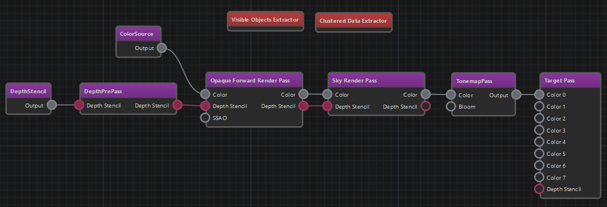
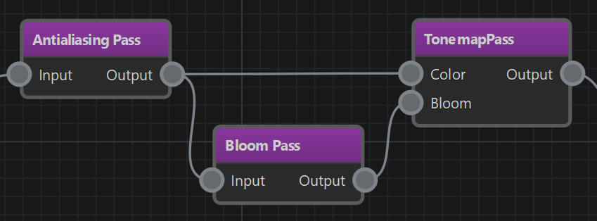

# Render Pipeline

A render pipeline defines the steps that the renderer should take to generate the final image. In EZ the render pipeline is fully configurable. Which render pipeline your project uses is configured per platform in the [asset profiles](../../assets/asset-profiles.md#render-pipelines).

Projects may also use multiple different render pipelines, for example when doing [render to texture (TODO)](../render-to-texture/render-to-texture.md).

## Render Pipeline Asset

The render pipeline asset is used to create configurations in a visual way. A pipeline generally *flows* from left to right. There are two different types of *nodes* in the graph. Violet nodes are **render passes**, red nodes are **extractors**.

### Extractors

Some extractor nodes have configuration properties, but they usually don't have any input or output pins. When an extractor is present in a pipeline, it gets executed every frame and is responsible for finding objects to render. Most pipelines need at least one type of extractor, such that the render pipeline has something to do, at all. Only few pipelines don't need extractors, for instance ones that operate only on images, for example to downscale or blur an image.

For a list of all available extractor nodes, see [this page](render-pipeline-extractors.md).

#### Programming Details (C++)

All extractor nodes are C++ classes that derive from `ezExtractor`. When an extractor finds an object to render, it records this *render data* in the `ezExtractedRenderData` object that it is given. The render data to record differs, depending on the type of object to render. For example to render a mesh, different data has to be recorded, than when rendering a particle effect. Render data is stored in objects which derive from `ezRenderData`.

After extraction, all render data is sorted according to various criteria (distance to camera, transparency settings and such) and then *may* get rendered by a *render pass node*. It may also get picked up multiple times, for example first by a depth pre-pass and then by an opaque render pass.

To actually render an object, a matching `ezRenderer` instance is used. Classes derived from `ezRenderer` specify which types of `ezRenderData` they can handle and which `ezRenderData::Category` they implement. So when a render pass attempts to render the *SimpleTransparent* category and there is render data of type `ezGridRenderData` then the `ezGridRenderer` will be used.

Extractors have to be part of a render pipeline configuration, so that one can control which kind of objects get rendered. *Renderers* are automatically instantiated through [code reflection](../../runtime/reflection-system.md).

### Render Passes

Broadly speaking, render pass nodes modify render targets. Usually they are handed one or multiple render targets through the input pins. They may use some inputs only for reading and others for writing. Opertions can be pure image manipulations, like downscaling or blurring, or they may use renderers (see `ezRenderer`) to draw *render data* that was prepared by *extractors*.

The input and output pins are used to connect which render target a render pass works on. In some cases a pass generates a completely new image, in other cases it forwards an input as its output.

In the image above the *TonemapPass* takes two inputs, one for the general image to tonemap, and one (optionally) to composite bloom on top of. There are different ways how the bloom image could be generated. In this case, the output from the *AntialiasingPass* is used both for the tonemapping, as well as for generating bloom. So the output is fed into two render passes. The *BloomPass* extracts overbright areas and creates a new (temporary) image with the result, which is then given to the *TonemapPass* as well.

Note that, although the *BloomPass* does create a new image, you do not need to give it an input image to write to. It automatically retrieves a *scratch texture* internally.

> **NOTE**
>
> All render passes have an 'active' flag, with which they can be deactivated. Depending on what the pass is supposed to do when active, a deactivated pass may do nothing and also output nothing, or it may pass input render targets through as outputs, or it may do a copy of a texture (but nothing else). Some passes also may not support being deactivated.

Be aware that *render pass nodes* are a high level functional unit. They don't map directly to render passes in graphics APIs like Vulkan or D3D12 even though there are definitely similarities.

For a list of all available pass nodes, see [this page](render-pipeline-passes.md).

## See Also

* [Render Pipeline Passes](render-pipeline-passes.md)
* [Render Pipeline Extractors](render-pipeline-extractors.md)
* [Shaders](../shaders/shaders-overview.md)
