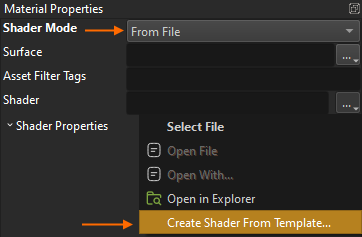

# Shader Templates

Writing a custom shader from scratch is a rather difficult task, especially if you want a custom material shader, that has all the PBR lighting features. However, using *shader templates* this becomes quite straight forward.

A shader template is simply a functioning shader file that you can edit. Shaders are generally written in [HLSL](https://docs.microsoft.com/windows/win32/direct3dhlsl/dx-graphics-hlsl), though EZ shader files have additional sections for configuring various other aspects. There are different templates available for common use cases.

## Creating a New Shader from a Template

Open a [material asset](../../materials/materials-overview.md) that should use a custom shader. As it's `ShaderMode` select *From File*. Now click the browse (`...`) button next to the `Shader` property, to open the context menu:

From this menu select **Create Shader From Template...**. The following dialog is shown:

Select the output file name and which template to create the shader from. When you select a template, the area below shows additional options. These simply select what code from the template should be included in your new file and is purely for convenience to get started more easily. You can add and remove any feature manually afterwards as needed.

Once you click `OK` the shader file is created, applied to the material and opened in a text editor for you to start editing. When you make structural changes (exposed parameters, permutation variables used and such) you need to [transform](../../assets/assets-overview.md#asset-transform) the material for the changes to properly show up.

As long as you only modify the HLSL code, you can also just press `F4` to [reload resources](../../runtime/application/common-application-features.md#reload-resources) at any time. If there are any errors, they are shown in the [log](../../debugging/logging.md).

## Adding a Shader Template

If you want to add another shader template itself, have a look at the folder *Data/Tools/ezEditor/ShaderTemplates*. All you need to do is add another *.ezShaderTemplate* file here. Shader templates have an additional `TEMPLATE_VARS` section at the beginning that define what options to display in the dialog.

The final shader code is built by running a C preprocessor over the file, but instead of replacing `#if` / `#endif` sections, it only looks at `%if` / `%endif` (using a percentage sign rather than a hash), to generate the output.

## See Also

* [Shaders](shaders-overview.md)
* [ShaderCompiler](../../tools/shadercompiler.md)
