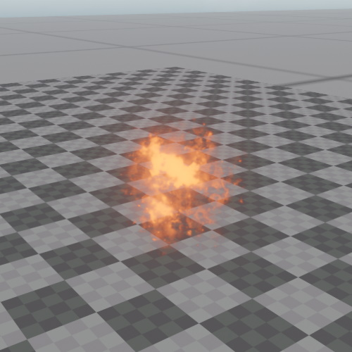

# Sprite Component

The *sprite component* is used to render a textured quad that always faces the camera and whose on-screen size never exceeds a defined limit. Sprites are mainly used to place 3D icons or markers in the world. For example all the [shape icons](../scenes/selection.md#shape-icons) in the editor are sprites. However, they can also be used for simple effects, for instance to represent small projectiles.

Although sprites have a world space size, their on-screen size is clamped to a maximum value. That means they won't fill up the screen when the camera comes very close.

## Component Properties

* `Texture`: The [texture](textures-overview.md) to use.

* `BlendMode`: How to blend the sprite with the background.

* `Color`: A tint color to multiply into the texture.

* `Size`: The actual size of the sprite in the world. Based on this, the screen space size is computed. This mostly affects how large the sprite appears from far away.

* `UseMaxScreenSize`: If disabled, the on-screen size is not clamped and the sprite grows without limit as the camera comes closer. This is typically what you want for effects, whereas icons and markers should keep the clamping enabled.

* `MaxScreenSize`: The maximum size of the sprite on screen. When the camera is close to the sprite, it will not fill up the entire screen. Instead, its on-screen size is clamped to this. Therefore, when getting close to a sprite, it appears to shrink. Only used when `UseMaxScreenSize` is enabled.

* `AspectRatio`: The ratio of width to height of the sprite texture.

## Sprite Animations

A sprite can play back an animation from a *spritesheet*, meaning a single texture that contains all frames laid out in a regular grid.

* `Columns` and `Rows`: Into how many cells the texture is subdivided. The frames are played back in order from left to right, top to bottom. With both values at 1 (the default) the entire texture is shown and no animation takes place.

* `IsAnimated`: Whether the animation is played back. If this is disabled and the texture has more than one frame, the last frame of the grid is displayed.

* `Framerate`: How many frames are shown per second.

* `Loops`: How often the animation is played back before `OnFinishedAction` is executed. A value of zero means that it loops indefinitely and the action is never executed.

* `OnFinishedAction`: What to do once the configured number of loops has been played. The component can delete itself, delete its entire owner object, or do nothing, in which case the sprite keeps displaying the last frame.
## See Also

* [Textures](textures-overview.md)
