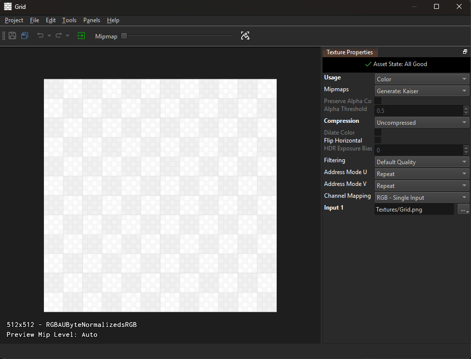
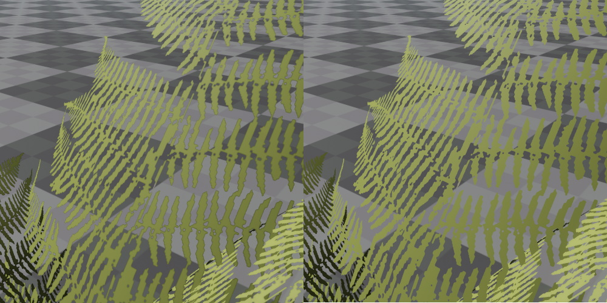

# Textures

Textures come in multiple forms. Most common are 2D textures loaded from file. 2D textures can also be created as render targets for [render-to-texture (TODO)](render-to-texture/render-to-texture.md). For [sky boxes](../effects/sky.md) or special effects you can also set up cubemap textures.

When the source texture comes from a file, you can create a texture [asset](../assets/assets-overview.md) for that file by [importing](../assets/import-assets.md) it. Otherwise you need to create the respective asset [document](../editor/editor-documents.md) manually, for example for render targets.

Textures are most often referenced by [materials](../materials/materials-overview.md). Texture assets only specify how source files are imported and combined, they don't define rendering behavior. Therefore most components don't use textures directly, but rather use materials, which configure the overall rendering, unless the component in question already sets up the rendering itself, such as the [SkyBox component](../effects/sky.md#skybox-component).

All texture assets show a **3D preview**. Here you can move the camera around to observe how the texture looks. Using the **Mipmap slider** in the toolbar, you can inspect individual mipmaps. With the **channel selection dropdown** next to the slider you can choose which channels to show. In the bottom left of the viewport, some **stats** are displayed, for instance what compression format is used.

On the right-hand side you see the property grid where you choose the **texture settings**. Since transforming a texture can take quite some time, these assets are not automatically updated when you change their properties or even save the asset. Instead, **transform the asset manually** either by clicking the transform button in the toolbar or with `Ctrl + E`.

## Video: How to import textures

## 2D Texture Asset

The following properties are available:

**Usage:** Tells the texture converter what type of data the texture represents. This affects what [color space (TODO)](../appendix/color-spaces.md) will be used, ie. whether the format uses *sRGB* or *Linear* encoding. If your color texture ends up using the incorrect color space (e.g. *Linear* when it should be *sRGB*) you will typically notice that the texture appears too bright and washed out.

* **Auto:** In this mode the converter will guess the *usage*, utilizing file name heuristics, the source file format and sometimes even the content. If your file names use suffixes like `_D`, `_Normal`, etc. this can work pretty well.
* **Color:** Use this for textures that represent color. For example diffuse textures, skyboxes and emissive color textures.
* **Linear:** Use this for textures that represent 'data' that is not directly a color. For example *roughness*, *metallic*, *ao* and *specular* maps.
* **HDR:** For textures that contain *high dynamic range* data. Since HDR data requires special file formats, *Auto* mode can detect this reliably.
* **Normal Map:** For textures that represent normal maps.
* **Normal Map (Inverted):** For normal maps that use a different convention for the direction vectors.
* **Bump Map:** For greyscale textures that represent height values, which should be converted to a normal map.

**Mipmaps:** This property allows you to choose whether the texture should have *mipmaps* and what algorithm to use for generating them. Unless you have a very special use case, mipmaps should always be enabled. The *Kaiser* filter usually gives slightly better results than the *Linear* filter.

**PreserveAlphaCoverage, AlphaThreshold:** When you want to use a texture for vegetation, where the alpha channel is used to define transparent areas, then using this feature can improve how the vegetation looks when it is far away. The smaller a mipmap becomes, the more it represents the *average* color of the original texture. The same is true for the alpha channel. The problem then is, that if a vegetation texture is mostly transparent, the lower mipmaps will become more and more transparent. In practice that means the further you are away from a plant, the more transparent it becomes. For example all the leaves in a tree may disappear. If, on the other hand, the texture is mostly opaque, the lower mipmaps would become more and more opaque, so tree would appear much thicker when far away. *PreserveAlphaCoverage* can improve this, by making sure that the percentage of pixels with a value below and above *AlphaThreshold* stays the same throughout all mip levels. Thus, if the leaves of a tree are 70% transparent in the original texture, even when viewed from far away about 70% of its pixels will be transparent and not more. For this to work, the *AlphaThreshold* that will be used by the shader to discard pixels has to be known exactly and may not differ when the texture is used later. Computing the alpha coverage takes more time. Unless you are trying to solve the problem described above, keep this option disabled.

**Compression:** Specifies how strong the texture should be compressed. Depending on *Usage* and whether an alpha channel is present, this determines which exact file format will be used (printed in the lower left corner of the viewport). Note that for some combinations there may be no difference between *medium* and *strong* compression. Don't choose *Uncompressed* unless you actually notice compression artifacts. Texture compression saves significant amount of memory (usually a 4:1 compression, sometimes even 8:1) and has no performance overhead during rendering. The only downside is, that it takes longer to transform compressed texture assets.

**DilateColor:** For textures with an alpha mask. Will *dilate* (smear) the color channel outwards everywhere where the alpha channel is zero. Useful for example for vegetation textures, where the alpha channel defines a cutout mask. If the color channel does not contain some average color in the transparent areas, but something different, usually black, this unwanted color will *bleed* into the opaque areas in the lower mipmaps. As a result, masked objects appear to have a black edge. To fix this, either author your source textures to have a representative color in the transparent areas, or enable this option to automatically generate it. Note that this option makes texture transform slower.

The image below shows the difference of a texture that is completely black in the transparent areas, versus the same texture, using color dilation. Notice how there is a black edge around the plant in the left image.

**Flip Horizontal:** For textures that are stored upside down.

**HdrExposureBias:** For textures that have the *HDR Usage*. Allows you to scale the brightness.

**Filtering:** Specifies with which *filter method* the texture is sampled during rendering. If you select one of the *Fixed* modes, it will be filtered exactly with that mode. Mostly useful, if you want to use *Nearest* filtering, for artistic reasons. Using one of the other modes (*Low Quality* / *Default Quality* / *High Quality*) the texture will use a filtering mode that is decided at runtime. For example, if the *default* sampling mode is set to *Anisotropic 2x*, then *High Quality* will result in *Anisotropic 4x* (one mode higher) and *Low Quality* will be result in *Trilinear* sampling (one mode lower). *Lowest* and *Highest* will use two modes lower/higher, though *Nearest* filtering will never be used.

**AddressMode:** Specifies whether a texture will be repeated when the texture coordinates used to sample the texture are outside the `[0; 1]` range. The 3D preview shows the effect of this property after you transform the asset.

**Channel Mapping:** This option allows you to choose which channels the texture will have, and from which files to take the data for each channel. `RGB(A) - Single Input` is the most common choice, but you can also combine multiple textures, e.g. take the color from one input file and the alpha channel from another.

**Input N:** Depending on the chosen *channel mapping* you need to specify one to four input textures.

## Cubemap Texture Asset

Cubemap assets have a subset of the properties that 2D textures have. Their behavior is identical, except for **Channel Mapping**, which allows you to build a cubemap either from one or from six input files.

## Render Target Asset

Render targets can be used like regular 2D textures. That means materials can reference them and display their content. However, they are filled by rendering to them at runtime, for example by using a camera to render the scene from a certain viewpoint. Have a look at the [render to texture (TODO)](render-to-texture/render-to-texture.md) article for details.

Apart from some properties shared with 2D texture assets, render targets have these unique properties:

**Format:** Determines whether the texture can store HDR data (10 bit or 16 bit) and whether the texture represents colors (sRGB) or linear data.

**Resolution:** The dimensions of the texture. If set to `CVar RT Resolution N` the resolution will be read from the [CVar](../debugging/cvars.md) `r_RenderTargetResolutionN`. This can be used to adjust the resolution dynamically.

**CVarResScale:** If the resolution is read from a CVar, this allows to scale it. For instance to create a *half resolution* render target.

## See Also

* [Materials](../materials/materials-overview.md)
* [Render to Texture (TODO)](render-to-texture/render-to-texture.md)
* [Sky](../effects/sky.md)
* [Color Spaces (TODO)](../appendix/color-spaces.md)
