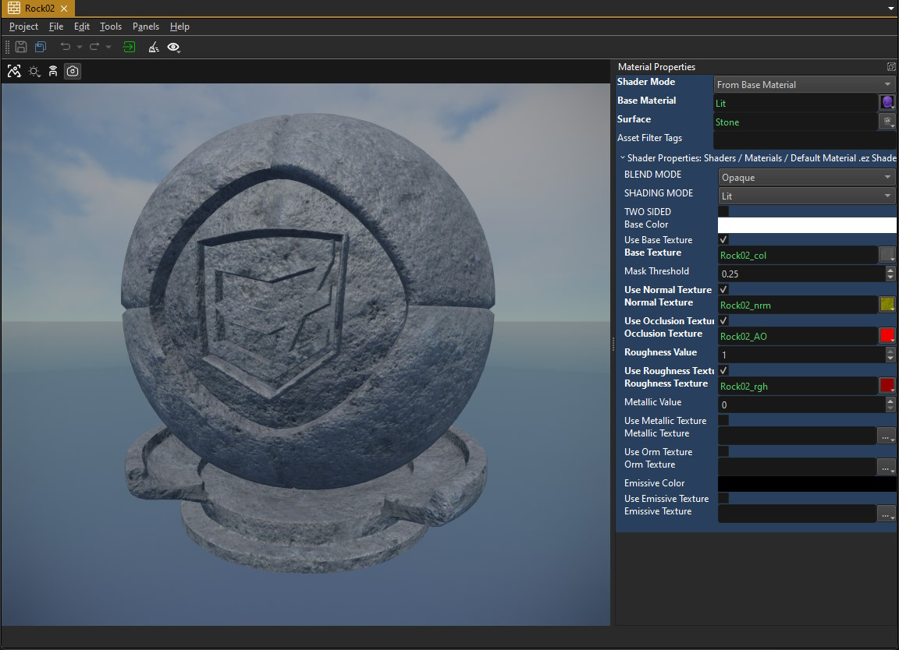

# Materials

*Materials* are used to define the visual properties of rendered objects. Materials specify what [shader](../graphics/shaders/shaders-overview.md) to use to render an object and they allow you to configure that shader. Most commonly you select which [textures](../graphics/textures-overview.md) to use. The most common use case for materials is through [meshes](../graphics/meshes/meshes-overview.md). Each sub-mesh can have its own material.

The image above shows the material asset editor. Material assets are often automatically created when you [import a mesh asset](../assets/import-assets.md). For example importing an `FBX` or `OBJ` file will not only create a mesh asset, but can additionally create the necessary material and texture assets for you. Unfortunately, this process is not always perfect, so you should always review which assets were created and how.

## Video: How to create a material

## Physical Properties

Although materials are mainly used to configure the rendering, they can optionally reference a [surface](surfaces.md), which is used to define physical properties (e.g. friction) and gameplay relevant interactions. Whether the referenced surface is actually used depends on where the material is applied. For instance, on a [greyboxing component](../scenes/greyboxing.md) the material sets up both the graphics and the physics properties, on a [mesh component](../graphics/meshes/mesh-component.md) it only sets up the rendering and you would need to additionally select a surface for the corresponding [collision mesh](../physics/jolt/collision-shapes/jolt-collision-meshes.md).

## Selecting a Shader

Through the `ShaderMode` property there are three ways a material can select which shader to use:

* **From Base Material:** This is the most convenient and most commonly used method. In this mode, you need to select a `BaseMaterial`, which is just another material. All the properties of that base material are copied over to your material, including the shader selection. You can then override each property as you like. This makes it easy to set up a few common base materials and then "derive" all other materials from this common base.

* **From File:** In this mode the material actually references a proper shader file. This allows you to select a custom [shader](../graphics/shaders/shaders-overview.md). By default, EZ doesn't have many different shader files, as all important variations are provided by the same shader file. However, if you do decide to write a custom one, this is the way to select it for your material. The engine parses the shader file for configurable properties and displays those as UI elements in the material editor. So things like which texture you can select and what other lighting properties the material will have, are all defined by the selected shader.

  You can easily create a custom shader from a [shader template](../graphics/shaders/shader-templates.md).

* **Visual Shader:** In this mode the material editor will show an additional editing area beneath the 3D view, where you can create your own shader through a visual graph system. This enables you to create custom shader effects like animated textures. There is a dedicated chapter about [visual shaders (TODO)](visual-shaders.md) that explains how to do so.

If you change the selected shader, you need to *transform* (`Ctrl+E`) the material [asset](../assets/assets-overview.md) for the change to take full effect.

## Shader Properties

The `Shader Properties` section lists all the properties that the selected shader exposes. The 3D viewport will live update for any change you make here.

### DefaultMaterial Properties

The `DefaultMaterial` shader that comes with EZ implements a **P**hysically **B**ased **R**endering model (PBR), which is the de facto industry standard these days. The details of PBR rendering are beyond the scope of this documentation, if you want to get an understanding of how *roughness* and *metalness* are used (see below), please search the internet.

The `DefaultMaterial` provides these options:

**Blend Mode:** Defines whether the object will appear opaque or transparent.

* **Opaque:** The object appears solid.
* **Masked:** In this mode the object can have fully transparent (invisible) areas and fully opaque ones. *Blending* is not possible. This is commonly used for vegetation or things like chain-link fences to cut out part of the object. *Masked* geometry does not require any sorting during rendering and is therefore the most efficient and reliable mode of transparency. Which areas appear transparent are defined by the *alpha channel* of the *base texture* and the `MaskThreshold` property. Every pixel whose alpha value is above the threshold (e.g. white) will be visible (opaque) and every pixel whose value is below the threshold (e.g. black) will be invisible.
* **Transparent:** In this mode geometry will appear see-through, ie. it will be blended with the geometry behind it. This mode is commonly used for things like glass or water. Again, the *alpha channel* of the *base texture* determines which areas appear more or less transparent.
* **Additive:** In this mode the geometry will not be blended with the background but simply added on top of it. The *alpha channel* affects how strongly it is added.
* **Modulate:** This mode allows you to darken or brighten the background. A pure white material (base texture and base color) will brighten everything that is behind the object. A pure black material will darken the background. A material that is mid grey will let the background through unmodified. This mode can be used for various special effects, especially when writing a [visual shader (TODO)](visual-shaders.md) that animates the texture and the alpha channel with noise.

For testing transparent materials it may be useful to create an object in a scene and observe it there, where you can place it in front of different backgrounds.

**Shading Mode:** This mode allows you to select whether objects with this material should receive realistic *lighting* or should always appear *fullly bright*. The latter is useful for 2D sprites and UI elements.

**Two Sided:** If enabled, polygons with this material can be seen from both sides. This is useful for fences, vegetation and other *masked* geometry that is often represented only by a single polygon but can be looked at from both sides.

**Base Color:** The base color of the material. When no *base texture* is used, this is its only color, otherwise it is multiplied into the base texture color.

**UseBaseTexture:** If enabled, the *Base Texture* is used to color the object. This requires proper UV coordinates on the mesh.

**MaskThreshold:** Used for the *Masked* blend mode (see above).

**UseNormalTexture:** If enabled, the shader uses the *Normal Texture* to apply *normal mapping*.

**UseOcclusionTexture:** If enabled, an *OcclusionTexture* is used to affect lighting and to pronounce crevices. The effect of this can be very subtle.

**Roughness Value:** If no *Roughness Texture* is given, this value is used for lighting. If a roughness texture is available, this value is multiplied into the texture's value. The rougher a material is (value closer to one), the more *diffuse* the lighting will be (stone, cloth, etc). The smoother the material is (value closer to zero), the more pronounced specular highlights it will have (glass, ceramic).

**UseRoughnessTexture:** If enabled, the shader uses the *Roughness Texture* to determine how rough the surface is. The texture's value is multiplied with the *Roughness Value* so make sure to set that `1` to get the exact result.

**Metallic Value:** If no *Metallic Texture* is provided, this is the fallback value. Typically this should be `1` for metals and `0` for all other material types.

**UseMetallicTexture:** If enabled, a dedicated *Metallic Texture* is used to specify per pixel whether it is a metal or not. In physics, a material is either a metal or not, in computer graphics values in between are allowed and used to blend between the two results.

**UseOrmTexture:** If enabled, a dedicated *Occlusion / Roughness / Metallic (ORM) Texture* is used to specify these values per pixel. This takes precedence over the individual *UseOcclusionTexture*, *UseRoughnessTexture* and *UseMetallicTexture* options and if individual textures are also specified, they are not going to be used. ORM textures pack these three values into 3 channels (*Red = Occlusion*, *Green = Roughness*, *Blue* = *Metallic*) which is generally more efficient, though it means you can't have different resolutions for each texture.

**EmissiveColor:** An additional overall emissive color. If an *Emissive Texture* is activated, these two colors are multiplied, so you need to set this to *white* for the texture to have an effect. This is an HDR color, so you can scale up its *intensity* and thus pronounce the glow even further.

**UseEmissiveTexture:** If enabled, the *Emissive Texture* is used to define per pixel where the material will *glow*. This is multiplied with the *EmissiveColor*, so make sure that is not set to black (its default).

## Material Preview

The 3D viewport of the material editor allows you to switch the [render mode](../editor/editor-views.md#render-modes) to inspect only specific aspects of the material.

Using the *eye dropdown menu* you can also select different meshes for previewing the material on.

## Filtering Materials for Special Use Cases

Most materials will be applied to standard meshes and thus use shaders that work with them. However, some materials are meant for meshes that have non-standard data. For example the [Kraut](../terrain/kraut-overview.md) tree meshes are not compatible with the standard materials.

This means that materials authored for these trees should not be used on standard meshes, and vice versa. Thus when picking a material for a mesh (or a tree) the editor should only show the compatible materials for each situation.

To set this up, two things are necessary:

1. The C++ code has to specify which materials are compatible for each resource slot. This is defined through the `ezAssetBrowserAttribute`, using the *tag* argument (the second string). Setting this, for example, to `"Kraut"` makes the editor only show materials that have this tag.
1. In the material, use the `Asset Filter Tags` option to configure what the material is compatible with. You can add multiple tags, separated by semicolon.

For standard materials none of this is necessary, and for non-standard materials it is only a usability improvement.

## See Also

* [Visual Shaders (TODO)](visual-shaders.md)
* [Textures](../graphics/textures-overview.md)
* [Meshes](../graphics/meshes/meshes-overview.md)
