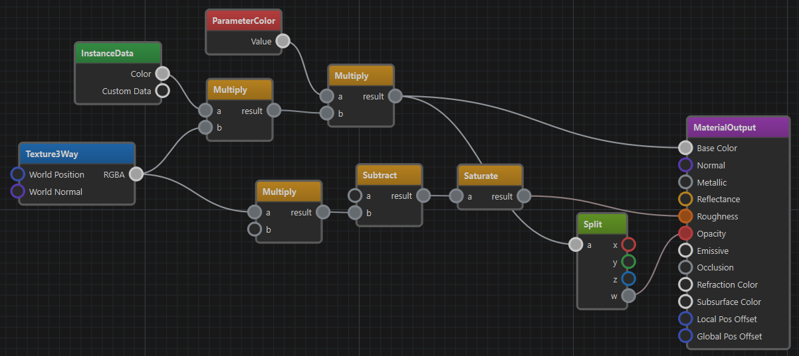

# Visual Shaders

Visual Shaders are a mode of [material asset](materials-overview.md). This allows to create custom shading effects within a given framework (e.g. a PBR lighting model). Visual Shader Editing (VSE) is much simpler than writing a full shader and is a good start to get familiar with shaders.



An alternative to using visual shaders is to write a custom shader based off of a [shader template](../graphics/shaders/shader-templates.md). However, this is only necessary, once you want to create advanced effects that are not possible with visual shaders.

## Limitations

Visual shaders are mainly used to write *pixel shaders*. Although an output node may allow to also modify the vertex position, there are strict limitations for what can be done.

Visual shaders do not support writing geometry shaders or tesselation shaders.

The output node defines the base functionality, for instance that a material uses a PBR lighting model. If you have different requirements, you can create a custom output node for your project.

There is no support for loops or conditionals. If you need such functionality, you have to write a full shader using HLSL. A starting point for this are [shader templates](../graphics/shaders/shader-templates.md).

## Getting Started

To work with visual shaders, switch the `Shader Mode` property of a material to **Visual Shader**. Now a node editing panel at the bottom shows up. Next create an **Output node** and connect something to its pins.

To see the result of your custom shader, **save the material asset** to compile the shader. Now the 3D preview should start showing the result of your custom shader. If it doesn't, check the [trouble shooting](#trouble-shooting) section below.

Every node has properties. These are shown when you select the node. If no node is selected, the general *material properties* are shown.

## Trouble Shooting

The material preview is supposed to show the result of the shader. In case that it doesn't behave as expected, check the following:

* Make sure you have exactly one *output node*.
* Make sure the asset is *saved*. Modifications that haven't been saved yet, are not shown.
* Check the window in the bottom right for *shader compilation errors*.
* Make sure all parameters have the expected values.
* There is a bug where the preview doesn't switch to the newly modified shader. Save and close the material asset, then reopen it, to fix this issue.

## Available Visual Shader Nodes

To see which nodes are available, just open the context menu in the node editor. Nodes are sorted by category. When you instantiate a node, you can point the mouse cursor at the node title to show a tooltip with a short description. Additionally, pointing at any of the input or output pins, may show a tooltip with more details about its functionality.

### Output Nodes

Every shader must have *exactly one* node from the **Output** category. This defines what type of shader this will be.

#### Material Output Node

This is used for standard PBR material shaders.

> **IMPORTANT**
>
> When using this output node, the `Asset Filter Tags` property on the material should be set to **empty** for the material to be available as a standard mesh material.

If the `Local Pos Offset` or `Global Pos Offset` pin of this node are connected, this code is injected into the **vertex shader**. This allows to do vertex position manipulation.

> **IMPORTANT**
>
> Some nodes produce different output when they are used for vertex shaders. For instance, the *VertexPosition* and *VertexNormal* nodes return their data in different spaces. See the tooltips on their output pins for details.

#### Decal Output Node

This is used for projected textures in [spotlights](../graphics/lighting/spot-light-component.md).

> **IMPORTANT**
>
> When using this output node, the `Asset Filter Tags` property on the material must be set to **Decal** for the material to be available for spotlights.

This output node is **pixel shader only**. It does not allow to modify the vertex shader.

## Constants and Parameters

These nodes define input values for a shader. Constants are always fixed, whereas parameters show up in the material properties section (after saving and transforming the asset).

> **IMPORTANT**
>
> Parameter nodes have a *default* value. If you change this, the material typicallys continues to use the previous value, because the material was already saved with the previous value. To change this, go to the material properties, right-click the property name and select *Revert to Default*.

## Texturing Nodes

These nodes allow you to sample a texture. There are a couple of nodes for typical texture types, like *Base Texture* and *Normal Texture*, that take care of some details. See the tooltip on the output pins for details. If you do not want to use a standard texture, simply use the `Texture 2D` node. If you want to use a non-standard *sampler*, for instance for nearest neighbor sampling, you have to use the `Texture 2D` node and connect a custom sampler type.

## Input Nodes

These nodes provide various kinds of input data. Some give access to vertex attributes like position, normal, color and UV texture coordinates. Others provide global values, like the time or camera configuration.

Of particular interest should be the **InstanceData** node, which allows to access object specific per-instance data. This is used to configure a shader differently and dynamically per object. Particularly the **Custom Data** value, which is available on [mesh components](../graphics/meshes/mesh-component.md), allows you to dynamically adjust a shader.

## How to Add Visual Shader Nodes

It is straight-forward to add new visual shader nodes.
The nodes are defined in `DDL` files located in

```cmd
Data/Tools/ezEditor/VisualShader
```

Simply add a file or edit an existing one to extend the system. The editor automatically hot-reloads the definition files when they change.

The majority of the configuration should be self-explanatory, just look at existing nodes and their input and output pin setups.

The following only describes non-obvious options.

> **IMPORTANT**
>
> Typically you are not supposed to have to add your own nodes. However, in case you come across missing functionality, or you have an idea for a useful helper node, please open a pull request to have it added to ezEngine.

### Node Options

* `NodeType`: Can be `Main`, `Texture` or empty.

  Use `Main` for final output nodes, `Texture` for texture sampling nodes.

* `CheckPermutations`: Typically only used on `Main` nodes. Defines which permutation variables to set to a fixed value when running checks on the generated shader. This is to reduce how many permutations get pre-compiled, to save time during development, by not compiling thousands of unnecessary shader permutations.

* `CodePermutations`: Typically only used on `Main` nodes. Defines which permutation variables to use for this shader. This will be injected into the [PERMUTATIONS section](../graphics/shaders/shader-permutation-variables.md).

* `CodeRenderStates`: Typically only used on `Main` nodes. The code that should be injected into the [RENDERSTATE section](../graphics/shaders/shader-render-state.md).

* `CodeVertexShader`, `CodeGeometryShader`: Code that will be injected into the body of the vertex or geometry shader. Often used to enable defines or include certain files.

* `CodeMaterialParams`: Code that will be injected into the `MATERIALPARAMETER` section of the shader. See [Shaders](../graphics/shaders/shaders-overview.md) and [Shader Permutation Variables](../graphics/shaders/shader-permutation-variables.md). Here `$prop0`, `$prop1`, etc are placeholders for the name of the first, second, etc `Property` of the node.

* `CodeMaterialConstants`: Typically only used on `Main` nodes. Code that is injected into the `MATERIALCONSTANTS` section. See [Shaders](../graphics/shaders/shaders-overview.md).

* `CodeMaterialCB`: Code injected into the material constant buffer (CB) section of the shader. Used to declare and initialize constant buffer variables that are shared between shader stages. Here `$prop0`, `$prop1`, etc are placeholders for the name of the first, second, etc `Property` of the node.

* `CodePixelDefines`: Code injected as preprocessor defines (`#define`) into the pixel shader. Used to enable features or declare macros required by pixel shader nodes. For example, nodes may add defines like `#define USE_TEXCOORD0` to ensure the shader includes necessary data.

* `CodePixelIncludes`: Code injected as `#include` statements into the pixel shader. Used to include additional shader files or shared code required by pixel shader nodes.

* `CodePixelSamplers`: Code injected to declare sampler states in the pixel shader. Used by nodes that require texture sampling, such as `BaseTexture` or `NormalTexture`, to add sampler definitions like `SamplerState BaseTexture_AutoSampler BIND_GROUP(BG_MATERIAL);`.

* `CodePixelConstants`: Code injected to declare constant variables in the pixel shader. Used by nodes that need to define constants for use in pixel shader calculations.

* `CodePixelBody`: Code injected into the main body of the pixel shader. Used to implement the actual logic or helper functions for calculations performed by output pins.

## See Also

* [Shaders](../graphics/shaders/shaders-overview.md)
* [Shader Templates](../graphics/shaders/shader-templates.md)
