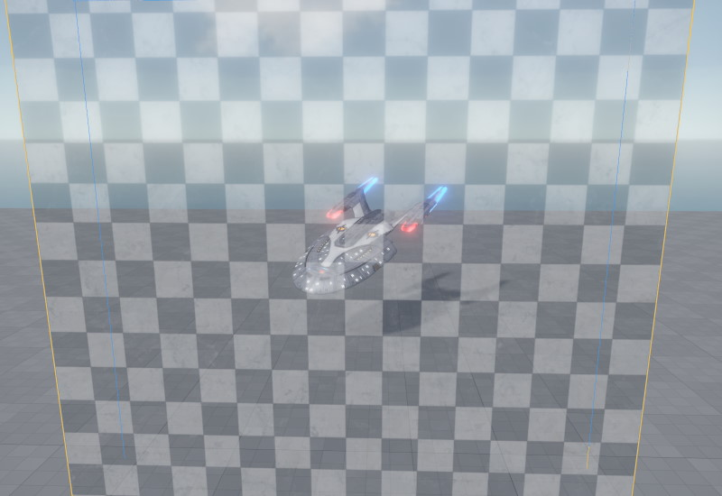
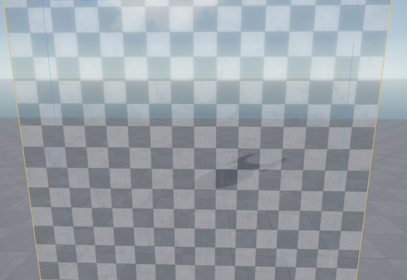
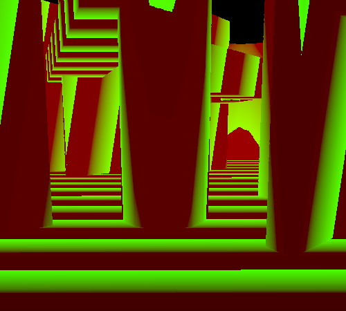

# Occlusion Culling

*Occlusion Culling* is an optimization to speed up rendering. The general idea is to somehow determine whether an object is *occluded* by other geometry, and if so, to not render it at all, since it won't contribute to the final image anyway.

There are different ways that occlusion culling can be implemented. EZ uses a *software rasterizer* to render *occluder geometry* to an offscreen buffer. For every object that is then supposed to get rendered by the GPU, it can quickly cross-check with the offscreen buffer, whether the object would be fully occluded, and if so, rendering is skipped.

> **IMPORTANT!**
>
> Occlusion culling is currently only available on Windows machines with CPUs that support the AVX instruction set. If not available, the occlusion culling optimization step is simply skipped.

Without occlusion culling, an object that is behind a wall, will be rendered. We can observe this by making a transparent wall:

Now if we turn the (transparent) wall into an *occluder*, the engine is able to skip rendering of the object. Of course in practice you would not use transparent walls as occluders, for obvious reasons.

Here you can observe that the object isn't visible anymore, but its shadow is. That's because from the point of view of the light source, the object is visible, and in fact the shadow could be visible from the main camera position. If the object was also occluded from the light source's perspective, its shadow would also not get rendered.

## How to Use Occlusion Culling

All rendered objects automatically benefit from occlusion culling. The only thing that's needed is for your level to contain occluders.

The easiest way to do so, is to use [greyboxing geometry](../scenes/greyboxing.md). It is automatically used as occluders and all its shapes are supported. Another option is to use [occluder components](../graphics/occluder-component.md). These components allow you to create invisible occluder geometry, that can also be moved around dynamically.

### Visualizing Occluder Geometry

Use the [CVar](../debugging/cvars.md) `Spatial.Occlusion.VisView` to enable a screen overlay that displays the main view's occlusion buffer:

This allows you to inspect whether occluders are well placed.

### Best Practices

You should have few but large occluders. Disable the occluder flag on greybox geometry that is too small to have a significant contribution. Generally try to avoid small occluders as they can create artifacts. The occlusion buffer has a limited resolution and fine details may therefore "occlude" objects, even though they are not actually occluded at full resolution.

Place [occluder components](../graphics/occluder-component.md) inside large objects, such as boulders, cars or furniture. It doesn't matter whether they are static or can move around. Do not add occluder geometry to small or thin objects. If in doubt, don't add occluder geometry.

Use the occlusion buffer visualization to inspect how well occluders are placed around your level. Use the CVar `Spatial.Culling.ShowStats` to see how many objects are rendered at any given time to get a feeling for how well occlusion culling works in your scene.

## Video: Frustum and Occlusion Culling

Click the image below to watch the video:

## See Also

* [Profiling](profiling.md)
* [Greyboxing](../scenes/greyboxing.md)
