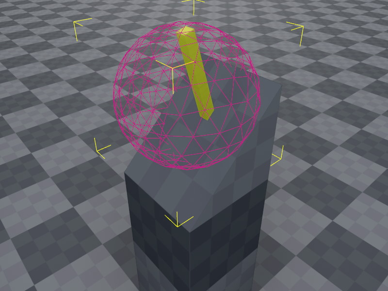

# Jolt Query Shape Actor Component

The *Jolt query shape actor component* is a [kinematic actor](jolt-dynamic-actor-component.md) that doesn't interact with the physics simulation.

Its intended use is to define areas that you want to be able to detect via *raycasts* and *overlap queries* but otherwise shouldn't interfere with the physical simulation.

## Example

The image above shows a mock-up of a lever that a player should be able to activate. The handle of the lever itself is very thin. If you use a raycast to detect what interactable objects a player is looking at, it can be difficult to hit. If the lever handle itself moves after activation, it would also move away from the point the player is looking at, so quickly activating it again becomes even harder.

To make this easier, instead of making the lever into a kinematic object and raycast against that, we can use a sphere shape that has a much larger size and therefore is much easier to pick.

However, we do not want this exaggerated shape to interfere with other objects. For example when a [character controller](../special/jolt-character-controller.md) moves towards it, we do not want it to block the path. Instead it should just pass through. We could achieve this with [collision layers](../collision-shapes/jolt-collision-layers.md), however the more collision layers you have, the harder it becomes to maintain them properly.

By using a query shape actor, it is very easy to define that this object only participates in *queries*, e.g. raycasts and overlap tests. And even then only, if those queries are configured to include query shapes.

## Component Properties

* `CollisionLayer`: The [collision layer](../collision-shapes/jolt-collision-layers.md) to use. Note that query shapes do not *collide* with anything, but this is used for additional filtering when raycasting against these objects.
* `Surface`: The [surface](../../../materials/surfaces.md) to use for this actor's shapes. This is only used to report the surface type back in raycasts and such. Otherwise the surface does not affect the actor's behavior in any way.

## See Also

* [Jolt Actors](jolt-actors.md)
* [Jolt Bone Collider Component (TODO)](../ragdolls/jolt-bone-collider-component.md)
