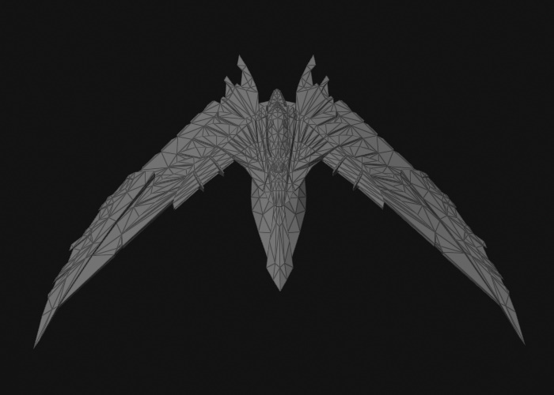
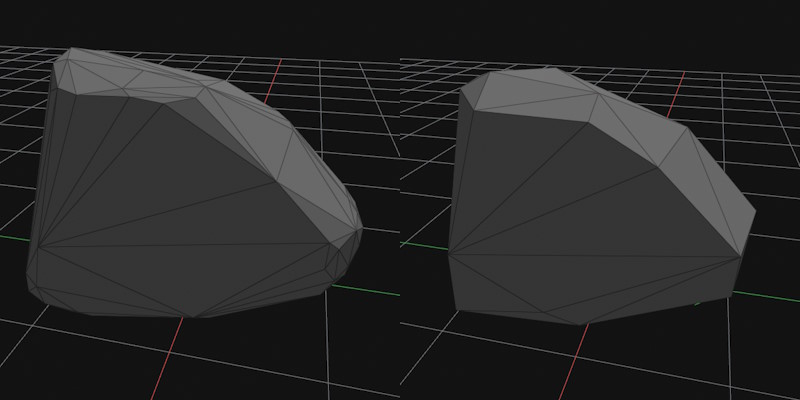

# Jolt Collision Meshes

Collision meshes are special [meshes](../../../graphics/meshes/meshes-overview.md) that are used by the physics engine to compute physical interactions. Their internal representation is optimized to speed up this task. Additionally, physics engines generally distinguish between two types of meshes: *convex* meshes and *concave* meshes. While concave meshes can represent any arbitrary geometric shape, they can only be used for static [physics actors](../actors/jolt-actors.md), which limits them to be used for the static level geometry. Convex meshes are often an oversimplification of the original mesh. However, they can be used for all physical interactions.

## Concave Collision Meshes

To create a concave collision mesh, use the asset type *Jolt Triangle Collision Mesh* when [importing an asset](../../../assets/import-assets.md).

The image above shows a mesh imported as a concave collision mesh. As you can see it represents every detail faithfully. Due to this complexity, the model can only be used for static [physics actors](../actors/jolt-actors.md), meaning you can place it in a level, scale and rotate it, but you may not move it dynamically during the game and it cannot be used to simulate a rigid body. The complexity of a mesh has direct impact on the performance of the game. Especially small details may result in large computational costs when dynamic objects collide with those detailed areas. If you want to optimize performance, you should author dedicated collision meshes with reduced complexity, instead of using the render mesh directly.

Concave collision meshes are set directly on the [static physics actor](../actors/jolt-actors.md) component and have no dedicated [physics shape](jolt-shapes.md) component.

Triangle meshes can use a different [surface](../../../materials/surfaces.md) for each submesh.

## Convex Collision Meshes

The simulation of [dynamic actors](../actors/jolt-dynamic-actor-component.md) is only possible with convex shapes. To create a convex collision mesh, use the asset type *Jolt Convex Collision Mesh* when [importing an asset](../../../assets/import-assets.md). To attach a convex mesh to an actor, use the [convex mesh shape component](jolt-convex-shape-component.md).

Convex meshes may only use a single [surface](../../../materials/surfaces.md), even if the mesh is made up of multiple convex pieces.

There are multiple modes how to create the convex collision mesh:

### Convex Hull

In the image above the mesh import computed the *convex hull*. The number of vertices and triangles was also reduced to less than 250 (a requirement by Jolt).

Obviously, the mesh lost all of its details and the object will not collide with its surroundings according to its actual geometry, but in many use cases that won't be obvious. This is the most efficient way to use an arbitrary mesh as a collision mesh, as it will always use exactly one, very low poly convex mesh for the physics calculations.

### Convex Decomposition

In the image above the mesh import decomposed the mesh into multiple pieces (seven pieces in this case). Each piece is a convex mesh with less than 250 vertices and triangles.

This mode allows you to dictate into how many pieces to split the mesh. The more pieces, the closer the result resembles the original shape. These collision meshes can still be used for dynamic simulation, the Jolt actors simply use multiple convex shapes as their representation. Of course the more pieces such a mesh contains, the less efficient the simulation becomes.

## Selective Mesh Import

Sometimes a **dedicated collider mesh** is embedded in the same source asset as the graphics mesh. You can use the properties `MeshIncludeTags` and `MeshExcludeTags` to selectively import only those meshes. See the [mesh asset properties](../../graphics/meshes/mesh-asset.md#asset-properties) for details.

As an example, if the graphics mesh is called *Bunny* and the dedicated collider mesh is called *$COL_Bunny*, you can set the *MeshIncludeTags* to `$COL` to only import *$COL_Bunny* as the collider mesh.

## Mesh Simplification

Collision meshes support mesh simplification to reduce their amount of triangles and vertices. See the [mesh asset](../../../graphics/meshes/mesh-asset.md#asset-properties) for details about the parameters.

The image below shows the original mesh and a simplified collider mesh that has roughly one fourth the number of triangles.

## Visualizing Collision Meshes

To visualize *all* colliders in a scene, see [Jolt Debug Visualizations](../jolt-debug-visualizations.md).

However, for some use cases you can also just attach a *Collision Mesh Visualizer* component. This renders the collision mesh into your scene the same way as in the images above.

## See Also

* [Jolt Physics Integration](../jolt-overview.md)
* [Jolt Physics Shapes](jolt-shapes.md)
* [Jolt Physics Actors](../actors/jolt-actors.md)
* [Jolt Collision Layers](jolt-collision-layers.md)
* [Jolt Debug Visualizations](../jolt-debug-visualizations.md)
* [Surfaces](../../../materials/surfaces.md)
