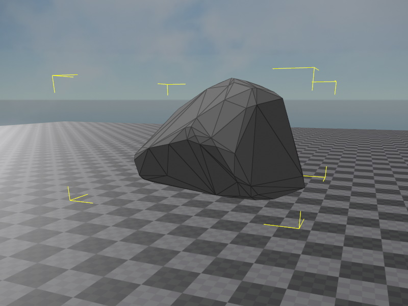

# Jolt Convex Shape Component

The *Jolt convex shape component* adds a [convex mesh](jolt-collision-meshes.md) as a [shape](jolt-shapes.md) to the [Jolt actor](../actors/jolt-actors.md) that is attached to the closest parent node.

You can attach this component to the same node where the actor component is attached, or you can create a child object to attach it to, which allows you to position the shape relative to the actor.

Convex mesh shapes are the least efficient shape to handle for the physics engine, but it is also the only shape that allows you to define your own (convex) collision geometry. For many kind of objects this is necessary.

The convex shape component references a [convex collision mesh](jolt-collision-meshes.md), which you need to create first.

Note that the editor doesn't visualize convex shape components in any way. The image above was taken by using a [collision mesh visualizer component](jolt-collision-meshes.md#visualizing-collision-meshes).

## Component Properties

* `CollisionMesh`: The [convex collision mesh](jolt-collision-meshes.md) to use.

## See Also

* [Jolt Shapes](jolt-shapes.md)
* [Jolt Actors](../actors/jolt-actors.md)
