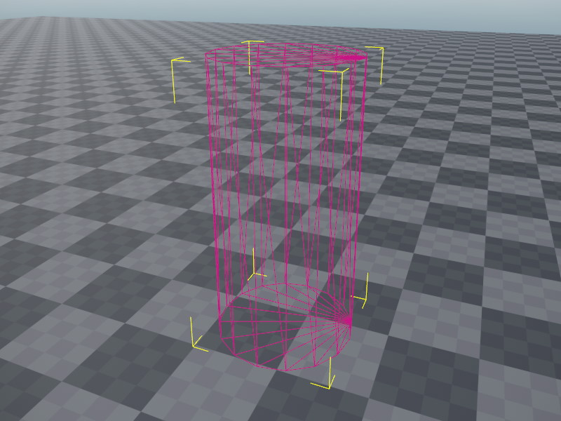

# Jolt Cylinder Shape Component

The *Jolt cylinder shape component* adds a cylinder as a [shape](jolt-shapes.md) to the [Jolt actor](../actors/jolt-actors.md) that is attached to the closest parent node.

You can attach this component to the same node where the actor component is attached, or you can create a child object to attach it to, which allows you to position the shape relative to the actor.

Cylinders are relatively efficient for the physics engine to handle. However, cylinders are known to not always yield the desired behavior. Generally prefer them over the [convex shapes](jolt-convex-shape-component.md), though if the behavior is too erratic, you can try those instead, and see if the results are better.
Whenever possible, prefer to use [capsule shapes](jolt-capsule-shape-component.md) instead.

## Component Properties

* `Radius`: The radius of the cylinder, ie its thickness.
* `Height`: The height or length of the cylinder.

## See Also

* [Jolt Shapes](jolt-shapes.md)
* [Jolt Actors](../actors/jolt-actors.md)
