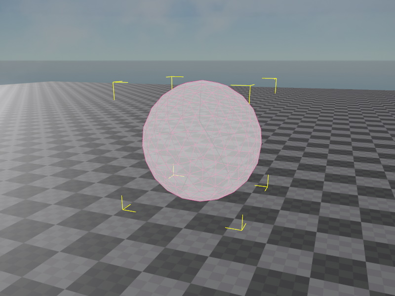

# Jolt Sphere Shape Component

The *Jolt sphere shape component* adds a sphere as a [shape](jolt-shapes.md) to the [Jolt actor](../actors/jolt-actors.md) that is attached to the closest parent node.

You can attach this component to the same node where the actor component is attached, or you can create a child object to attach it to, which allows you to position the shape relative to the actor.

Spheres are very efficient for the physics engine to handle. Therefore you should prefer them over all other shapes, especially [convex shapes](jolt-convex-shape-component.md), when you can approximate the geometry of an object with one or a couple sphere shapes.

> **Note**
>
> It is *valid* to have a sphere with zero radius. This is useful when you need a dummy actor, for example a kinematic object, to which you later want to attach a [constraints](../constraints/jolt-constraints.md) to join a dynamic actor to.

## Component Properties

* `Radius`: The radius of the sphere shape. It is valid to set this to zero to have a shape without any volume. In this case the shape doesn't interact with other shapes.

## See Also

* [Jolt Shapes](jolt-shapes.md)
* [Jolt Actors](../actors/jolt-actors.md)
