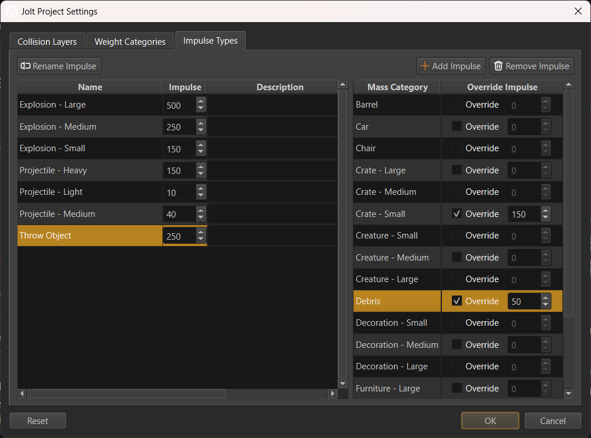

# Weights and Forces

For a physical simulation all dynamic objects (*rigid bodies*) muss have a mass. The unit for mass is *kilogramm* (kg). Heavier objects will require more force to alter their motion and they will push lighter objects out of their way.

Unfortunately, game physics engines don't work well with realistic masses. When two objects collide whose mass-ratio differs significantly (one is very heavy, the other is very light), the simulation becomes unstable. Often the lighter object will fly away at ridiculous speeds or get pushed through walls. But the heavy object may also react unrealisticly.

Consequently, it is best to only use masses within a certain range. For example, no object should have a mass lower than *1 kg* and no object should be heavier than *1000 kg*. Fortunately, it isn't important for objects to have exact masses, there is a lot of room for deviation without it being noticeable. Therefore, you can treat mass as a value that only needs to be somewhat correct in relation to another object. E.g. an object that is in reality significantly heavier than another, should also have a significantly larger mass in game, but the exact values don't matter much.

## Weight Categories

All physical object masses are configured through so-called **Weight categories**.

Weight categories solve the problem of managing masses for many objects. They allow you to define named categories for common weights in your game (e.g., *Small Crate*, *Barrel*, *Car*). Instead of setting the mass for each object individually, you select a weight category for it. If you later decide that all *Barrel* objects should be heavier or lighter, you can simply adjust the category's value, and all objects using that category will update automatically.

Weight categories are configured through the dialog at *Project > Plugin Settings > Jolt Project Settings...*.

If you do want to set the mass for an object directly, use one of these weight categories:

* **Custom Mass**: Use this when you want to specify the exact mass for an object directly.

* **Custom Density**: Use this to specify a density for the object. Its mass will then be calculated from its volume. This way the mass automatically scales with the object size, however, since volumes scale exponentially (a twice as large box has eight times the volume) this has to be used carefully.

### Weight Scale

The *weight scale* parameter allows you to adjust the weight from the weight category within a limited range. This is only meant for small tweaks and shouldn't be used too much.

## Impulse Types

When a game wants to push physical objects (for example in an explosion or a bullet hit), it has to apply an *impulse*. The impulse strength and the mass of the affected object determine how far the object will be pushed.

Using the same impulse strength to push all object types rarely gives the desired result. An impulse that may only barely move a heavy object, might already make a small object fly away at high speed.

*Impulse types* allow you to define named categories for different kinds of physical impulses. An impulse type has a default impulse strength, but this value can be overridden for each *weight category*.

When an impulse should be applied to an object, you don't specify the impulse strength directly, but instead select an impulse type. This is then used to look up whether there is a specific impulse strength value for the weight category of the pushed object. Otherwise the default strength of that impulse type is used. This way an explosion can push objects, using different impulse strengths, such that the overall result looks pleasing.

Impulse types are configured in the *Project > Plugin Settings > Jolt Project Settings...* dialog.

On the left-hand side, you specify the impulse types and their default strength. On the right-hand side you can override the impulse strength for each weight category.

For example, in the image above the *Throw Object* impulse type has a default strength of `250` but for *Crate - Small* and *Debris* there are overrides to reduce the strength, to prevent these light object types from being thrown too far.

## See Also

* [Jolt Dynamic Actor Component](../actors/jolt-dynamic-actor-component.md)
* [Jolt Ragdoll Component](../ragdolls/jolt-ragdoll-component.md)
* [Jolt Rope Component](../special/jolt-rope-component.md)
