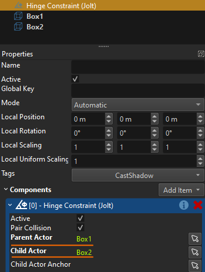
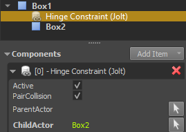

# Jolt Constraints

A *Jolt constraint* is a component that links [Jolt actors](../actors/jolt-actors.md) to constrain their movement. Constraints are often also called *joints*. There are multiple types of constraints that each constrain the actors in different ways.

Constraints can be used for simple things like door hinges, up to complex configurations like rag dolls.

## Joining Actors

Constraints can be used to link:

* Two [dynamic actors](../actors/jolt-dynamic-actor-component.md). This will create a more complex dynamic object that can still freely move throughout the scene, but has multiple parts that can wiggle around.
* One [static actor](../actors/jolt-static-actor-component.md) with one [dynamic actor](../actors/jolt-dynamic-actor-component.md). In this case the dynamic actor is now constrained in its movement relative to the static actor. Since the static actor never moves, the dynamic actor's freedom is severely limited.
* One [dynamic actor](../actors/jolt-dynamic-actor-component.md) with no second actor. This just affixes the dynamic actor with 'the world'. This is effectively the same as joining it with another static actor.
* One [dynamic actor](../actors/jolt-dynamic-actor-component.md) with one [kinematic actor](../actors/jolt-dynamic-actor-component.md#kinematic-vs-simulated). If the kinematic actor moves, the dynamic actor is forced to follow according to the constraint between them. The dynamic actor does not affect the kinematic actor in any way. This setup is common to have full control over the movement of one part (the kinematic actor) and still get physically plausible behavior from another part.

There are two ways that a constraint component can link actors.

### Using Object References

You can use the [object references](../../../scenes/object-references.md) on the joint component to specify both the *parent actor* and the *child actor*:

With this method, the [game objects](../../../runtime/world/game-objects.md) for the actors and the joint don't need to have a specific hierarchy, they can be placed just next to each other. This also allows to create *loops* of linked actors. On the other hand, you always need to know exactly which actors shall be linked.

> **Note:**
>
> The `Child Actor` of a joint always has to be specified this way.

### Using the Object Hierarchy

To determine which `Parent Actor` to link the joint to, you can utilize the object hierarchy. If no parent actor is specified as an object reference, the joint will automatically traverse its object hierarchy upwards and search for the closest object with a static or dynamic actor. If it finds one, the joint will link to that object as the parent actor.

If it does not find any such actor on a parent node, the joint will attach to 'the world', meaning it will be fixed to its current world position.

This method can be useful especially when you want to put the joint into a [prefab](../../../prefabs/prefabs-overview.md). For example, if you have a prefab for a chandelier that can swing around, you can set up the joint to only reference the actor that represents the chandelier, but the prefab does not contain an actor for the anchor point. If this prefab is placed into a scene, the rule that a joint *without* a parent actor just gets linked to the world, means that you can easily place these prefabs in a scene, and they will swing around the location where they have been instantiated.

However, if your scene contains for example a moveable room, you can also place it there and make sure to attach the chandelier prefab as a child node of the moveable room actor. That means, the joint of the chandelier will now link the chandelier actor with the moveable room actor, and thus whenever the room moves, the chandelier will be physically dragged along as well.

> **Important:**
>
> This method of linking actors only works properly, if the parent actor is either **static** or **kinematic**. It doesn't work for simulated dynamic actors, as the transform update introduces jitter.

## Constraint Position

The position and rotation of a constraint specifies the pivot point. For [hinge constraints](jolt-hinge-constraint-component.md), [point constraints](jolt-point-constraint-component.md), [cone constraints](jolt-cone-constraint-component.md) and [swing-twist constraints](jolt-swing-twist-constraint-component.md) the position of the joint determines around which point the linked actors rotate. For [fixed constraints](jolt-fixed-constraint-component.md) the position still affects how strong forces may become due to lever effects.

For [distance constraints](jolt-distance-constraint-component.md) the joint position determines from where the distance is computed. Only for [slider constraints](jolt-slider-constraint-component.md) is the position of the joint less relevant, though for computational stability, it should still be somewhere in between the linked actors.

## Video: Basic Setup

> **Note:**
>
> In the video we use PhysX joint components, but the concepts are identical for Jolt.

## Using the ChildActorAnchor Property

Using the `ChildActorAnchor` property is entirely optional and often not needed. Basically this option is used to reference any object, and tell the constraint that the position and orientation of that object should be the anchor point where the constraint acts upon the child actor. For most constraint types this is rarely needed. If you link two actors with a hinge constraint, the position of the constraint already defines where between the actors the hinge will be.

However, this setup always assumes that the two actors should start out in the 'default configuration' of the constraint. For example, for a hinge constraint with a stiff spring, the default configuration is when it is fully relaxed, meaning you could not put them into a start configuration where the constraint is already under tension.

Similarly, for a distance constraint, the child actor would always need to start out such that the constraint position is exactly at the position of the actor, where it should link to the actor. This can be problematic especially when the distance constraint uses a *minimum distance*, as the constraint would immediately push away the actor, potentially with high speed.

Using a dedicated object to specify the anchor point, both situations can be fixed. The anchor point specifies the position at which the constraint affects the child actor. For most constraint types the rotation of the anchor point is important as well. If the anchor's transform is identical to the constraint's transform, it is redundant and could be left out. However, if it is different from the constraint's transform, this difference tells the constraint how much its start state deviates from the 'default configuration'. For example for a hinge constraint the position of the anchor should always be identical to the constraint's position, otherwise the child actor will jerk towards the hinge constraint at startup. However, the rotation may deviate from the constraint's rotation, which specifies how much the constraint is already rotated at startup.

### Video: How to use the Anchor Property

> **Note:**
>
> In the video we use PhysX joint components, but the concepts are identical for Jolt.

## Shared Constraint Component Properties

These properties are shared among all joint types:

* `PairCollision`: If disabled, joined actors will not collide with each other. This can be preferable, because then the joined actors may overlap.
* `ParentActor`, `ChildActor`: References to objects with [actor components](../actors/jolt-actors.md) to link with this constraint. See [joining actors](#joining-actors) above.
* `ChildActorAnchor`: An optional reference to an object that tells the constraint where it should attach to the child actor. See [using the ChildActorAnchor property](#using-the-childactoranchor-property) above.
* `BreakForce`, `BreakTorque`: If either of these values is larger than zero, the constraint is *breakable*. That means if during the physics simulation the force or torque acting upon the constraint exceeds this threshold, the constraint will be deleted and the bodies won't be joined any longer. When this happens, `ezMsgPhysicsJointBroke` will be sent as an [event message](../../../runtime/world/world-messaging.md).

## Constraint Types

These types of constraints are currently available:

* [Jolt Hinge Constraint Component](jolt-hinge-constraint-component.md)
* [Jolt Point Constraint Component](jolt-point-constraint-component.md)
* [Jolt Fixed Constraint Component](jolt-fixed-constraint-component.md)
* [Jolt Slider Constraint Component](jolt-slider-constraint-component.md)
* [Jolt Distance Constraint Component](jolt-distance-constraint-component.md)
* [Jolt Cone Constraint Component](jolt-cone-constraint-component.md)
* [Jolt Swing-Twist Constraint Component](jolt-swing-twist-constraint-component.md)

## Constraint Stability

Joining multiple actors in a chain can quickly result in really bad simulation results. Have a look at [dynamic actor simulation stability](../actors/jolt-dynamic-actor-component.md#simulation-stability) for ways to improve this. When working with constraints the following aspects help a lot:

* Make sure that the involved actors are not too light. For smaller objects the automatically computed mass is often too low for the constraint to be stable.
* Drastically increase linear and especially angular damping on the actors (`0.1` to `0.8`).
* Don't create very long chains, try to achieve the desired result with as few constraints as possible.
* Don't use constraint limits (hinge constraint, swing-twist constraint), they can add significant instability.

## See Also

* [Jolt Actors](../actors/jolt-actors.md)
