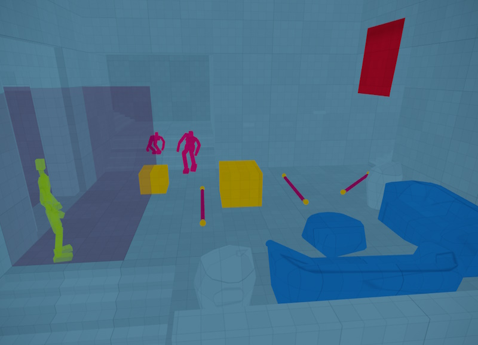
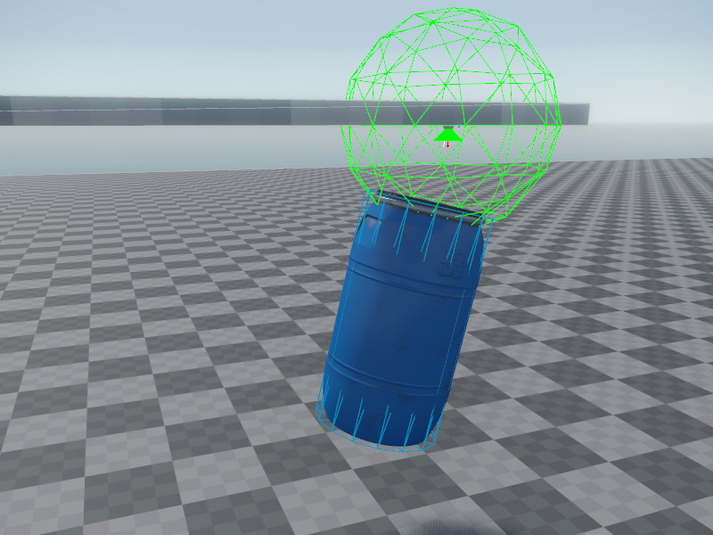

# Jolt Debug Visualizations

To debug physics issues it can be very valuable to visualize certain aspects of the Jolt simulation.
Debug visualizations are enabled through [CVars](../../debugging/cvars.md).

## Visualize Jolt Geometry

These [CVars](../../debugging/cvars.md) enable rendering of the Jolt collision geometry:

* `Jolt.Visualize.Geometry`: Enables visualization of physics collision geometry.
* `Jolt.Visualize.Exclusive`: Disables rendering of regular geometry.
* `Jolt.Visualize.Distance`: Configures the distance up to which Jolt geomtry gets extracted from objects.

The collision geometry is rendered using these color codes:

* *light blue* = [static geometry](actors/jolt-static-actor-component.md)
* *dark blue* = [kinematic](actors/jolt-dynamic-actor-component.md)
* *yellow* = [dynamic bodies](actors/jolt-dynamic-actor-component.md)
* *green* = [query shapes](actors/jolt-queryshape-actor-component.md) (or [hitboxes](ragdolls/jolt-hitbox-component.md))
* *pink* = [ragdolls](ragdolls/jolt-ragdoll-component.md) and ropes[Jolt Rope Component](special/jolt-rope-component.md)
* *red* = soft bodies
* *transparent* = [triggers](actors/jolt-trigger-component.md)

## Debug Draw Constraints

The *debug draw* CVars enable wireframe overlays which are mainly useful to debug issues with constraints. This visualization has a high performance impact and thus should only be used in very small test scenes.

These debug draw [CVars](../../debugging/cvars.md) are available:

* `Jolt.DebugDraw.Bodies`: Enables visualization of physics bodies.
* `Jolt.DebugDraw.Constraints`: Enables basic visualization of [constraints](constraints/jolt-constraints.md).
* `Jolt.DebugDraw.ConstraintFrames`: Enables more detailed visualization of constraints.
* `Jolt.DebugDraw.ConstraintLimits`: Enables visualization of constraint limits.

## Video: How To Visualize Physics Colliders

Click the image below to watch the video:

## See Also

* [Jolt Integration](jolt-overview.md)
* [Jolt Physics Settings Component](jolt-settings-component.md)
