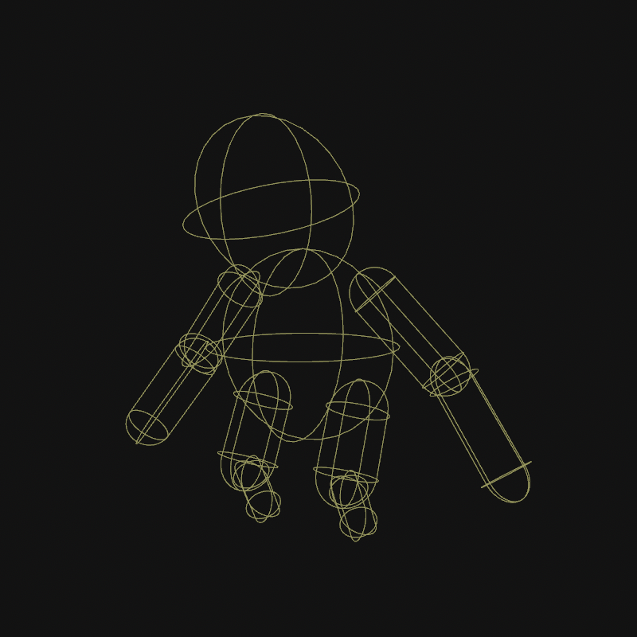

# Jolt Hitbox Component

The *Jolt hitbox component* is used to add collider shapes to an [animated mesh](../../../animation/skeletal-animation/animated-mesh-component.md).

The component must be attached next to another component that defines the [skeleton](../../../animation/skeletal-animation/skeleton-asset.md) to use, for instance an [animated mesh component](../../../animation/skeletal-animation/animated-mesh-component.md) or a [skeleton component](../../../animation/skeletal-animation/skeleton-component.md). It will then use that skeleton to create the physics shapes.

Consequently, the configuration of the hitbox shapes is set up through the [skeleton asset](../../../animation/skeletal-animation/skeleton-asset.md).

The hitboxes are usually used to be able to shoot an animated character. Although they share the collider setup with the [Jolt ragdoll component (TODO)](jolt-ragdoll-component.md), hitboxes and ragdolls are separate features that can be used independently of each other. For example, while a character is alive, it would use hitboxes, so that raycasts can determine where it would be hit, but it would not use a ragdoll component yet. Once a character dies, a ragdoll component would be activated to make it fall to the ground. The hitbox component could now be deactivated (which also makes sense for performance reasons), since it's functionality may not be needed anymore.

## Component Properties

* `Query Shapes Only`: If true, the shapes that get created act the same way as [query shape actors](../actors/jolt-queryshape-actor-component.md). That means the shapes can be detected via raycasts and other shape queries (e.g. the [projectile component](../../../gameplay/projectile-component.md) will be able to hit it), but otherwise they don't participate in the physical simulation. If set to false, full kinematic shapes are used, which means the shapes will push all [dynamic actors](../actors/jolt-dynamic-actor-component.md) aside. This is rarely desired, usually one would rather use a [character controller](../special/jolt-character-controller.md) or a single kinematic actor in the form of a capsule to represent the animated mesh, but in some exceptional cases it might be useful.
* `Update Threshold`: How often the hitboxes are updated to follow the animation. At 0, they are updated every frame. If perfect alignment with the animation is not necessary, it is better for performance to use a larger time step.

## See Also

* [Jolt Ragdoll Component (TODO)](jolt-ragdoll-component.md)
* [Jolt Query Shape Actor Component](../actors/jolt-queryshape-actor-component.md)
* [Skeleton Asset](../../../animation/skeletal-animation/skeleton-asset.md)
* [Skeletal Animations](../../../animation/skeletal-animation/skeletal-animation-overview.md)
