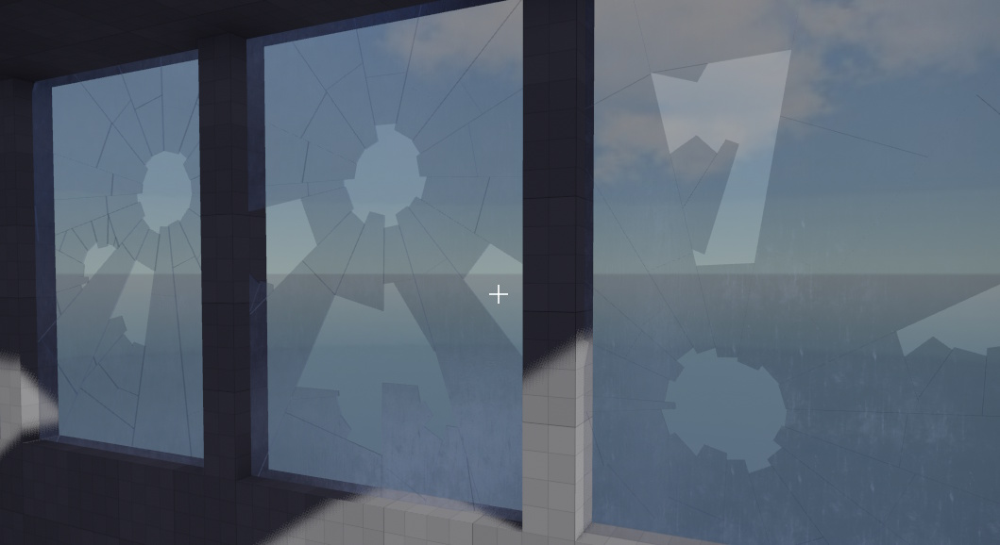

# Jolt Breakable Slab Component

The *Jolt breakable slab component* simulates a destructible surface that can shatter into smaller pieces (shards). It is useful for creating breakable glass, wood, or stone surfaces in your scenes. When broken, the shards become dynamic physics objects.

Jolt breakable slabs can be anchored on any of their edges, allowing you to control which sides remain fixed after breaking. The component supports different shapes and various break patterns, such as radial (like glass) or cellular (Voronoi, like stone or wood). Shards can be shattered by direct impact or scripted events.

## Component Properties

* `Width`, `Height`, `Thickness`: The size of the slab.
* `Material`: The [material](../../../materials/materials-overview.md) used for rendering the slab.
* `UVScale`: The scaling factor for texture UV coordinates.
* `CollisionLayerStatic`: The [collision layer](../collision-shapes/jolt-collision-layers.md) for the unbroken slab and the static shards.
* `CollisionLayerDynamic`: The collision layer for the broken, dynamic shards.
* `Shape`: The basic shape of the slab (rectangle, triangle, or circle).
* `Flags`: Which edges of the slab are fixed/anchored in the world. Shards adjacent to fixed edges will not fall under gravity.
* `GravityFactor`: How strongly gravity affects the shards.
* `ContactReportForceThreshold`: When this is set to a value larger than `0`, physical contacts with other objects will be reported (to script code) with the `ezMsgPhysicContact` message. Then a script may react to such impacts by breaking the slab. Set this to `0` to ignore physical impacts. Note that this property can be adjusted dynamically, so for example an unbroken slab may ignore physical impacts, but once it got damaged, contacts can be used to break the object further.

## Scripting and Events

* `Restore()`: Restores the slab to its original, unbroken state.
* `ShatterAll(fShardSize, vImpulse)`: Shatters the entire slab into pieces of roughly the given size, applying an impulse to the shards.
* `ShatterCellular(vGlobalPosition, fCellSize, vImpulse, fMakeDynamicRadius)`: Shatters the slab using a cellular (Voronoi) pattern around a point.
* `ShatterRadial(vGlobalPosition, fImpactRadius, vImpulse, fMakeDynamicRadius)`: Shatters the slab in a radial pattern around a point.

## Usage Notes

* There is no built-in logic when to break the slab. Breakage always has to be triggered from user code, e.g. a script. This allows you to control the conditions for when and how to break the object. Check out the [Testing Chambers sample](../../../../samples/testing-chambers.md) and take a look at the scripts, for an example how to do this.
* Use the `Flags` property to control which edges are fixed. For example, a window pane may be fixed on all sides, while a hanging sign may only be fixed at the top.
* The break patterns and shard sizes can be customized for different visual effects.
* The component is designed for visual and gameplay effects, not for precise structural simulation.

## See Also

* [Jolt Cloth Sheet Component](jolt-cloth-sheet-component.md)
* [Jolt Rope Component](jolt-rope-component.md)
* [Collision Layers](../collision-shapes/jolt-collision-layers.md)
