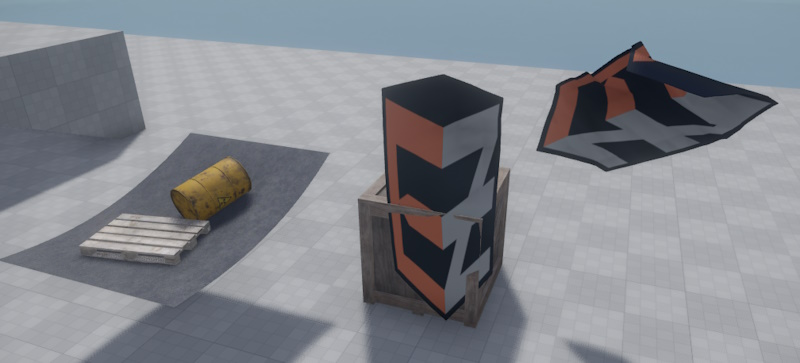

# Jolt Cloth Sheet Component

The *Jolt cloth sheet component* simulates a square patch of cloth as it hangs and swings in the wind. It is meant for decorative purposes such as flags but it also interacts with other physics objects. Note that this interaction isn't very precise and prone to tunneling as well as getting tangled up inside dynamic objects.

Jolt cloth sheets are affected by [wind](wind/wind.md) and contrary to the [cloth sheet component](../../../effects/cloth-sheet-component.md) they also interact with physics objects and collide with scene geometry.

## Component Properties

* `Size`: The physical size of the cloth sheet in the world.

* `Segments`: How detailed to simulate the cloth.

* `CollisionLayer`: The [collision layer](../collision-shapes/jolt-collision-layers.md) to use.

* `Damping`: How quickly the cloth loses energy while swinging. Higher values make it come to rest more quickly, low values make it swing for a longer time.

* `WindInfluence`: How strongly [wind](wind/wind.md) should make the cloth swing.

* `GravityFactor`: How strongly gravity pulls on the cloth.

* `Flags`: These define at which corners and edges the sheet of cloth is attached to the world.

* `Material`: The [material](../materials/materials-overview.md) used for rendering the cloth. Make sure to set it to *two-sided* for cloth that can be seen from both sides.

* `TextureScale`: Scale for the texture UV coordinates.

* `Color`: An additional tint-color for rendering.

## See Also

* [Cloth Sheet Component](../../../effects/cloth-sheet-component.md)
* [Jolt Rope Component](jolt-rope-component.md)
* [Wind](wind/wind.md)
