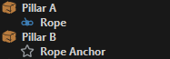

# Jolt Rope Component

The *Jolt rope component* is used to physically simulate ropes, cables and chains.

<video src="media/rope-swing.webm" width="600" height="600" autoplay loop></video>

Ropes can be attached to walls as decorative elements (cables, wires), or they can even be attached to [dynamic physics objects](../actors/jolt-dynamic-actor-component.md) to link them together. This can be used as a gameplay feature.

If all you need is a decorative rope, that doesn't react to physical stimuli (except [wind](../../../effects/wind/wind.md)), prefer to use a [fake rope component](../../../effects/ropes/fake-rope-component.md), as that has a much lower performance overhead.

## Setting Up a Rope

A rope requires two anchor points between which it hangs. One anchor point is the rope object position itself, for the other one typically uses a dummy game object. The `Anchor` [object reference](../../../scenes/object-references.md) is used to select which one to use.

In the object hierarchy it typically looks like this:

The position of the anchors can be moved in the 3D viewport to position the rope as desired. The approximate shape of the simulated rope will be shown as a preview. Use the `Slack` property to make the rope sag.

[Run the scene](../../../editor/run-scene.md) to see the final shape and behavior.

### Rendering

With just the rope simulation component, you won't be able to see the rope, at all. You also need to attach a [rope render component](../../../effects/ropes/rope-render-component.md) to the same game object.

### Examples

The [Testing Chambers](../../../../samples/testing-chambers.md) project contains a dedicated **Ropes scene** with many examples.

## Simulation Stability

See [Dynamic Actors - Simulation Stability](../actors/jolt-dynamic-actor-component.md#simulation-stability).

Overall the same guidelines to prevent stability issues apply here as well.

## Component Properties

* `Anchor1`, `Anchor2`: A [reference](../../../scenes/object-references.md) to an object whose position determines one end of the rope. If only one anchor is specified, the position of the rope component's owner object is used as the other end.

* `Anchor1Constraint`, `Anchor2Constraint`: How the rope is attached to each anchor:
    * `None`: The rope is not attached to the object, at all, and once the simulation starts, it will fall down at that end.
    * `Point`: The rope is attached with a point constraint and thus can freely rotate around that end.
    * `Fixed`: The rope won't be able to rotate around that end point. The orientation of the anchor is used to specified the direction of the rope there.
    * `Cone`: The rope can rotate around that anchor, but only within a cone of `MaxBend` opening. Similar to `Fixed`, the orientation of the anchor defines the starting direction of the rope.

  If an anchor object is attached to a [dynamic actor](../actors/jolt-dynamic-actor-component.md), the rope will pull that actor. Otherwise, the rope will be fixed at that static location. If the rope is not attached at one or both ends it is free to move away from there.

* `Mass`: The total mass of the rope. It will be distributed equally among all pieces.

* `Pieces`: How many individual pieces the rope is made up of. More pieces look prettier, but cost more performance and may decrease the simulation stability.

* `Slack`: How much slack the rope has. A value of zero means the rope is hung perfectly straight between its anchors. Positive values make the rope sag downwards. Negative values are also allowed, they make the rope hang upside down. This is useful to create a longer rope that shouldn't spawn inside the ground. The rope can thus be placed above the ground and it will simply fall down after creation.

* `Thickness`: How thick the simulated rope is. This may be very different from how thick it is rendered. A thinner rope will have more simulation issues, such as tunneling through other geometry.

* `BendStiffness`: Determines how hard it is to deform the rope.

* `MaxBend`, `MaxTwist`: These angles restrict how much each individual pieces in the rope can bend or twist relative to its neighboring piece. Low angles mean the rope is very stiff. A very flexible rope would use values above 45 degrees.

* `CollisionLayer`: The [collision layer](../collision-shapes/jolt-collision-layers.md) defines with which other objects the rope collides.

* `Surface`: The [surface](../../../materials/surfaces.md) defines how slippery or bouncy the rope is.

* `GravityFactor`: How much gravity affects the rope.

* `SelfCollision`: Whether the rope should be able to collide with itself.

* `ContinuousCollisionDetection`: If enabled, the physics simulation tries harder to prevent the rope from passing through other objects. This costs additional performance.

## See Also

* [Fake Rope Component](../../../effects/ropes/fake-rope-component.md)
* [Rope Render Component](../../../effects/ropes/rope-render-component.md)
* [Jolt Actors](../actors/jolt-actors.md)
