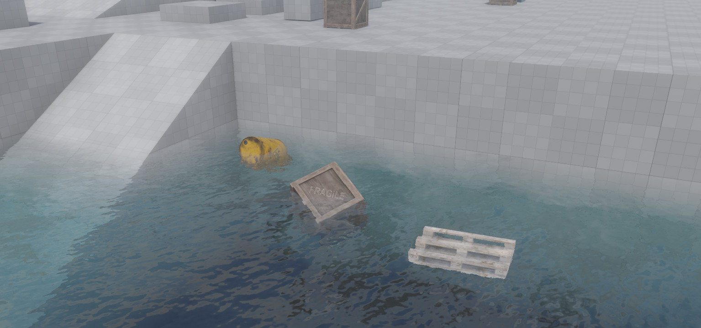

# Jolt Water Volume Component

The *Jolt water volume component* creates a box-shaped region that simulates water. It applies buoyancy forces to [dynamic actors](../actors/jolt-dynamic-actor-component.md) that enter the volume, and can trigger [surface interactions](../../../materials/surfaces.md) such as splash effects.

Objects inside the water volume are pushed upward against gravity (buoyancy) and experience drag that slows their motion. Whether an object floats or sinks is controlled by the `BuoyancyFactor` property on the dynamic actor itself. The water can also flow in a given direction, and its effective surface height can be randomized with Perlin noise to simulate choppy water.

## Setup

The water volume component requires a [Jolt trigger component](../actors/jolt-trigger-component.md) on the **same game object**. The trigger detects when dynamic actors enter and leave the water volume. Without the trigger component, no buoyancy will be applied and a warning is emitted at simulation start.

> **Note:** Only [dynamic actors](../actors/jolt-dynamic-actor-component.md) are affected by the water volume. Static and kinematic actors are ignored.

## Buoyancy Factor

How an object behaves inside the water is determined by the `BuoyancyFactor` property on the `ezJoltDynamicActorComponent`:

* **> 1.0** — Object floats upward (default is 1.1, which causes slight floating).
* **= 1.0** — Neutral buoyancy; the object neither rises nor sinks.
* **< 1.0** — Object sinks to the bottom.

## Water Surface Plane

The water surface is computed automatically from the extents of the volume. It is always the face of the box that points most *against* gravity — i.e., the top face under normal gravity. If the game object is rotated, or if gravity changes direction, the surface plane is updated accordingly.

When a dynamic actor is submerged, the buoyancy impulse is calculated relative to this surface plane. The `NoiseStrength` property further varies the perceived surface height per actor position, creating a natural floating motion.

## Rendering the Water Surface

The water volume component handles physics only. It does not render anything by itself. To make the water visible, you need a separate mesh object (typically a plane) positioned at the water surface, with a custom water material applied to it.

Water rendering typically requires effects such as transparency, refraction, and animated normals (waves). The built-in [default material](../../../materials/materials-overview.md) is not suitable for this. Instead, you need to write a [custom shader](../../../graphics/shaders/shader-templates.md) or use the [Visual Shader Editor](../../../materials/visual-shaders.md) to create a water material.

## Component Properties

* `Extents`: The size of the water volume box along each local axis. Default is (10, 10, 10). Use the in-editor box manipulator to resize it visually.

* `Flow`: Direction and speed of water flow in **local space**. This vector is transformed to world space at runtime. A flowing current pushes submerged actors in the given direction. Set to zero for still water.

* `NoiseStrength`: Adds Perlin noise to the effective water surface height at each actor's position. A value of `0` means a flat surface. Higher values produce choppier water where objects bob more unevenly.

* `Surface`: A [surface resource](../../../materials/surfaces.md) used to determine splash and interaction effects when actors enter the water. Only the interaction effects of the surface are used; its physical material properties are not applied.

* `Interaction`: Which interaction type (as defined in the surface resource) to trigger when a dynamic actor enters the water volume. Typically used to spawn splash particle effects.

## See Also

* [Jolt Dynamic Actor Component](../actors/jolt-dynamic-actor-component.md)
* [Jolt Trigger Component](../actors/jolt-trigger-component.md)
* [Surfaces](../../../materials/surfaces.md)
* [Visual Shaders](../../../materials/visual-shaders.md)
* [Custom Shaders](../../../graphics/shaders/shader-templates.md)
