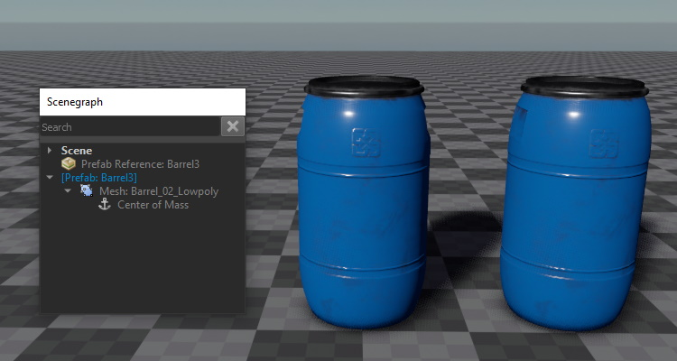
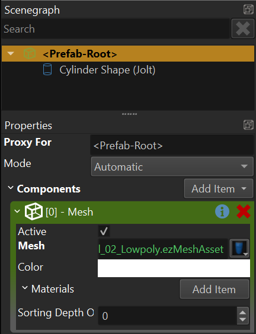

# Prefabs

When you build a game you need many different objects that you can place in your world. The complexity of objects can range from very simple objects with just one node and component, up to thousands of nodes and components. Some will be placed in scenes, others need to be instantiated dynamically at runtime.

These *prefabricated* objects are commonly referred to as *prefabs*. Generally, prefabs in EZ are the same as [scenes](../scenes/scene-editing.md). Therefore the workflow for creating prefabs is mostly identical.

## Video: How to use Prefabs

## Templates and Instances

When talking about prefabs, you need to distinguish between *prefab templates* and *prefab instances*.

A *prefab template* is the "original" object. For each prefab there is always exactly one template, which is stored in a dedicated file. When you want to change a prefab, you edit the template.

Once you place a prefab in a scene, that object is a *prefab instance*. You can create as many instances as you want, and they will all reference the same template.

The idea of prefabs is, that when you modify the *template*, all *instances* will automatically update to reflect these changes. This way you can set up placeholder templates early in your project and start instantiating them right away. Over time you can then flesh out the prefabs, without having to manually update your scenes.

### Instantiation Process

A prefab is basically just a chunk of a level. It contains game objects (entities / nodes) with components. For example a *box prefab* would contain a single game object, a [mesh component](../graphics/meshes/mesh-component.md), a [physics actor component](../physics/jolt/actors/jolt-actors.md) and a [physics box shape](../physics/jolt/collision-shapes/jolt-shapes.md). Together these make up an object that looks like a box and behaves like a box.

Now if you want to have such a box in your scene, you need to add a copy of this structure in your level. To have multiple boxes in your scene you would need to copy the same structure multiple times into the scene, and you need to adjust their positions for each object to end up in the desired place.

This is what *prefab instantiation* is doing for you. It integrates a copy of the prefab template into your scene. Since each object is a full copy, they can then change their state independently.

When a prefab is instantiated, it is decoupled from its template, as it is now a separate copy. Therefore, changing the *template* will not affect existing *instances*. To have existing instances show the changes that were made to their template, they must be deleted and recreated from the template. For *engine prefabs* (see below) the editor does this automatically for you, so while editing a scene, changes to prefabs will always show up immediately. However, while you [run your scene](../editor/run-scene.md), instances cannot be replaced, as they would then lose all their simulation state.

For *editor prefabs* (see below), the process of updating an instance to incorporate the latest template changes is more complicated, which is why the editor will only do this upon request.

## Prefab Types

ezEngine distinguishes between two types of prefabs: **Editor Prefabs** and **Engine Prefabs**.

The difference between the two types is, when and where the prefab templates get instantiated. For *editor prefabs*, the editor instantiates the prefab template and shows all the nodes and components of the prefab in its scene graph. For *engine prefabs*, the instantiation happens in the engine runtime, here all the editor sees is a single node with a *prefab reference component*. The editor has no information about the prefab, other than its position.

The image above shows the same prefab instantiated in two ways. One of the barrels is an *engine prefab*. As you can see in the scene graph, there is only a single node for this object. The other instance is an *editor prefab* and the scene graph shows the full node hierarchy for it.

*Engine prefabs* are by far the preferred way to use prefabs. The editor needs to handle less state, the prefabs get automatically re-instantiated every time the template is updated and even when you [run a scene](../editor/run-scene.md) in an external application like [ezPlayer](../tools/player.md). Therefore, you can modify a prefab and just launch your stand-alone game, without the need to re-export any of your scenes, and the prefabs will show up in their latest state already. Since the prefab is only instantiated (ie. copied into your world) at runtime, this also takes up less space on disk and is generally more efficient.

*Editor prefabs* should generally be avoided, except for very rare, special cases. As you can see in the image above, the entire structure of the prefab is available in the editor scene graph. That means you can modify the instance. For example you could switch out a mesh, change a color or even add or delete nodes. Because of this extra flexibility, the editor cannot delete and re-instantiate a prefab when the template changes. Instead, it has to try to *merge* both your changes and the changes to the template. This process is much slower, and error prone, which is why the editor never does this automatically. Instead, you have to trigger this manually by selecting *Tools > Update Prefabs*.

The possibility to modify a prefab instance may sound appealing. However, *engine prefabs* allow you to [expose parameters](../scenes/exposed-parameters.md), which you can then set on the *prefab reference component*. This way you can control exactly which aspects of a prefab you want the user to be able to change.

It is possible to convert back and forth between engine prefabs and editor prefabs in the editor, through the context menu entries under *Prefabs > ...*. When doing so, all customizations to a prefab instance will be lost, though.

## Working with Prefabs

In the editor you typically instantiate a prefab by dragging and dropping it from the [asset browser](../assets/asset-browser.md) into the scene. By default this will create an engine prefab. If you hold `Shift` before starting to drag the prefab asset, it will be instantiated as an editor prefab.

If the prefab has [exposed parameters](../scenes/exposed-parameters.md), you can set these on the *prefab reference component*.

### Spawning Objects at Runtime

Much game functionality requires to spawn objects dynamically at runtime. This is only possible with *engine prefabs*. Things like the [spawn component](../gameplay/spawn-component.md) store a reference to a prefab [asset](../assets/assets-overview.md). They can then be triggered at any time to create a new instance of that prefab.

[Surfaces](../materials/surfaces.md) also reference prefabs, to provide dynamic effects like footsteps or bullet impacts.

### Prefab Instance Root Node

Prefab templates are allowed to have multiple top-level nodes. When a prefab is referenced in a scene, the node that holds the *prefab reference component* acts as a root node (or group node) for all nodes that will be instantiated from the template. All instantiated nodes will be attached to this parent node.

In the prefab asset, this parent node is accessible. By default, new prefabs have a root node called **<prefab-root>** which acts as a proxy node for the node on which the prefab template will be instantiated on.

This way you can add components directly to this entity. If you don't need access to this object, you can give the proxy object a different name, then it shows up as a regular game object and will become a child object of the prefab root node, when the prefab is instantiated.

All of this is especially important to keep in mind when writing custom (script) code that searches for a node within a hierarchy. You can give a name to the prefab reference node (the one that instantiates a prefab), and therefore find a specific instance of the prefab by that name. From there on, you can continue searching for nodes by name, and thus find a specific sub-node from the prefab template.

Another situation where this is important, is when a prefab needs to create components on the prefab instance entity. For example when setting up physical objects, it can be useful to add the [dynamic actor component](../physics/jolt/actors/jolt-dynamic-actor-component.md) to the *<prefab-root>* node. This way [constraints](../physics/jolt/constraints/jolt-constraints.md) can attach directly to a prefab. For instance, you can have two instances of a box prefab, and add a constraint (or a [rope](../physics/jolt/special/jolt-rope-component.md)) between them. As long as the dynamic actor exists directly on the prefab-root object, the constraint is able to attach to both boxes. If the actor component were on a sub-node instead, the constraint would not be able to find it, and wouldn't work.

## See Also

* [Scene Editing](../scenes/scene-editing.md)
* [Spawn Component](../gameplay/spawn-component.md)
* [Exposed Parameters](../scenes/exposed-parameters.md)
* [Object References](../scenes/object-references.md)
