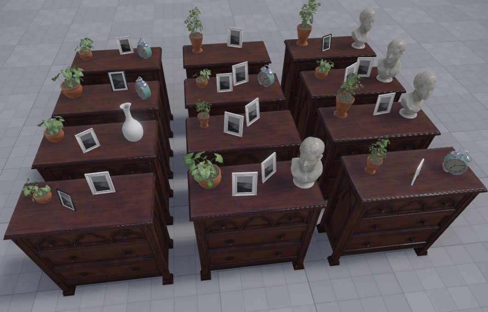

# Random Prefab Component

The *random prefab component* makes it possible to spawn prefabs randomly from a collection.

If this is used inside a prefab, instances of that prefab will appear differently. For example, in the image below the cupboard has 4 random objects, each from a different set of candidates and with some randomized position and rotation.

The randomization is *stable*, which means that simulating the same scene multiple times, always results in the same randomly placed objects.

## Component Properties

* `Preview`: If enabled, the randomized result will already be shown in the editor, while the scene is not simulating. This makes it easier to tweak the randomization. However, it can be useful to disable the preview, to have a cleaner scene while editing. This reduces visual clutter and may also improve performance, in case a lot of detail would be added this way.

* `Count`: How many objects to spawn.

* `Instantiate As Children`: If enabled, spawned objects will be attached to this object. Disable this when spawning physically simulated objects (e.g. [dynamic actors](../physics/jolt/actors/jolt-dynamic-actor-component.md)). Enable it, if the parent object is dynamic, and the spawned objects should move along with it.

* `Random Transform`: How much the position, rotation and scale may deviate from the base transform.

* `Random Color`: This allows to tint the color of the spawned objects.

* `Prefabs`: The list of prefabs to randomly choose from. The same prefab may appear multiple times, to increase the likelyhood that it is used. You can also add empty entries, for the possibility that no object gets spawned.

## See Also

* [Prefabs](prefabs-overview.md)
* [Spawn Component](../gameplay/spawn-component.md)
