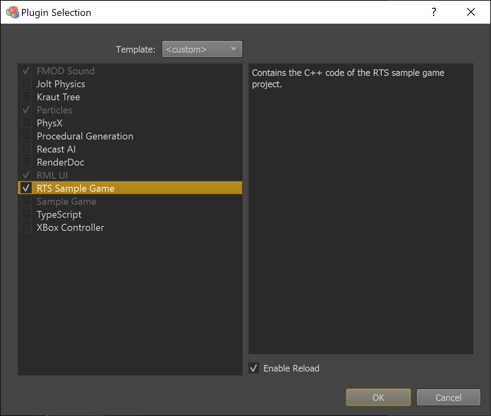

# Plugin Selection

Plugins are used to add functionality both to the runtime (the actual game) as well as to the editor. For example, sound, physics simulation, AI and GUI functionality are all added through plugins. Which of these features are required, of course, depends on the project. Therefore the set of active plugins is configured for each project.

## Modify the Set of Active Plugins

Under *Project > Plugin Settings > Plugin Selection* you can open the **plugin selection** dialog:



The list on the left lists all available plugins. Using the *Template* dropdown at the top, you can choose a default selection. The right-hand side shows a short description of the selected plugin.

Enable the checkmark for a plugin to make it active in this project.

> **NOTE:**
>
> Some plugins are mutually exclusive. In such a case, once one of them is activated, the others are greyed out.
> Similarly, some plugins depend on each other, in which case the dependent plugin is automatically enabled and can't be deselected.

### 'Enable Reload'

If you *Enable Reload* for a plugin, the engine will load a copy of the runtime plugin DLL, rather than the original DLL. This allows to edit and compile the DLL while the editor is running. Typically, this should only be active for a single, game-specific plugin. See [Hot Reloading C++ Game Plugins in the Editor](../custom-code/cpp/cpp-code-reload.md) for details.

## Custom Plugin Entries

If you have a [custom plugin](../custom-code/cpp/engine-plugins.md) that should show up in this list, you need to add an `ezPluginBundle` file.

### ezPluginBundle Files

Each ezPluginBundle file contains information for one plugin. Since the editor and the engine runtime are different processes, though, it is possible that one *logical* plugin actually consists of multiple DLLs. For example it is common that one DLL must be loaded into the runtime process (the actual game), another one into the editor process to add custom UI elements and a third one into the *editor engine process* for custom, editor-specific rendering.

How ezPluginBundle files work is documented inside this file:

> `Code/EditorPlugins/Assets/EditorPluginAssets/Assets.ezPluginBundle`

The editor searches for ezPluginBundle files in the binary folder where `Editor.exe` is located. All files that are found add an entry to the dialog. Typically the original ezPluginBundle file is stored next to the source code of a plugin and copied to the binary folder in a post-build step.

Examples for this can be found in the `CMakeLists.txt` files of existing plugins, for example in `Code/EnginePlugins/XBoxControllerPlugin/CMakeLists.txt`:

```cmd
add_custom_command(TARGET ${PROJECT_NAME} POST_BUILD
  COMMAND ${CMAKE_COMMAND} -E copy_if_different "${CMAKE_CURRENT_SOURCE_DIR}/XBoxController.ezPluginBundle" $<TARGET_FILE_DIR:${PROJECT_NAME}>
  WORKING_DIRECTORY ${CMAKE_SOURCE_DIR}
)
```

> **NOTE:**
>
> An `ezPluginBundle` file is automatically created and referenced for you, when you use the [C++ Project Generation](../custom-code/cpp/cpp-project-generation.md).

## See Also

* [Engine Plugins](../custom-code/cpp/engine-plugins.md)
* [C++ Project Generation](../custom-code/cpp/cpp-project-generation.md)
* [Hot Reloading C++ Game Plugins in the Editor](../custom-code/cpp/cpp-code-reload.md)
* [Sample Game Plugin](../../samples/sample-game-plugin.md)
