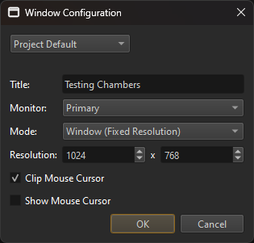

# Project Settings

Project settings are options that are configured once and affect the entire application. Most project settings can be configured from the editor, though some (currently) can only be configured by writing certain configuration files manually.

In the editor you will find the project settings under *Project > Project Settings > ...*.

## Data Directories

*Project > Project Settings > Data Directories...* opens a dialog to set up the [data directories](data-directories.md).

## Input Configuration

*Project > Project Settings > Input Configuration...* opens a dialog to [configure input actions](../input/input-config.md).

## Tags

*Project > Project Settings > Tags...* opens a dialog to configure which [tags](tags.md) are available in the project.

## Window Configuration

*Project > Project Settings > Window Configuration...* opens a dialog to configure the default window configuration when [running a scene](../editor/run-scene.md).

These settings allow you to configure basic window settings for Play-the-Game mode and when running an exported scene in [ezPlayer](../tools/player.md). A proper game would typically implement this logic in a custom [application](../runtime/application/application.md) and should allow the user to choose settings such as the resolution. The window configuration dialog is mainly for use during development.

There are two separately stored configurations:

**Project Default:** This configuration will be stored in the project folder and thus should be checked into source control to be shared with others.

**User Specific:** This configuration is only stored locally for the active user and not in the project directory. Therefore it cannot be checked into source control. It is meant for users who want to use settings different from the project default. For instance, when you have multiple monitors, you may want the exported scene to always appear on a specific one. This configuration must be enabled to override the default one.

Apart from the window position and size, the window configuration also controls the behavior of the mouse. If **Clip Mouse Cursor** is enabled, the mouse won't be able to leave the window area. This should be preferred for games that hide the mouse and only use relative mouse movement.

## Asset Profiles

*Project > Project Settings > Asset Profiles...* opens a dialog to edit [asset profiles](../assets/asset-profiles.md).

## Plugin Selection

Which optional functionality should be available is configured on a per-project basis. See the [plugin selection chapter](plugin-selection.md) for details.

If plugins provide additional editor options, they are typically found under *Project > Plugin Settings > ...*.

### Loading Plugins from Code

A custom [application](../runtime/application/application.md) or [game state](../runtime/application/game-state.md) can load plugins directly from code if necessary. For example the `ezInspectorPlugin` is automatically loaded for you by stock EZ applications, when building the code for development.

## FMOD

If the [FMOD Integration](../sound/fmod-overview.md) is enabled, *Project > Plugin Settings > FMOD Project Settings...* will be available to configure the speaker mode and which master sound bank to use.

## Jolt

If the [Jolt Physics Integration](../physics/jolt/jolt-overview.md) is enabled, *Project > Plugin Settings > Jolt Project Settings...* will be available to configure the [collision layers](../physics/jolt/collision-shapes/jolt-collision-layers.md).

## Video

## See Also

* [Projects](projects-overview.md)
* [Plugin Selection](plugin-selection.md)
* [Data Directories](data-directories.md)
