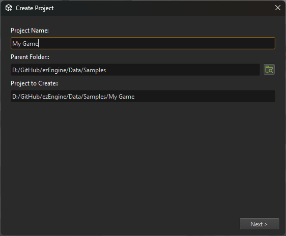

# Projects

The term *project* refers to one game or application, its global settings, and all its data. The editor distinguishes between projects, and allows you to configure various options of each one. On the runtime side, however, the concept of a project does not exist, the current state of the runtime represents the project. Therefore, when you switch to a different project in the editor, the engine will in fact be shut down completely and restarted with different settings (editor and engine are two separate processes).

## Video: How to create a project

**Note:** This video is slightly outdated, as there is now a creation wizard that makes things even easier.

## Creating a Project

You can use ezEngine entirely without the editor. In that case, you do not need to create a project, at all. Your [application](../runtime/application/application.md) is your project and you set up things like the [fileSystem](../runtime/filesystem.md), the [plugins](../custom-code/cpp/engine-plugins.md) and so on, entirely from code.

It is more convenient, though, to maintain your project through the editor. To create a new project, select `Project > Create Project...`. 

A creation wizard will show up:

Choose a name for your project and a location where it should be stored. The project name is used to create a new folder. 

> **Note:**
>
> The name of the folder represents the name of your project. This name is stored nowhere else, you can rename your project later simply by renaming the folder.

### Project Templates

In the next step you can choose a project template. If you choose a blank project, you get a mostly empty project and need to set up details yourself (see below).

If you choose a project template, many things will be configured up front, and your project will be populated with sample assets, that show how to achieve certain things.

The following project templates are currently available:

* [Basic FPS Project Template](../../samples/basic-fps-template.md)

## Configuring a Blank Project

If you choose to create a blank project, the creation wizard asks you to select which [plugins](plugin-selection.md) to use, since this also determines which [asset types](../assets/assets-overview.md) will be available. This can be adjusted later.

The editor will create a default 'Main' [scene](../scenes/scene-editing.md) for you, but other than that, only the assets from the `Base` [data directory](data-directories.md) are available.

## Project-Wide Options

You should be aware of these [project settings](project-settings.md), at some point you may need to adjust them for your purposes.

* [Data directories](data-directories.md)
* [Engine plugins](../custom-code/cpp/engine-plugins.md)
* [Collision layers](../physics/jolt/collision-shapes/jolt-collision-layers.md)
* [Input Configuration](project-settings.md#input-configuration)
* [Tags](tags.md)
* [Window Configuration](project-settings.md#window-configuration)
* [Asset profiles](../assets/asset-profiles.md)

Plugins may add additional options. 

Usually you should copy all required assets directly into your project folder, but in case that you want to share assets between multiple projects, you can put those assets into a dedicated folder and add that folder to your project as a [data directory](data-directories.md).

## See Also

* [Data Directories](data-directories.md)
* [Plugin Selection](plugin-selection.md)
