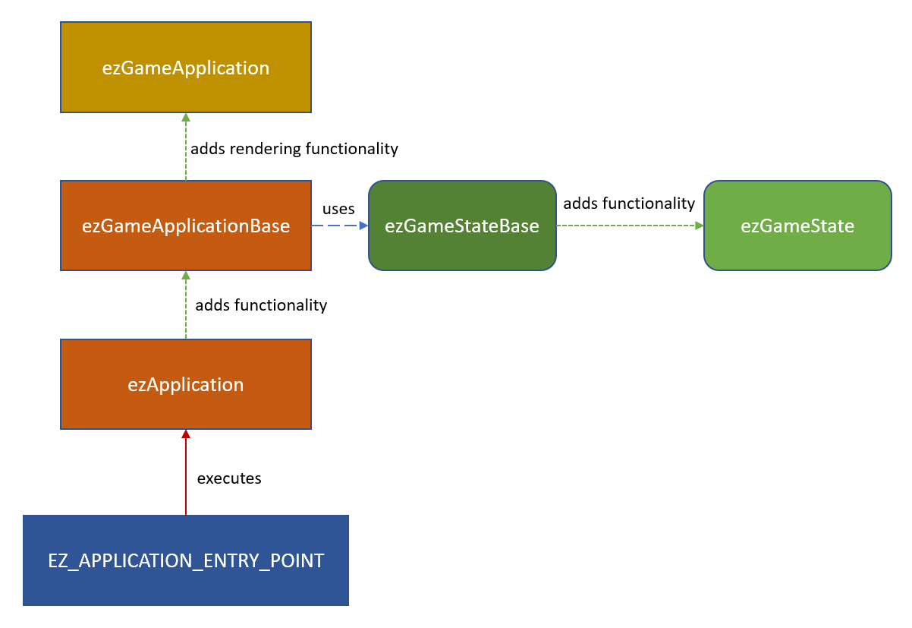

# Application

Every C++ application has one function that is the entry point for running the application. The name, signature and behavior of this function can differ across platforms. As a game developer you rarely care about interacting with the system on the lowest level. However, depending on what kind of application you write (for example a tool, rather than a game), you may either want to get a fully setup engine where all you add is your custom game code, or you may prefer to have a rather bare bones application, where you have full control.

Therefore EZ uses a number of abstraction layers, where each layer adds some functionality, and thus convenience for making a game. You build your application by overriding the layer that makes most sense for the intended use case.

> **NOTE**
>
> This is an *advanced* topic for people who are either building custom tools, using a completely custom renderer or are close to shipping and want a custom binary (rather than using [ezPlayer](../../tools/player.md)). As long as you only want to write  game code, add a [custom game state](game-state.md) inside an [engine plugin](../../custom-code/cpp/engine-plugins.md). See [C++ Project Generation](../../custom-code/cpp/cpp-project-generation.md) for the most convenient way to get started with this.

## Custom Application Use Cases

> **ATTENTION**
>
> Don't put game functionality into a custom application. If you do so, you'll lose the ability to test your game logic inside the editor. Only use a custom application to polish the overall game presentation.

There are two main situations in which you'll need to write your own application:

1. You want to write a custom tool. Usually a command line application to process some data.
1. You are preparing you game for shipping and don't want to run it through [ezPlayer](../../tools/player.md) anymore.

In the first case, you'll typically build your application on top of `ezApplication` which gives you a streamlined entry point similar to to a regular C++ `main` function.

In the second case you usually build your application on top of `ezGameApplication`. It is assumed that you already have a custom [Game State](game-state.md) anyway. The easiest way to get started, is simply to copy the [ezPlayer](../../tools/player.md) application and modify it to suit your needs, such as:

* Custom binary name
* Custom icon
* Startup videos
* Way to select graphics and other options
* Pause / mute game when it doesn't have focus

## Application Structure Diagram

The diagram below shows the structure that ezEngine uses. The chapters below describe each aspect in detail.



## Application Entry Point Macro

On the lowest C++ level platforms differ significantly how they execute an application. Therefore EZ uses the macro `EZ_APPLICATION_ENTRY_POINT` to generate the necessary, platform-specific code. This needs to be put into some cpp file of your application and you have to pass in the class name of your custom application. This class must be derived from `ezApplication` or `ezGameApplication`.

**Example:**

```cpp
class ezPlayerApplication : public ezGameApplication
{
  // ...
};

EZ_APPLICATION_ENTRY_POINT(ezPlayerApplication);
```

Some platforms (mainly Windows) differentiate between *console apps* and *window apps*. Console apps are executed inside a command prompt and typically do not have graphical output, whereas *window apps* create their own window to display output and interact with.

By default, applications are treated as *console apps* and thus show a command prompt on these platforms. This can be convenient for debugging, as you see the [log output](../../debugging/logging.md) there. To remove the command prompt, you need to configure your application as a *window app*. To do so, the *CMakeLists.txt* file for your application has to call `ez_make_windowapp`:

```cmake
ez_create_target(APPLICATION ${PROJECT_NAME})
ez_make_windowapp(${PROJECT_NAME})
```

### Injecting Custom Code

The preprocessor define `EZ_APPLICATION_ENTRY_POINT_CODE_INJECTION` can be used to insert additional code before the generated C++ *main* function. By default this is defined to be empty, but you can change this in your *UserConfig.h* file.

The main use case for this is to declare additional global functions or variables in your binary, which may modify how the OS or certain drivers treat your application. For example on Windows `EZ_WINDOWAPP_ENTRY_POINT` already adds `NvOptimusEnablement` and `AmdPowerXpressRequestHighPerformance`, which tell graphics drivers to prefer dedicated GPUs over onboard GPUs.

## ezApplication Based Apps

If you are building an application that doesn't need the full engine, derive your application class directly from `ezApplication`.

The most important functions to override are the following:

* `ezApplication::AfterCoreSystemsStartup()` - to configure systems
* `ezApplication::Run()` - the main loop

Note that `Run` will be called repeatedly until you call `RequestApplicationQuit()`.

For applications that process data and may be integrated into automatic build chains, it is also useful to use:

* `ezApplication::SetReturnCode()` - to set the return code passed to the operating system
* `ezApplication::TranslateReturnCode()` - to provide a human readable string for each return code

## ezGameApplication Based Apps

`ezGameApplicationBase` is built on top of `ezApplication` and implements the actual setup of the engine. It also adds the [Game State](game-state.md) functionality and other [common application features](common-application-features.md). `ezGameApplication` further adds functionality to setup the EZ renderer. In theory you can build a game that doesn't use the EZ renderer, by deriving from `ezGameApplicationBase`, but this is a very advanced topic and only makes sense in very specific circumstances.

In practice you should derive your game class from `ezGameApplication`, but be aware that there are additional virtual functions in `ezGameApplicationBase` that you can (and may need to) override.

These functions are of particular interest:

* `ezGameApplicationBase::CreateGameState()` - to hardcode which game state to use for your game
* `ezGameApplicationBase::FindProjectDirectory()` - to adjust where your project data is located
* `ezGameApplicationBase::Init_...()` - these init functions configure all sorts of aspects of the engine
* `ezGameApplicationBase::Init_ConfigureInput()` - you may need to set up input mappings for the main menu and closing the app
* `ezGameApplicationBase::Run_ProcessApplicationInput()` - handle input for the application

The best way to go about writing your own game application, is to copy the [ezPlayer](../../tools/player.md) code and adjust it to fit your needs.

If all you have is a game state, but you want to build a dedicated binary for your game, you can also do it like the [Asteroids sample](../../../samples/asteroids.md) which simply uses `ezGameApplication` directly to create an application instance with  a single line of code:

```cpp
EZ_APPLICATION_ENTRY_POINT(ezGameApplication, "Asteroids", "Data/Samples/Asteroids");
```

## Game State vs. Application

[Game States](game-state.md) play the role of encapsulating all of your game logic. Application classes are used to define how your app behaves within the operating system environment. The two are very clearly separated in what they are meant to do, thus there should never be the question whether you use a custom game state or a custom application. Everything that relates to the game logic should go into the game state. Only the few things that cannot be done there, should go into the application class.

The intended effect is, that you can [run your game](../../editor/run-scene.md) in the editor or through [ezPlayer](../../tools/player.md) and thus have multiple convenient ways to test it.

## See Also

* [Common Application Features](common-application-features.md)
* [Game States](game-state.md)
* [Startup System](../configuration/startup.md)
