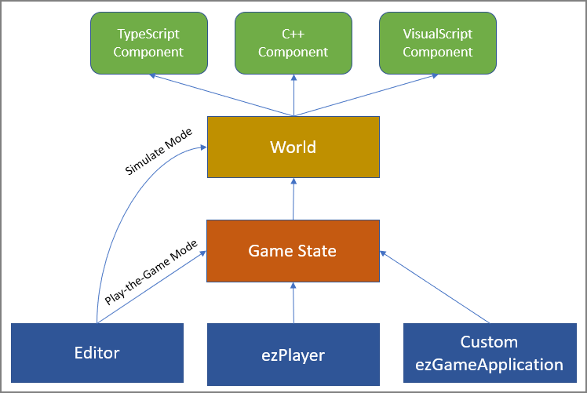

# Game States

Most game code is implemented by writing custom [components](../world/components.md). However, components always work in the context of an object, be it a single [game object](../world/game-objects.md) or an entire [prefab](../../prefabs/prefabs-overview.md). The most that a single component can be responsible for, is to do high level logic for a level, by acting as a [global message handler](../world/world-messaging.md#global-event-message-handlers).

However, for a full game you need a layer of control that is outside the world, where you can do logic like what level to load, what to do when the player dies or reaches their goal, how to display a main menu for the game settings and level selection, and so on. Most of these things would be possible with world components alone, but it would be cumbersome. Especially switching from one level to another is difficult, if some of your overall game logic has to be transitioned as well.

*Game States* are this extra layer. A game state sits between the [application (TODO)](application.md) layer and the [world](../world/worlds.md).

A game state is in so far optional, in that the engine will create an instance of `ezFallbackGameState`, if no custom game state is available. The diagram above shows, that the editor skips the game state in *simulate mode*. In practice that means that the editor will not allocate any game state when the scene is being edited or only simulated. Only when you enter *play-the-game mode*, will it create a game state, which can then take over full control for the windows, input and the main camera.

## Game State Responsibilities

The typical things that a game state controls are:

* Spawning one or multiple windows
* Setting up the main render pipeline
* Creating a world and loading a scene into it
  * Unless it's run in the editor, where it is handed an existing world
* Setting up input devices and bindings
* Processing main input (not component specific input)
* Setting up and controlling the main camera
* Spawning the player prefab
* Displaying game UI
* Providing a main menu
* Saving and restoring global state (progression, high-scores, etc)

For example when you have a [player start point component](../../gameplay/player-start-point.md) in a scene, the component itself doesn't do anything, it just holds some data. Instead, when you enter play-the-game mode, the active game state *can* (but is not required to) use the information from these components to spawn a player prefab.

Similarly, most scenes have a camera component whose usage hint is set to 'Main Camera' (this may be part of the player prefab). This camera defines what part of the scene will be shown on screen. At least that's how it appears. In reality it is the game state that controls the camera for the main render target. It's simply a feature of the `ezFallbackGameState`, that it searches the world for an appropriate camera component and applies that to the main camera. If it doesn't find any such camera component, it provides simple WASD fly-camera controls. You can even cycle through the different camera components in a scene using `Page Up` and `Page Down`.

As you can see, by implementing a custom game state, you can gain control over many things that otherwise appear to be built-in.

## Game State Instantiation

It is the responsibility of the `ezGameApplication` to instantiate a game state. By default this is done right at application startup, but if you write your own [application (TODO)](application.md) you could handle this differently. For example the editor only instantiates the game state for play-the-game mode.

The application knows what game states are available through the [reflection information](../reflection-system.md). When a game state is needed, all available ones are instantiated and 'asked' (via `ezGameStateBase::DeterminePriority()`) whether it is the right one to handle the situation. The game state that is the best fit will be kept and gets control.

The idea is, that there are typically only few game states available anyway. Usually you have the built-in `ezFallbackGameState` and then you have one other game state implementation from your custom game plugin. The latter one will take precedence. You could have multiple game states, for example when you have multiple game plugins loaded simultaneously, but then they would need to somehow figure out which one should get activated (e.g. through command line arguments).

## Sample Game State

For an example game state have a look at the [Sample Game Plugin](../../../samples/sample-game-plugin.md). The game state in the sample derives from `ezFallbackGameState` to benefit from its utilities, such as the default fly camera. In fact, it is a good idea to look at the source of `ezFallbackGameState` as an example, as well.

For all the details, read the [API Docs](../../api-docs.md) for `ezGameStateBase`.

## See Also

* [Custom Code](../../custom-code/custom-code-overview.md)
* [Application (TODO)](application.md)
