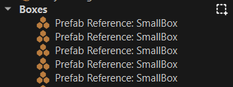

# Scene Editing

A scene or level is a [document](../editor/editor-documents.md) like all assets. To edit a scene there are multiple tools available. This page gives a broad overview what tools there are and in what order to try them out.

## Basics

### Open a Project and Scene

You can start editing an existing project and scene, or you can create your own. See the article about [projects](../projects/projects-overview.md) for how to do so. We suggest to start by looking at the [Testing Chambers](../../samples/testing-chambers.md) project, even if you then use an empty scene, as there are some useful prefabs in that project.

If you don't have a scene open yet, the easiest way is to set the *Filter* in the [asset browser](../assets/asset-browser.md) to **Scene** and then double click one of the scenes that belong to that project.

### First Steps

The very first thing you should familiarize yourself with is how to move the editor camera around the scene. The chapter about [camera controls](editor-camera.md#camera-controls) lists all the available options.

Next, try out [selecting objects](selection.md).

With one or multiple objects selected, you can try out the [editing gizmos](gizmos.md).

### Add Objects

The easiest way to add objects to a scene is to *drag and drop* existing items from the [asset browser](../assets/asset-browser.md) into the scene. You would mostly do this for [meshes](../graphics/meshes/mesh-asset.md) and [prefabs](../prefabs/prefabs-overview.md), but it works for many asset types. If you want to get your own assets into the editor, you should read up on how to [import assets](../assets/import-assets.md).

### Create Objects

You can build objects from the ground up by creating empty game objects and attaching components. Game objects mostly specify the position of an object, components give objects behavior.

The easiest way to create a new game object is to point somewhere with the mouse cursor and press `Ctrl + Shift + X` (or right-click and select *Create Object Here*). This will create a new game object at the position you pointed at. It also opens a context menu to select a [component](../runtime/world/components.md) to attach. Recently used component types are listed at the top. This way you can quickly create things like [light sources](../graphics/lighting/lighting-overview.md). If you cancel the context menu (e.g. via the `ESC` key), a [shape icon component](../Miscellaneous/components/shape-icon-component.md) is attached, whose sole purpose is to make that new object visible and selectable. You can remove that component as soon as you have no further need for it.

You can also right-click anywhere in the scene tree and select *Create Empty Child Object*.

When you copy an object (`Ctrl + C`), you can also point anywhere and *paste* (`Ctrl + V`) to create a duplicate at that position.

### Editing Object Hierarchies

The way objects are parented to each other is often very important. There are multiple ways to change the hierarchy:

* **Drag and drop:** In the *Scenegraph* panel, you can drag and drop a node onto another node to parent it to that.

* **Right-click -> Detach:** Selecting *Detach* from the context menu, will make a node a top-level game object that has no parent.

* **Right-click -> Attach to This:** Selecting *Attach to This* from the context menu, will make the selected node a child of the object that you pointed at in the viewport.

* **Paste As Child:** When you copied an object, you can select a desired parent node and then use *Paste As Child* from the context menu, to paste a new object and attach it to the selected object right away.

#### Video: How to parent objects

### Blocking Out a Scene

To get some geometry into your scene, you can use the [greyboxing](greyboxing.md) tool. The nice thing about greyboxing geometry is, that it automatically sets up colliders, as well, thus once you try to play your game, you won't fall through the geometry.

### Play

You can now try to [run your scene](../editor/run-scene.md). If you use the [Testing Chambers](../../samples/testing-chambers.md) sample project, and you created an empty scene, make sure to add a [Player Start Point](../gameplay/player-start-point.md) and make it reference the `Player` prefab. This way when you use *Play-the-Game* mode, you get a first person shooter game play experience.

## Advanced

Now that you know the basics, you can explore some of the more advanced functionality.

### Views

Apart from the single 3D perspective view, there are also orthographic views and different types of render modes. [This article](../editor/editor-views.md) describes all the details.

### Materials

Materials are what is used to give objects a texture. There is much more to this and the [chapter about materials](../materials/materials-overview.md) lists all the details, but for the time being you can get away with just the most simple material setup. For instance, when you [import](../assets/import-assets.md) a [mesh](../graphics/meshes/meshes-overview.md), it may add materials automatically for you. Usually you just need to make sure that the paths to the referenced [textures](../graphics/textures-overview.md) are correct.

### Physics

The fun really starts once you get to play around with physics. Read up on the [Jolt Physics integration](../physics/jolt/jolt-overview.md) for this. For a basic setup you always need at least an [actor component](../physics/jolt/actors/jolt-actors.md) ([static](../physics/jolt/actors/jolt-static-actor-component.md) for scene geometry, [dynamic](../physics/jolt/actors/jolt-dynamic-actor-component.md) for stuff that should fall down) and a [shape component](../physics/jolt/collision-shapes/jolt-shapes.md) to give the object a physical shape.

### Advanced Editing

Once you have *one* physically correct falling box, you may want to have one hundred. Using [these tools](advanced-object-transform.md), you are only a few clicks away from that.

### Active Parent

Usually when you drag assets into a scene, they are created on the top level of the scene hierarchy. However, you may prefer that they get added into a specific group right away.

To do so, you can specify one game object to be the **active parent**. To do so, right click on a game object in the scene tree and choose *Set Active Parent* or use the shortcut `Ctrl + Shift + A`.

From now on, all objects that get created through asset drag & drop, of through *Create Object Here* (`Ctrl + Shift + X`) will be created below this object. The active parent object is indicated by a selection box icon next to it:

To reset this, right click in the scene tree and choose *Clear Active Parent* (`Ctrl + Shift + C`).

> **Note:**
>
> The active parent does not affect copy & paste or duplicate. These operations always use the parent of the currently selected object, such that the new objects become siblings of the selected object.

### Scene Layers

Once your scene starts to become bigger, you may want to use [scene layers](scene-layers.md) for better organization.

## Video

## Next Steps

Now that you are familiar with how to create, edit and test a basic scene, there are many other things to explore. [Decals](../effects/decals.md) and [particle effects](../effects/particle-effects/particle-effects-overview.md) can make your scene more interesting. Proper [sounds](../sound/sound-overview.md) add a lot of atmosphere. And finally, by writing [custom code](../custom-code/custom-code-overview.md), either in C++ or through scripting, you will bring your own game idea to life.

## See Also

* [Asset Browser](../assets/asset-browser.md)
* [Editor Camera](editor-camera.md)
* [Editing Gizmos](gizmos.md)
* [Greyboxing](greyboxing.md)
* [Running a Scene](../editor/run-scene.md)
