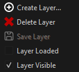

# Scene Layers

By default all objects that you create in a scene end up in the same overall structure and are saved in the same `.ezScene` file. Since scenes quickly become full of objects, it can become difficult to keep things organized in a useful way. Additionally, since all objects are stored in the same file, it is not possible to have multiple people edit the same scene simultaneously. Instead, you have to make sure that each scene is always only edited by one person at a time, and then synchronized to others, before they can make a change.

**Scene layers** are a concept that is meant to help both with generally organizing a scene, as well as splitting it up in a way that enables people to collaboratively work on it to some degree.

## Managing Scene Layers

Scene layers are managed through the *Layers* panel:

Here a scene is divided up into 4 different layers. Each layer is stored on disk as a dedicated `.ezSceneLayer` file, except for the main layer, which is stored in the `.ezScene` file itself.

Layers are added and deleted through the context menu:

> **Note:**
>
> Once a layer is created, it can't be renamed (other than renaming the file on disk manually).
> Another option is to create a new layer, and move all objects there, then delete the old one.

## Main Layer

Every scene has exactly one *main layer*, the one that is represented by the `.ezScene` file itself. The main layer always has the name of the scene itself. It is the only layer that can't be unloaded and it stores references to all the other layers. Thus adding or removing a layer is always a modification of the main layer as well.

## Active Layer

The layer that is *selected* in the *Layers* panel is considered to be the **active layer**. The *Scenegraph* panel displays the list of objects that are part of the active layer.

When you [select an object](selection.md) in the viewport, the active layer is automatically set to be the one that contains the selected object.

## Layer Visibility

The *eye icon* next to each layer indicates whether a layer is *visible*. Click the icon or use the context menu to toggle the layer's visibility. When a layer is set to invisible, all objects in it are hidden during editing. This is effectively the same as [hiding all objects](editor-camera.md#showhide-objects), though it is more convenient when you put objects that often need to be hidden, into their own layer.

## Load / Unload Layers

Every layer is either *loaded* or *unloaded*. By default all layers are *loaded*. Layers can be unloaded through the context menu or by clicking the *folder icon* next to them in the *Layers* panel. If you unload a layer, all its objects get removed from the scene. It is then not possible to select or edit any of them, and selecting that layer won't make it *active*.

Unloading layers thus can be used as a way to not only *hide* objects, but to properly remove them (temporarily). This can be beneficial in large scenes, to improve performance.

## Moving Objects between Layers

When you create a new object, it is always put into the *active layer*. To move an object to another layer, drag and drop it from the *Scenegraph* panel onto another layer in the *Layers* panel.

## Undo/Redo across Layers

Every layer has its own *undo stack*, meaning the list of operations that were executed while it was active. Clicking *undo* will change only the active layer, never any other layer, and it will not switch to another layer either.

Operations such as moving an object from one layer to another, are effectively two operations. A *delete operation* on the active layer, and an *add operation* on the target layer. Thus undoing the move operation right away, will only undo the delete operation, and thus you end up with a duplicate. Similarly, undoing the operation only on the target layer will only undo the add operation and thus delete the object altogether. To properly undo operations that operate across layers, you need to undo one step in all affected layers. The editor doesn't do this automatically for you, since you might have done additional operations on those other layers already and thus it can't guarantee to do the right thing.

## Exporting Scenes with Layers

When [exporting a scene](../editor/run-scene.md#export-and-run) all data is exported into a single file. Currently there is no runtime concept of layers (although this may be added later, since this can be useful for streaming large worlds).

However, only the objects from *loaded layers* are put into the exported scene file. *Unloaded layers* don't contribute to the result. This can be utilized to export only a part of a scene to speed up loading times during testing.

## Saving Scenes with Layers

Since every layer is a separate file, each one also has its own modified flag (the star next to its name, indicating that it was changed). The regular *Save Document* (`Ctrl+S`) action only saves the *active layer*. You can use *Save All* (`Ctrl+Shift+S`) to save all documents. This will save all layers in a scene, but also all other documents.

## Object References across Layers

Creating [object references](../concepts/object-references.md) across scene layers is not possible (and also not planned to ever be allowed). Objects that should reference each other must either be in the same scene layer, or one of them has to be a [prefab](../prefabs/prefabs-overview.md) and [expose the reference property](../concepts/exposed-parameters.md) in a useful way.

## Multi-User Editing with Layers

Layers don't magically solve the problem of editing the same scene concurrently with multiple people. However, they give you a tool to do so, as long as everyone involved sticks to some rules.

To enable multi-user editing, you need to decide how to best split up a scene, such that everyone can work on a mutually exclusive set of layers, meaning that no layer is ever modified by two people at the same time.

One option is to have one layer per person, and everyone only modifies the things that they worked on previously. Another option is to divide a level into groups of object types, such as *terrain*, *NPCs*, *vegetation* and so on, and always have only one person work on each aspect. Finally, another option is to divide the scene into areas. This may be most useful for large scenes, where one person works for example on the village, and another person on the forest around it.
Of course all of these methods can also be mixed and matched as makes most sense in each project and scene.

> **Tip:**
>
> To prevent accidentally editing a layer that shouldn't be touched, it is best to either *unload* it or at least set it to *invisible*. This way you can't accidentally select and change such an object.

> **Important:**
>
> The main layer stores references to all other layers. Thus adding a new layer will modify the main layer. In that case, it is best to quickly synchronize this change with all other team members. In case a layer WAS modified by two people at the same time, for example because both added a new layer, such changes are possible to resolve manually or even automatically by tools like *git*, since the layer files are text based and merge-friendly, as long as there are only few changes.

## Miscellaneous Tips

Some objects are more important during editing than others. For example the objects that configure the overall level [lighting](../graphics/lighting/ambient-light-component.md), [skybox](../effects/sky.md), [player start position](../gameplay/player-start-point.md), [physics settings](../physics/jolt/jolt-settings-component.md), [cameras](../graphics/camera-component.md) and so on. It is very useful to put all of these objects into a dedicated layer, because that makes finding them much easier.

## See Also

* [Scene Editing](scene-editing.md)
* [Editor Documents](../editor/editor-documents.md)
