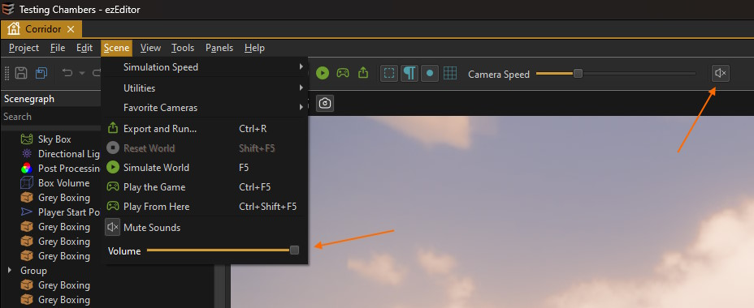

# MiniAudio Integration

[MiniAudio](https://miniaud.io) is a leight-weight, cross-platform audio solution. Its integration is provided as a **free alternative** to the [FMOD integration](../fmod/fmod-overview.md), for games that have fewer requirements for game audio. It is also easier to set up and use, especially if you are unfamiliar with FMOD.

The MiniAudio integration supports both positional (3D) and non-positional [sound sources](ma-sound-component.md). The [MiniAudio listener component](ma-listener-component.md) is used to control from where sound is perceived.

The [MiniAudio sound asset](ma-sound-asset.md) is used to get a *.WAV* or *.MP3* file into the engine and contains options for randomizing sound playback.

Sounds can also be played programmatically, e.g. from [visual scripts](../../custom-code/visual-script/visual-script-overview.md) or [AngelScripts](../../custom-code/angelscript/angelscript-overview.md), using the script function `ezSound::PlaySound()`.

## How To Enable MiniAudio

To enable MiniAudio support in your project, follow these steps:

1. Open ezEditor
1. Go to *Project > Plugin Settings > Plugin Selection...* to open the [plugin selection](../../projects/plugin-selection.md) dialog.
1. If *MiniAudio* is greyed out, you have another sound plugin active (such as FMOD). Deactivate that sound plugin.
1. Activate the *MiniAudio* plugin and click *OK*.
1. Click *Yes* to restart the editor.

If your project already made use of other sound components, the [Asset Curator](../../assets/asset-curator.md) will now show you which assets need to be updated.

## Scene Editing Settings

The MiniAudio editor plugin adds UI elements to *mute* sound entirely and to adjust the *overal volume*:

## Limitations

Currently, all instantiated sounds get played, no matter how far away they are. There is no *sound virtualization* and no culling. This is typically no problem for small games, but when you start making games with larger scenes, you may run into performance problems.

The *attenuation model* of MiniAudio is also not particularly well suited for first-person and third-person types of games, as it lacks control for game designers.

Overall, the feature set of MiniAudio is not comparable to what [FMOD](../fmod/fmod-overview.md) offers, and the integration into EZ is even more limited. Some functionality can and may get added to the integration, but if you do need significantly more control or plan on building large worlds where many sounds may play simultaneously, FMOD is the better choice. 

The concepts of how MiniAudio and FMOD are integrated into EZ are nearly identical, so it is possible to start with MiniAudio and switch to FMOD when needed. However, be aware that you would still need to adjust every object and every script that plays sound, as you would need to switch from the [MiniAudio sound component](ma-sound-component.md) to the [FMOD event component](../fmod/fmod-event-component.md) and adjust asset GUIDs in scripts.

## See Also

* [Sound](../sound-overview.md)
* [MiniAudio](https://miniaud.io)
