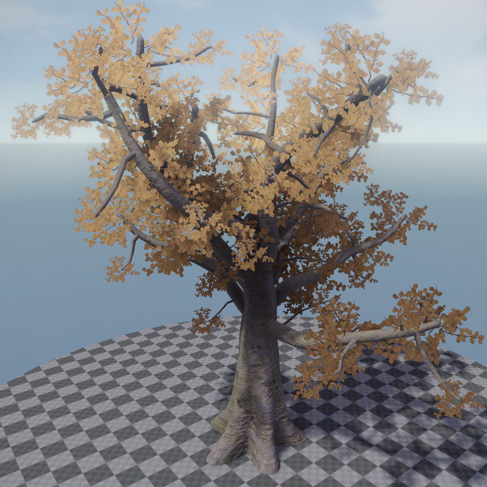

# Kraut

[Kraut](https://github.com/jankrassnigg/Kraut) is a system for procedurally generating trees and other plants directly inside the ezEngine editor. Tree geometry is defined and edited through the [Kraut tree asset](kraut-tree-asset.md).

## Kraut Materials

Kraut uses three material types for different parts of a tree. Ready-to-use base materials are provided under *Plugins/Kraut* in the asset browser:

- **`KrautStem`** — used for trunks, branches, and twigs.
- **`KrautFrond`** — used for static leaf-card geometry.
- **`KrautLeaf`** — used for camera-facing billboard leaves.

These materials should be used as the **base material** for custom tree materials. Each of them sets the appropriate asset filter tag (`Kraut-Stem`, `Kraut-Frond`, `Kraut-Leaf`), which is how the asset browser filters for compatible materials when assigning them in the tree asset.

## See Also

* [Kraut Tree Asset](kraut-tree-asset.md)
* [Kraut Tree Component](kraut-tree-component.md)
* [Kraut GitHub Repository](https://github.com/jankrassnigg/Kraut)
* [Terrain and Vegetation](terrain-overview.md)
