# Kraut Tree Asset

The *Kraut tree asset* is used to procedurally design and generate trees. Tree generation is done entirely inside the ezEngine editor — no external tool is required. The asset stores all growth and appearance parameters and generates tree meshes at transform time.

For background on the Kraut system, see the [Kraut overview](kraut-overview.md). To place a tree in a scene, use the [Kraut tree component](kraut-tree-component.md).

The [Kraut GitHub repository](https://github.com/jankrassnigg/Kraut) contains additional reference material about the underlying generator.

## Branch Type Hierarchy

A tree is built from up to ten branch type slots arranged in a fixed hierarchy:

- **Trunk** — the root branch, always present
- **Main Branch 1 / 2 / 3** — first-generation branches grown from the trunk
- **Sub Branch 1 / 2 / 3** — second-generation branches grown from main branches
- **Twig 1 / 2 / 3** — third-generation branches grown from sub-branches

Each branch type slot can independently enable up to three child slots via the *Grow Sub-Branch Type 1 / 2 / 3* checkboxes. A slot whose parent has not enabled it will not generate any geometry.

All branch type slots share the same set of properties described below.

## Branch Type Properties

### General

`Branch Segment Length` — Length of one segment along the branch. Branches change direction at most once per segment. Shorter segments allow more curvature but increase generation cost. It is rarely necessary to change this from the default.

The image below shows a tree with the default segment length and a much increased segment length. Note how the shorter segment length is necessary for the desired curvature:

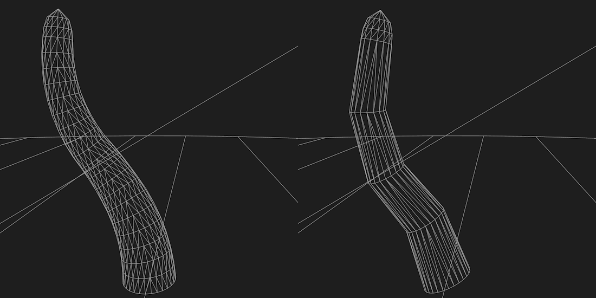

`Branchless Part at Start` — Absolute distance from the start of the branch within which no child branches are spawned.

`Branchless Part at End` — Absolute distance from the end of the branch within which no child branches are spawned.

`Lower Usage Range / Upper Usage Range` — Define the fraction of the parent branch along which this branch type may be spawned. The default range 0–1 allows spawning anywhere. Setting *Lower Usage Range* to 0.5 restricts spawning to the second half; setting *Upper Usage Range* to 0.5 restricts it to the first half.

The image below demonstrates the effect of this. On the left, the branches have a lower and upper usage range of 0% and 100% respectively. So they spawn anywhere on the trunk. On the right the lower usage range is set to 50%, which means they will only grow on the upper half of the trunk.

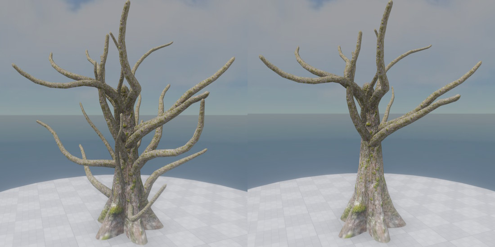

`Min Branch Thickness / Max Branch Thickness` — The thickness range for this branch type. If the parent branch is thinner at the spawn position than the minimum thickness of the child type, no child branch is spawned there.

### Spawn Nodes

Spawn nodes are the areas where branches get spawned. For instance in the image below there are three spawn nodes on the trunk. Each spawn node spawns a number of branches of the same type within a certain distance. If multiple sub-branch types are active, they will take turns.

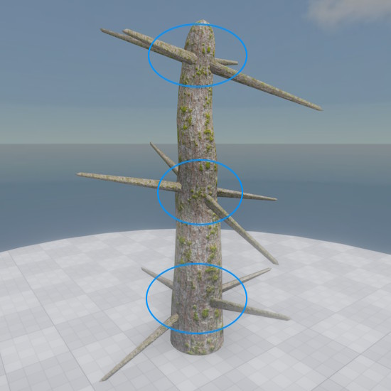

`Min Branches Per Node / Max Branches Per Node` — How many branches are spawned at each spawn node. For example in the image above this was set to 4, so each spawn node spawns exactly 4 branches.

`Space Before Spawn Nodes / Space After Spawn Nodes` — Empty space reserved before and after each spawn node so that spawned branches have room and do not intersect siblings.

`Spawn Node Height` — The height over which branches within one node are distributed. A height of zero spawns all branches at the same position, as can be seen in the image above. In the image below you can see how a non-zero height randomly distributes branches over this area.

`Rotational Deviation` — How much each spawned branch may deviate from its equally-distributed starting angle around the parent. With four branches per node the maximum effective deviation is 90°; the slider always represents the full 0–180° range.

The image above shows a deviation of 0, here all branches are perfectly distributed in a cross pattern. In the image below a deviation of 20 degree gives the branches more variied starting directions.

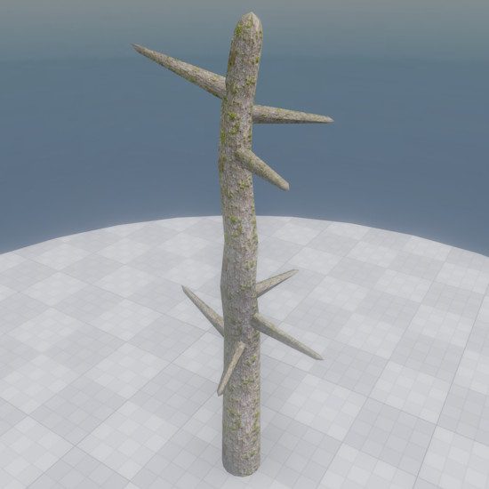

`Branch Angle` — The up/down angle at which a branch is spawned relative to its parent. 90° is orthogonal to the parent.

The image below shows a branch angle of 130 degree (pointing up) and 50 degree (pointing down). Here the angle deviation is 0.

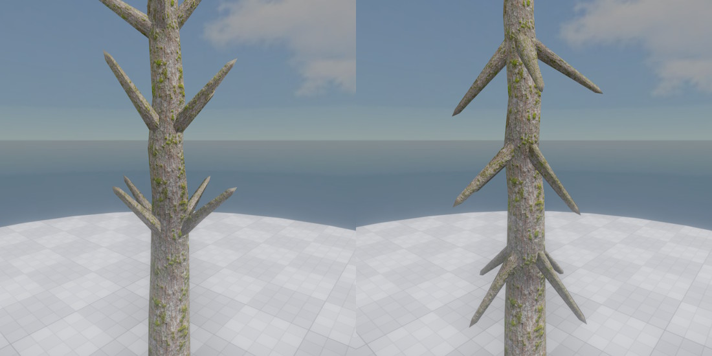

`Branch Angle Deviation` — Maximum deviation from the branch angle, in both directions. Use this to randomize the branch angle (see image above).

### Growth

#### Target Direction

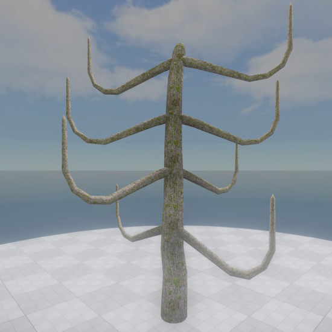

`First Target Direction` — The direction toward which the branch grows from its start. *Straight* continues in the spawn direction; other values are angles from straight up (e.g. *Upwards*, *90 Degree*, *Downwards*). In the image above the first target direction is slightly downwards.

`Dir Relative to Parent` — When unchecked, the target direction is relative to the world (0° = sky, 180° = ground). When checked, it is relative to the parent branch at the spawn point (0° = same as parent, 90° = orthogonal, 180° = opposite). This is less relevant for trunks which already mainly grow upwards, but becomes important when branching off other branches, which grow into various directions.

`Second Direction Mode` — Whether and how a second target direction is used after some point along the branch:
- *Off* — only the first target direction is used.
- *Relative* — switches to the second direction after a fraction of the branch length.
- *Absolute* — switches after an absolute distance.

`Second Direction Offset` — The relative or absolute distance at which the switch to the second target direction occurs. In the image above the offset is set to a meter, so after a meter of growing into the first target direction (slightly down), the branches start growing into the second direction (upwards).

`Second Target Direction` — The direction used after the offset threshold is reached. In the image above, the second target direction is set to *upwards*, which is why the branches start growing up after a certain distance.

`Target Direction Deviation` — How many degrees the branch's actual target direction may deviate from the configured target. Higher values cause branches to grow in more varied directions.

#### Growth Path

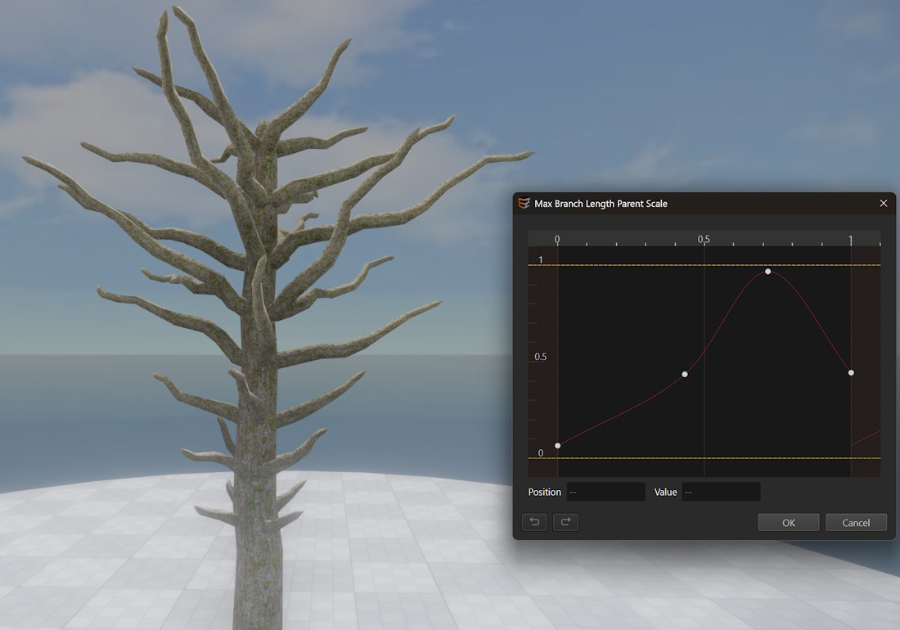

`Min Branch Length / Max Branch Length` — The length range for branches of this type.

`Max Branch Length Scale` — A curve that scales the maximum branch length based on position along the parent branch. Use this to shape the tree's crown, for example making branches longer near the top. This was done in the image.

`Grow Direction Deviation` — How many degrees the branch may deviate from its current target direction per segment, producing a winding appearance. Interacts with *Direction Change Per Segment*. In the image above a value of 50 was used to allow the branches to deviate strongly from their overall target direction.

`Direction Change Per Segment` — How many degrees per segment the branch bends toward its current target direction. Higher values cause more frequent direction changes and a more twisted appearance. Interacts with *Grow Direction Deviation*. In the image above a value of 20 was used to allow the branches to change direction rapidly.

`Only Grow Up And Down` — When enabled, the branch only grows upward or downward and never sideways. Useful for branches that represent large leaves such as palm fronds, giving the appearance of gravity influence.

The image below shows the effect: When not set (on the left), branches will grow randomly into all directions. When set (on the right), branches still change direction randomly, but only along their up and down axis.

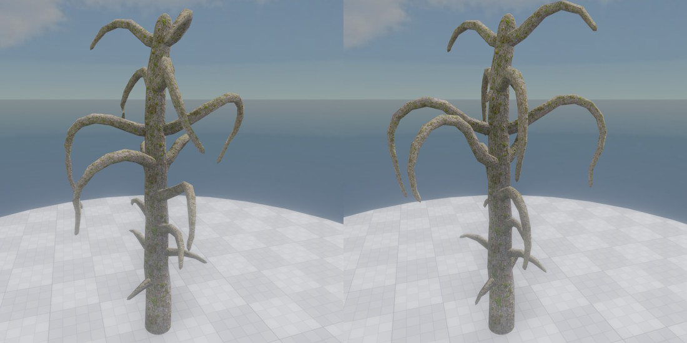

### Appearance: Branch Mesh

`Enable Mesh` — When unchecked, no branch mesh is generated for this branch type. Useful when a branch should consist only of fronds.

`Branch Material` — The [material](../materials/materials-overview.md) used for the branch mesh. Must use a [Kraut stem base material](kraut-overview.md#kraut-materials).

`Thickness` — A curve that scales the branch thickness along its length, in addition to the min/max thickness settings. Thickness also controls where child branches can be spawned: if the branch is too thin at a position, no child is spawned there.

In the image below branches start with a randomized thickness, as configured by `Min Branch Thickness / Max Branch Thickness`. Additionally, a curve is used to scale the thickness over the length of each branch, giving it a sudden drop-off in the middle.

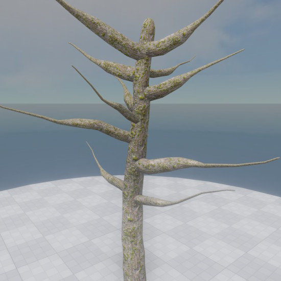

`Roundness` — How round or pointed the branch tip is. A high value keeps the branch thickness nearly constant along its length and rounds the tip; a low value tapers the branch toward a point.

The image below shows the effect of this. Note how the round branch keeps a constant thickness.

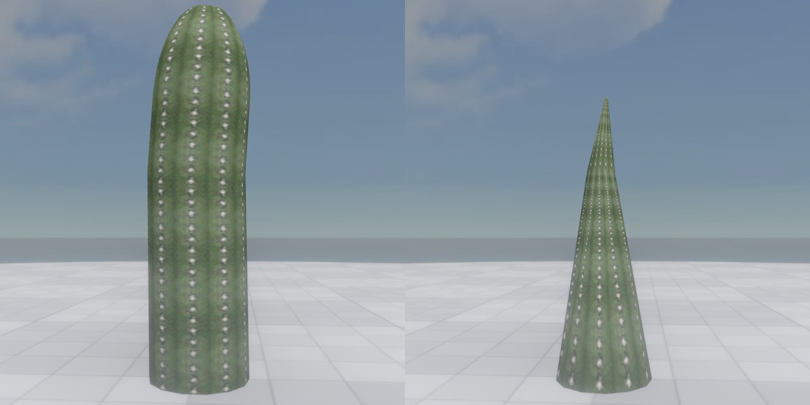

`Flares` — Number of flares that modify the branch surface to simulate roots or ridges. Typical values are 4–6; use 0 to disable.

`Flare Width` — Width of the flares relative to the branch thickness. A value of 2 allows flares to become twice as thick as the branch.

`Flare Width Curve` — Scales the flare width along the branch. Use this to create prominent root flares at the base that taper off quickly.

`Flare Rotation` — How much the flares rotate along the branch length.

`Rotate Texture Coordinates` — When checked, texture coordinates rotate with the flares. When unchecked, the texture coordinates remain unaffected as the flares rotate.

The image below shows what a trunk looks like without flares, with flares, and with rotated flares. A curve is used to make the flares very pronounced at the bottom, and fade them out towards the top.

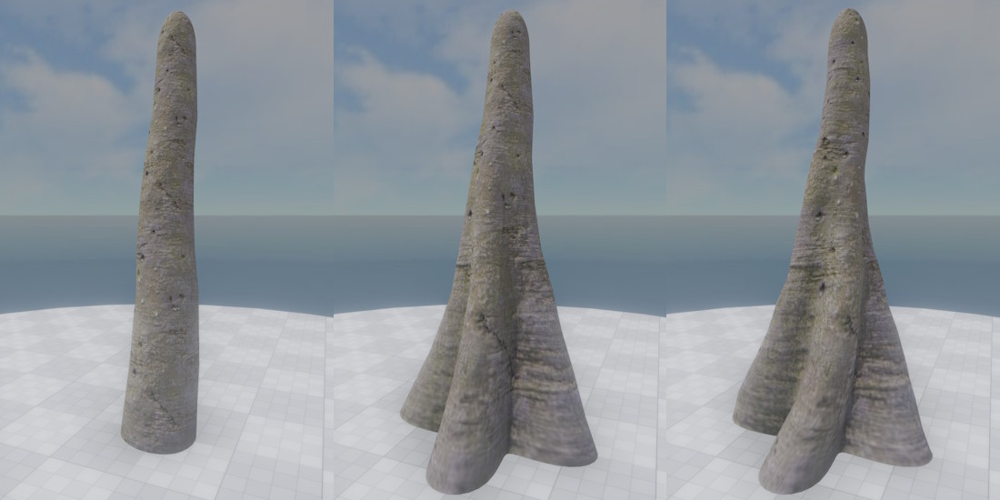

### Appearance: Fronds

Fronds are flat card meshes placed along a branch. They can represent individual leaves or leaf-card textures that add visible detail with few polygons.

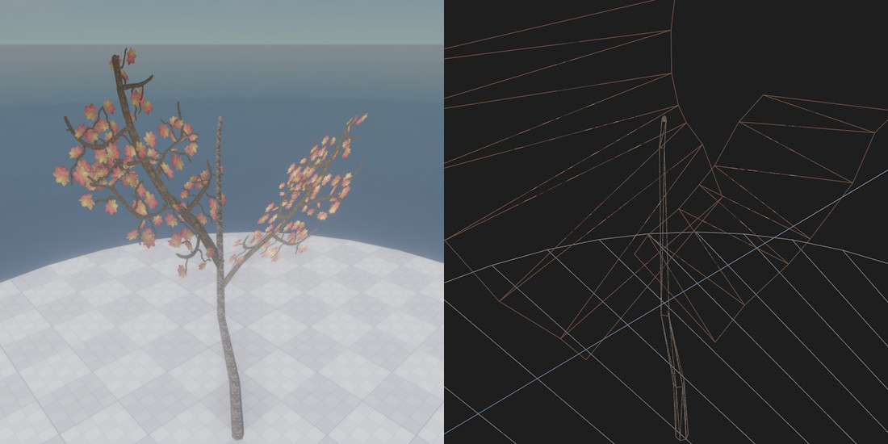

`Enable Fronds` — When unchecked, no fronds are generated for this branch type.

`Frond Material` — The [material](../materials/materials-overview.md) used for frond geometry. Must use a [Kraut frond base material](kraut-overview.md#kraut-materials).

`Texture Repeat` — The distance in meters at which the frond texture repeats. A value of 0 stretches the texture across the entire branch without repeating.

The image below shows a frond texture repeat value of 0 on the left, 1 in the middle and 2 on the right. With 0, the texture is stretched over the entire length of the branch. Non-zero values scale the texture to meters. In practice this is useful for frond textures that should have a fixed density. For instance, the spikes of a cactus can be done with fronds, using a texture that contains multiple spikes.

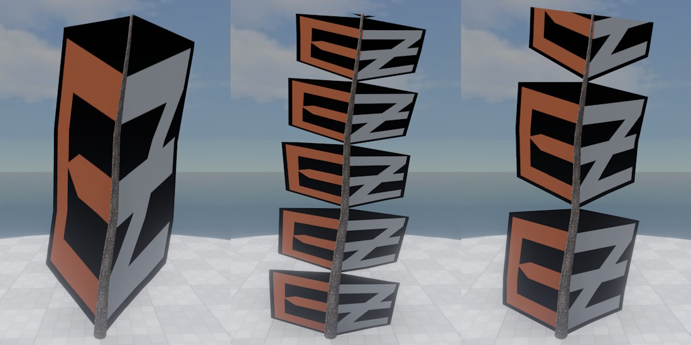

`Up Orientation` — The base orientation of the fronds:
- *Upwards* — fronds always face up.
- *Along Branch* — fronds align with the parent branch's grow direction.
- *Orthogonal To Branch* — same as *Along Branch*, rotated 90°.

The image below shows the *upwards* (left) and *orthogonal* (right) orientation. *Along branch* only makes a difference, if the parent branch has a strong curvature.

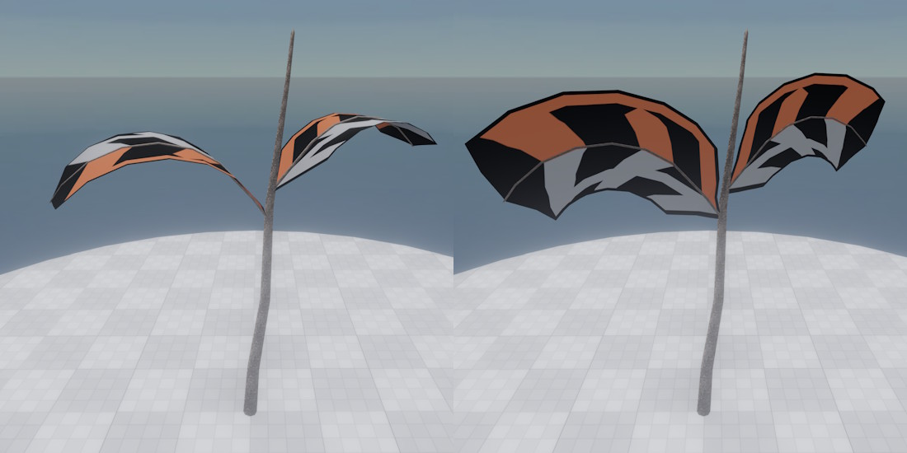

`Rotational Deviation` — How much each frond may deviate from its base rotation around the branch.

`Num Fronds` — How many fronds are placed around the branch at each position. A cactus using spike fronds might use 8 or more.

`Align to Surface` — Usually frond geometry ignores the branch width. For thin branches, this doesn't matter. However, for thick branches, some fronds look better when they properly start on the branch mesh surface, rather than inside. This option splits the fronds geometry in two halves and alignes each half with the branch mesh.

The image below shows the difference between not-aligned (left) and aligned (right) frond geometry. On the left you see how leaves intersect the branch mesh, since the fronds already start inside it. On the right the center of the frond texture is perfectly aligned with the branch mesh, which is why the center stem of the frond texture is still visible.

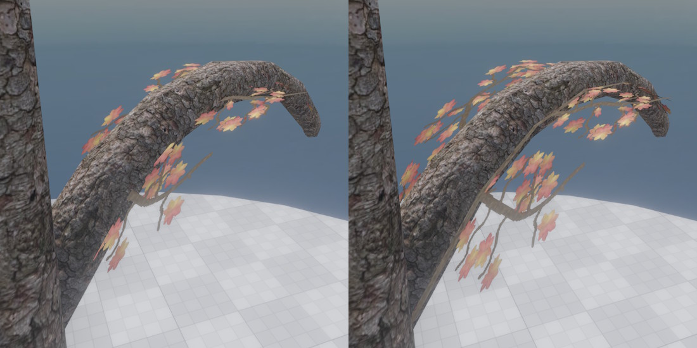

`Frond Detail` — Subdivision count for the frond mesh. More subdivisions allow more detailed contours. Simple leaves need 0; palm fronds need higher values.

The image below shows a frond with low and high detail. Higher detail is necessary when using a contour curve.

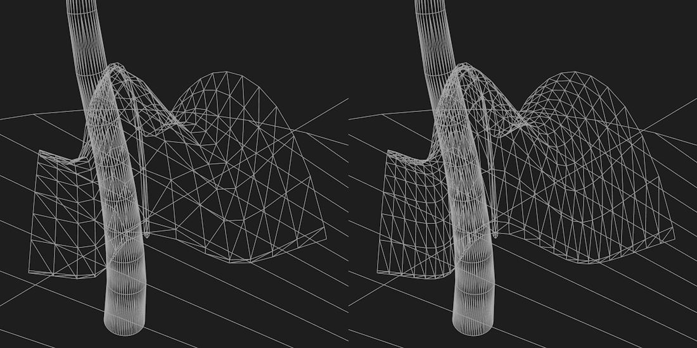

`Frond Contour` — A curve describing the cross-section shape of the frond.

The image below shows the effect of the contour curve. For example, it allows you to make large leaves that droop downwards at the sides. Stronger curvature requires higher *frond detail* to be able to represent the detail.

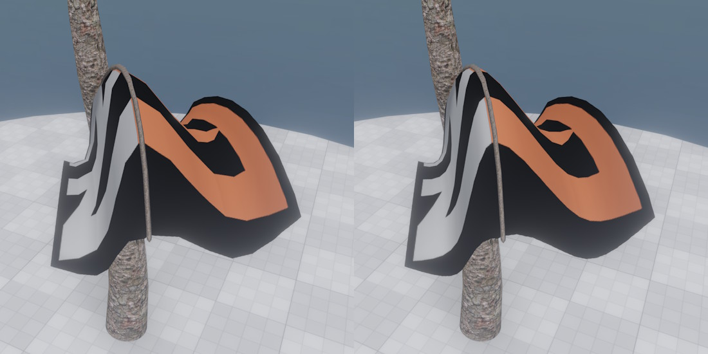

`Contour Mode` — How the contour curve is applied:
- *Full* — the curve describes the complete cross-section.
- *Symetric* — the curve describes one half; the other half is mirrored.
- *Inverse Symetric* — same as *Symetric* but the contour is also flipped. 

`Contour Scale` — Overall scale of the contour. Multiplied with *Contour Scale Curve* to determine the scale at each point along the branch.

`Contour Scale Curve` — Per-position scale for the contour along the branch. Allows to make the contour more pronounced at some places than at others. For example, to make the frond entirely flat at the start and end, but have it droop in the middle.

`Frond Width` — Overall width of the frond. Multiplied with *Frond Width Curve*.

`Frond Width Curve` — Per-position width scale along the branch.

The image below shows how the frond width and width curve can be used to form the shape of fronds. Note that this is done on the geometry and too drastic shape adjustments will introduce texture distortions and make the low resolution geometry more apparent. High frequency detail should be baked into the frond textures instead.

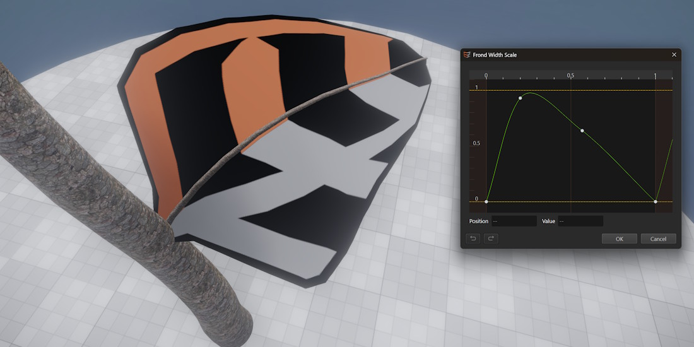

### Appearance: Leaves

Leaves are billboards that rotate to face the viewer, allowing dense-looking trees with few polygons. The image below shows that the dense canopy of the tree top is just a few textured quads rotated towards the camera.

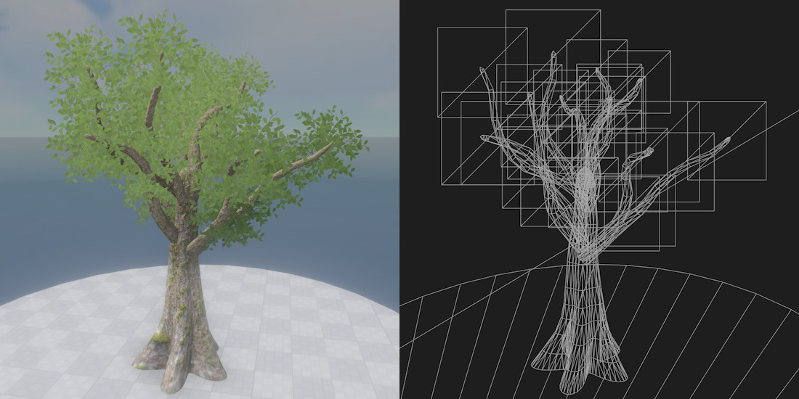

`Enable Leaves` — When unchecked, no leaf billboards are generated for this branch type.

`Leaf Material` — The [material](../materials/materials-overview.md) used for leaf billboards. Must use a [Kraut leaf base material](kraut-overview.md#kraut-materials).

`Leaf Size` — Overall size of each leaf billboard. Multiplied with *Leaf Size Curve*.

`Leaf Size Curve` — Per-position size scale along the branch.

The image below demonstrates how the leaf size curve can be used to limit where leaves appear at all, and what size they should have.

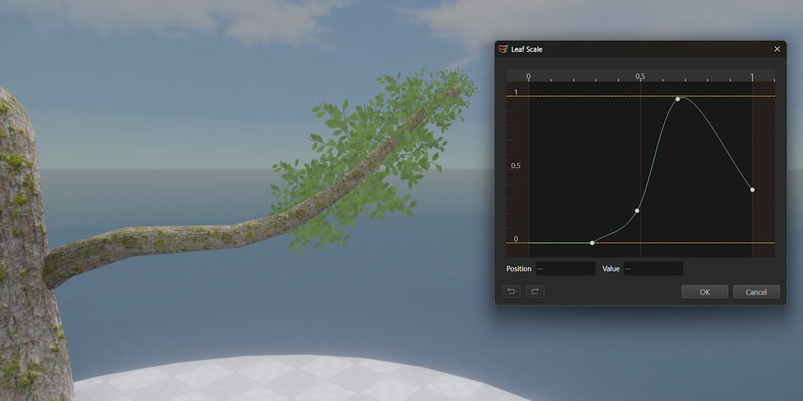

`Interval Length` — Distance between consecutive leaf placements along the branch. A value of 0 places a single billboard only at the branch tip.

The image below shows the placement of leaves along a branch using a value of 0 (left) and 1 meter (right).

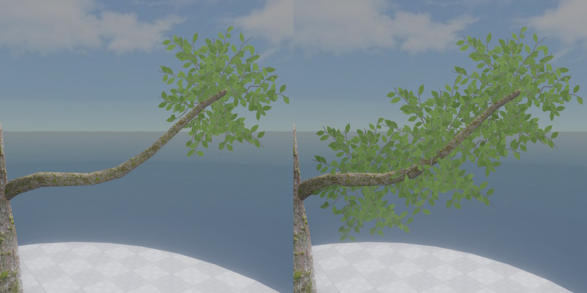

## Global Tree Properties

`Display Random Seed` — The seed used to generate the tree shown in the asset editor. Change it to explore how the tree looks with different seeds.

`Good Random Seeds` — A list of seeds that produce good-looking results for this tree configuration. The [Kraut tree component](kraut-tree-component.md) uses this list when a variation index is set. Keep the list small (a handful of entries) so that placed trees have visible variety without too many similar-looking variants.

`Min Ambient Occlusion` — AO values are clamped to this minimum. Set to 1 to disable vertex AO entirely, which also reduces generation time.

`Static Collider Radius` — Radius of the cylinder collider placed at the tree's location.

`Tree Stiffness` — How stiffly the tree reacts to wind.

`Surface` — The [surface](../materials/surfaces.md) assigned to the collider object.

## LOD Settings

Up to five LOD levels can be configured. Each level defines the detail used when the camera is within a certain distance.

`Use LOD up to Distance` — Camera distance in meters up to which this LOD is used. Lower-numbered LODs (higher detail) take priority at shorter distances.

`Tip Detail Threshold` — Controls polygon reduction at branch tips. Lower values produce rounder tips.

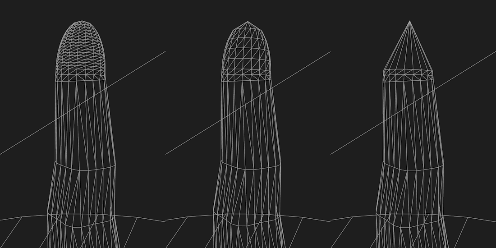

`Curvature Threshold` — The primary setting for polygon reduction. Describes how closely the simplified skeleton must match the full-detail skeleton. Higher values reduce polygon count more aggressively but lose roundness.

The image below shows the same branches generated with different curvature thresholds.

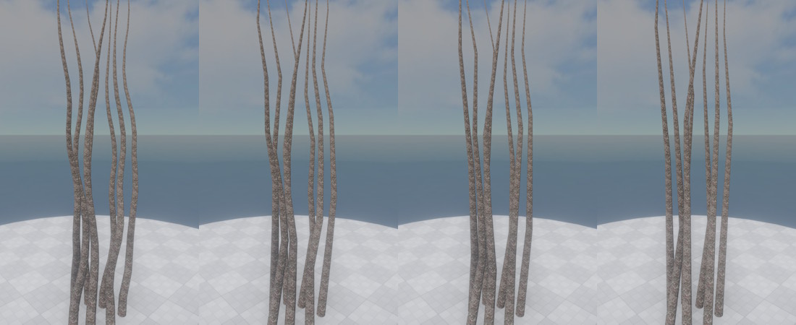

`Thickness Threshold` — Controls polygon reduction for branches with varying contours. Higher values reduce detail in branch cross-sections. Has minimal effect on branches with simple contours. **Note:** both this threshold and *Curvature Threshold* must be exceeded before a segment is simplified, so a very low *Curvature Threshold* can make this setting appear to have no effect.

The default value of 0.2 already covers most cases well, but as can be seen in the image below, when using strongly varying branch thickness, the setting can still make a big difference. 

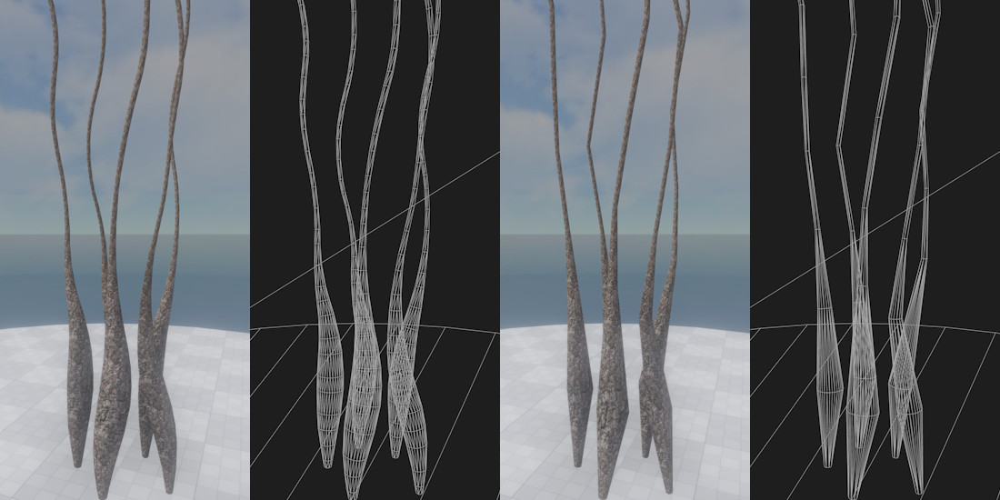

`Ring Detail Threshold` — Controls how many vertices are used around the branch cross-section. Lower values produce smoother cylinders; higher values produce more angular shapes. Has a large influence on total triangle count.

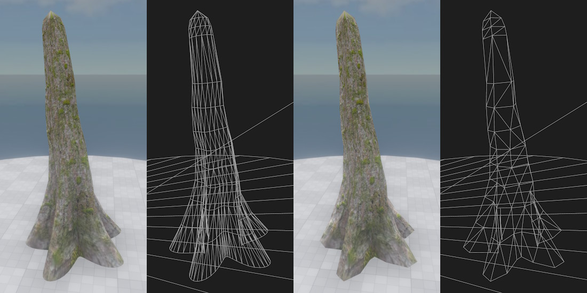

`Allow Branch Meshes for` — Per-branch-type checkboxes. Uncheck to disable branch mesh generation for specific branch types in this LOD.

`Allow Fronds on` — Per-branch-type checkboxes. Uncheck to disable frond generation for specific branch types in this LOD.

`Allow Leaves on` — Per-branch-type checkboxes. Uncheck to disable leaf generation for specific branch types in this LOD.

`Max Frond Detail` — Maximum frond subdivision level for this LOD. Only has an effect for fronds that have a non-zero detail value.

`Frond Detail Reduction` — Amount by which frond detail is reduced before being clamped to *Max Frond Detail*. Only has an effect for fronds that have a non-zero detail value.

## Asset Editor UI

The asset editor toolbar provides options for previewing the tree under different conditions.

**Wind** — Simulates wind in the preview viewport. Options: *No Wind*, *Gentle Breeze*, *Moderate Wind*, *Storm*.

**Display Fronds and Leaves** — Toggles visibility of frond and leaf geometry in the viewport, making it easier to inspect the branch structure.

## See Also

* [Kraut Overview](kraut-overview.md)
* [Kraut Tree Component](kraut-tree-component.md)
* [Materials](../materials/materials-overview.md)
* [Surfaces](../materials/surfaces.md)
