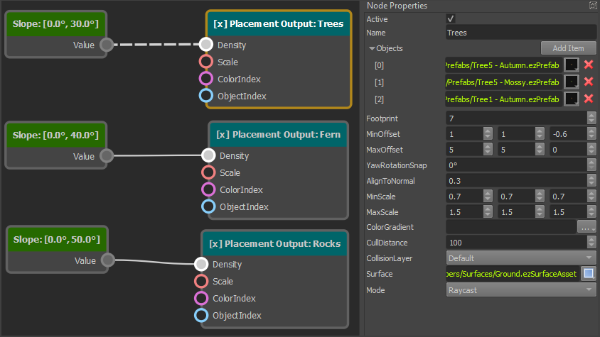
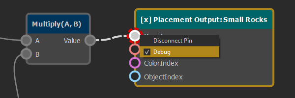
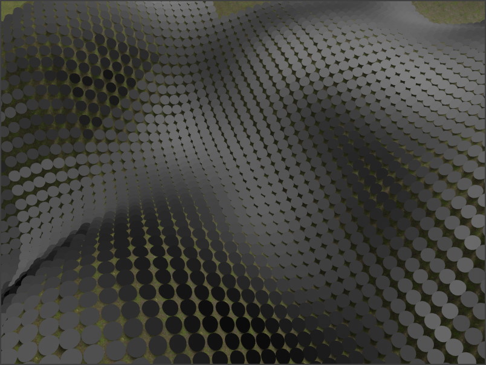

# ProcGen Graph Asset

The *ProcGen Graph Asset* is used to configure the rules for [procedural object placement](procedural-object-placement.md). In this graph structure you define which objects should be placed under which conditions.

## Editing the ProcGen Graph

The main area of this document is used to place and connect nodes in a graph. Use the context menu to add nodes. Drag and drop pins from left to right to connect outputs to inputs. Pins usually represent single number values, such as a density value or a single channel of a color (e.g. 'red'). By connecting a pin on the right side of a node (output) to a pin on the left side of a node (input), the output value is forwarded into the other node and affects how that node operates.

Nodes that only have pins on their right side, are pure *input nodes*, they only provide data for other nodes to consume. Nodes that only have pins on their left side, are *output nodes*. They consume various input values and then create some kind of result, for example they decide whether to place an object at a certain location.

When you select a node, the *property grid* shows additional configuration options. The image below shows a graph with three *input nodes* and three *output nodes*. Each input node is connected to one output node and thus affects how that output node places objects.

### Interactions

* Right-click and drag in the view, to move it around.
* Mouse-wheel to zoom.
* Left-click to select nodes.
* Left-click and drag to select multiple nodes.
* Ctrl + left-click to add or remove a node from the selection.
* Right-click on a node, pin or connection for a context-menu in which you can delete the object.
* Click on an empty spot to open a context menu from which to create new nodes.
* Left-click and drag any pin to connect it to another pin. The UI will indicate which pins can be connected.

## Graph Output

What exact output the procedural rules generate depends on which *output nodes* are present in the graph. Currently these types of output are available:

1. [ProcGen Graph Placement Output](procgen-graph-output-placement.md)
1. [ProcGen Graph Vertex Color Output (TODO)](procgen-graph-output-vertexcolor.md)

> **Tip:**
>
> To learn the system, it is best to start with the [placement output](procgen-graph-output-placement.md) node and ignore the rest. The simplest possible graph only contains a single such node and nothing else.

## Using a ProcGen Graph

The ProcGen graph asset doesn't have any kind of pre-visualization. To see what effect a rule has, you need a scene in which the necessary setup is available.

The scene should contain some geometry with [collision meshes](../../physics/collision-shapes/collision-meshes.md), such that raycasts can hit the geometry. [Greyboxing](../../scenes/greyboxing.md) and [heightfield components](../heightfield-component.md) work just fine for that.

You also need a component that applies the ProcGen graph. Depending on the *output nodes* used in the graph this would be one of these:

1. [Procedural Placement Component](procgen-placement-component.md)
1. [Procedural Vertex Color Component (TODO)](procgen-vertex-color-component.md)

Make sure the ProcGen graph asset is [transformed](../../assets/assets-overview.md). Then [press play to simulate it](../../editor/run-scene.md). If everything is set up right, you should see objects getting placed around the camera, within the specified volume.

## Live Editing

When you edit a ProcGen graph asset, most changes trigger a live update in any running scene. That means you can switch back and forth between the asset and a test scene, and see changes update right away.

However, this is limited to certain types of changes. Changes to referenced assets (such as [color gradients](../../animation/common/color-gradients.md) or [prefabs](../../prefabs/prefabs-overview.md)) won't update the already placed objects.

If such a change was done, you need to stop simulating a scene, and [run it again](../../editor/run-scene.md).

## Debug Mode

It can be difficult to get an idea for the values that a rule graph produces. To visualize the values, you can right-click any pin and enable the *Debug* flag. This disables all placement output and instead switches to a mode where for every location only a sphere is rendered, and the shade of the sphere represents the value of the pin on which the debug flag is enabled. Black for `0` and white for `1`.

When you then switch to a scene and run the simulation, you will see this pattern:

## Building Complex Rules

Once you've figured out the basics, you can build more complex rules.

1. Use the [ProcGen graph input nodes (TODO)](procgen-graph-inputs.md) to receive more information about a location, such as its slope or height.
1. Pass the data through [ProcGen graph math nodes](procgen-graph-math.md) to adjust it as necessary.
1. Use [ProcGen graph modifier nodes](procgen-graph-modifiers.md) to make it possible to configure the rules locally.

## See Also

* [Procedural Placement Component](procgen-placement-component.md)
* [ProcGen Graph Placement Output](procgen-graph-output-placement.md)
* [Procedural Vertex Color Component (TODO)](procgen-vertex-color-component.md)
* [ProcGen Graph Vertex Color Output (TODO)](procgen-graph-output-vertexcolor.md)
* [Procedural Volume Box Component](procgen-volume-box-component.md)
* [Procedural Volume Image Component](procgen-volume-image-component.md)
