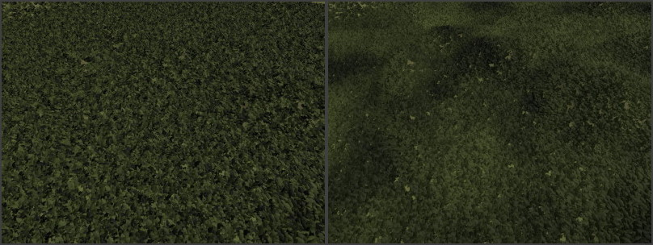

# ProcGen Graph Math Nodes

These node types implement math functions for [ProcGen graph assets](procgen-graph-asset.md).

## Blend Node (Standard Math Operators)

The *Blend* node provides the most common math expressions to combine two values. These include **Add**, **Subtract**, **Multiply**, **Divide**, **Min** and **Max**.

### Node Properties

* `Mode`: Determines how the two input values get combined.
* `InputA`, `InputB`: Fallback values for pins `A` and `B` respectively, in case one of the pins isn't connected. Use this, in case you want to combine one value with a constant (e.g. to multiply `A` by two, leave `B` disconnected and set `InputB` to `2`).
* `ClampOutput`: If this is enabled, the output value is clamped to [0;1] range.

## Perlin Noise Node

The *Perlin Noise* node outputs a [Perlin Noise](https://en.wikipedia.org/wiki/Perlin_noise) value for the current location.

This value can be used to add variety, however, not through completely random values, but rather ones that gradually change. So for instance, if the quality of soil varies, the look of vegetation may be different. However, bushes that grow next to each other are affected the same way, so their look will be similar.

In the two images below, the same plants are placed. However, in the second image, Perlin noise is used to affect their color. Note how in the second image all plants in an area become darker or brighter.

### Node Properties

* `Scale`: Over which area the noise is stretched. Large values mean that the noise value changes slowly over large distances, whereas smaller values result in higher frequency noise. If the value is too small for the used object density, the results lose their gradually changing quality.
* `Offset`: Pushes the values along the respective axis.
* `NumOctaves`: How many Perlin noise values to combine for the final result. More octaves give a more varied pattern and can be scaled across a larger area without showing obvious repetitions, but also cost more performance to evaluate.
* `OutputMin`, `OutputMax`: The output value will be between these two values.

## Random Node

The *Random* node outputs a random number for the current location. The result is deterministic for a given position and seed value, however, contrary to the *Perlin noise* node, the values for locations right next to each other have no correlation.

This type of noise can be used to add variation between plants, where there is no shared reason for the variation (such as soil quality).

> **Note:**
>
> Properties such as object scale and color variation CAN be controlled through input pins and thus random values can be passed in, however, if no such input is provided, they will already vary randomly between their allowed values. Unless more control is needed, it is therefore not necessary to add and connect a *Random* node.

### Node Properties

* `Seed`: A seed value for the random number generator. If a fixed seed is chosen, the random number output is always exactly the same.
* `OutputMin`, `OutputMax`: The output value will be between these two values.

## Remap Node

The *Remap* node transforms values from an input range to an output range. This is useful for converting values that come in one range (such as height or slope values) into a different range needed by another node.

For example, if you have a height value between 0 and 100, but need to convert it to a density value between 0 and 1, you would set `InputMin` to 0, `InputMax` to 100, `OutputMin` to 0, and `OutputMax` to 1.

### Node Properties

* `InputMin`, `InputMax`: The expected range of the input value.
* `OutputMin`, `OutputMax`: The range to map the output value to.
* `ClampIntermediate`: If enabled, the normalized intermediate value is clamped to [0, 1] before being scaled to the output range. This prevents output values from going outside the output range when input values are outside the input range.

## Curve Node

The *Curve* node remaps values using a custom curve. This allows for non-linear transformations, such as easing functions or custom falloff patterns.

The input value is used as the X coordinate on the curve, and the Y value at that point becomes the output.

### Node Properties

* `Curve`: The curve definition with control points. Click to open the curve editor.
* `NumSamples`: The number of samples used to approximate the curve. Higher values give more accurate results but use more memory.

## See Also

* [Procedural Object Placement](procedural-object-placement.md)
* [ProcGen Graph Input Nodes (TODO)](procgen-graph-inputs.md)
