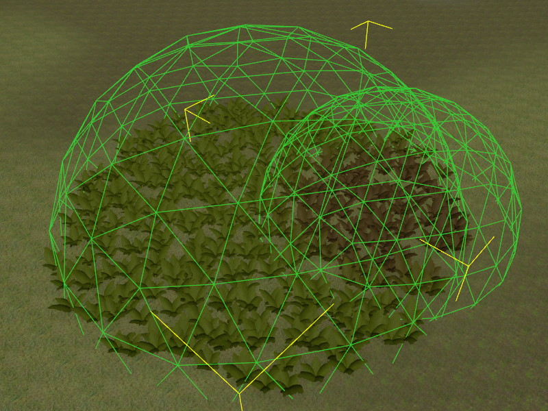

# ProcGen Graph Modifier Nodes

The output that the rules in a [ProcGen graph](procgen-graph-asset.md) produce, mostly depends on the terrain on which it is applied. Flat plains, steep cliffs and different surface types determine where which kind of vegetation grows.

However, often it is necessary to have some more control. By itself, the rules rarely create a clearing in a forest, and even if they do, it is hard to control where it is and how it looks like. The procedural nature of the system takes away control from the level designers.

To give this control back, without reintroducing the need for lots of manual work, the system allows you to place *modifiers* in the world, which affect the rules as you like. The modifiers typically are simple volumes such as [spheres](procgen-volume-sphere-component.md) and [boxes](procgen-volume-box-component.md). They are [tagged](../../projects/tags.md) to differentiate what they represent. The rule graph can evaluate whether a location is influenced by certain volumes and change the output accordingly.

What the system does with this additional information is up to the person who sets up the rules. You can create volumes that modify the *density* of specific plants down to zero, meaning that it suppresses their placement. Or a volume may affect the color, size or other parameter.

## Example

The following graph has a single [placement output](procgen-graph-output-placement.md) node, which places a single object type. However, both the *Density* and the *ColorIndex* inputs are connected to a modifier node. The default value for each input is configured on those nodes. In this case, the default density is `0`, meaning that without an extra modifier volume in the scene, this type of plant won't be placed, at all. The placement node also has a [color gradient](../../animation/common/color-gradients.md) from which the color of each plant is selected. The default value makes the plant green, but by providing a different *ColorIndex*, it can be shifted towards red/brown.

The image below shows how we can use this. There are two [sphere volumes](procgen-volume-sphere-component.md) in our scene. One is [tagged](../../projects/tags.md) to be picked up by the node that feeds into the *Density* input, the other is tagged to be picked up by the *ColorIndex* modifier node.

The sphere on the left overrides the *Density* to be `1` and thus inside its area of influence, vegetation appears. The sphere on the right overrides the *ColorIndex* towards red/brown, thus plants inside its volume have a different color.

Note that the rules in the graph are *not* tied to specific volumes in a scene. Rather the modifier nodes use [tags](../../projects/tags.md) to filter which volumes are considered as their inputs. Thus you can use as many volumes as you like to locally control the rule output.

In the image below, the same rules are applied, but now there are three spheres in the scene that override *Density* and another one for color:

## ApplyVolumes Node

The *ApplyVolumes* node looks up the scene for ProcGen volume components at each location where a plant shall be placed. It uses [tags](../../projects/tags.md) to filter volumes. Thus you need to set up different tags to have volumes affect the placement rules in different ways.

The node then takes its own *value* (either provided through the `In` pin or the `InputValue` property) and modifies it with each *value* provided by local volumes, according to their `BlendMode` setting. If multiple volumes are found for the same location, their `SortOrder` and their overall size are used to decide in which order their values are applied. This way a smaller volume typically takes precedence over larger volumes, but using the `SortOrder` you can force a desired priority.

If a volume additionally uses an [image](../../Miscellaneous/imagedata-asset.md) (such as the [volume image component](procgen-volume-image-component.md)) to provide detailed data, the `ImageVolumeMode` is used to determine either which channel (red, green, blue or alpha) should be considered, or whether a specific color represents whether the volume should be applied. Choosing a channel means that you can only control four different things, but you have smooth values ([0; 1] range) to work with. So a channel could control *how strongly* to tint a color or how think a density should be.
When using a reference color instead, you can have many more inputs, but each one can only be on or off and they can't overlap. This is useful to tag areas of a type. So for instance *brown* could represent "swamps", *green* "forests", *blue* "water", grey "roads" and so on. Such general information about the area type can then be used to decide which types of plants to place.

### Node Properties

* `IncludeTags`: These [tags](../../projects/tags.md) control which volumes are considered. If your volumes seem to have no effect, make sure this tag is set correctly both on the node and on the [game object](../../runtime/world/game-objects.md) to which the volume component is attached. Set up different tags to differentiate what volume shall affect what parameter.
* `InputValue`: If no value is provided through the `In` input pin, this is the default value to use. The final output `Value` is determined by taking this value and combining it with all the values of the volumes, using their individual `BlendMode`. The `SortOrder` on the volumes controls in which order the values are combined. If the sort order values are equal, larger volumes are applied first and then smaller volumes. This way a more local volume have 'the last word'.
* `ImageVolumeMode`: If a location is modified by an [image volume](procgen-volume-image-component.md), this mode specifies how the image data is used.
  1. `ReferenceColor`: The color in the image is compared with `RefColor`. If the colors roughly match, the volume takes effect, otherwise it is as if the volume wasn't present, at all.
  1. `Red/Green/Blue/Alpha Channel`: The volume always has an effect, but its `Value` is additionally multiplied with the value from the chosen channel of the image.
* `RefColor`: If `ImageVolumeMode` is set to `ReferenceColor`, this volume only has an effect, if the image at the sampled location (roughly) matches this color.

## See Also

* [Procedural Object Placement](procedural-object-placement.md)
* [Procedural Volume Box Component](procgen-volume-box-component.md)
* [Procedural Volume Sphere Component](procgen-volume-sphere-component.md)
* [Procedural Volume Image Component](procgen-volume-image-component.md)
