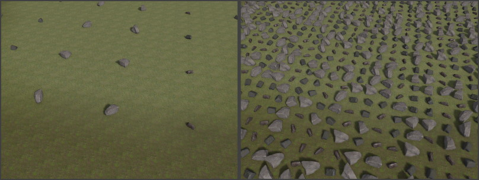
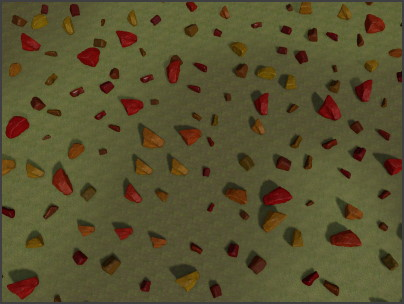
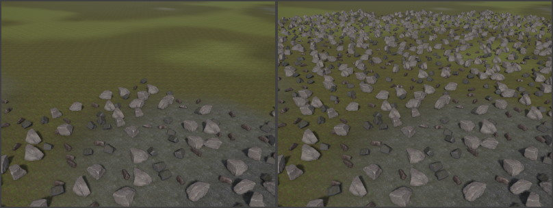
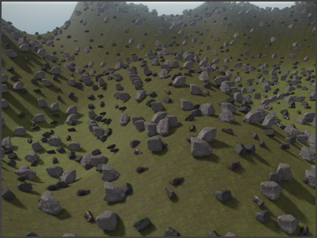
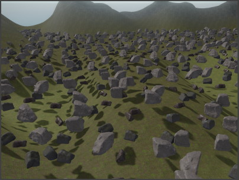
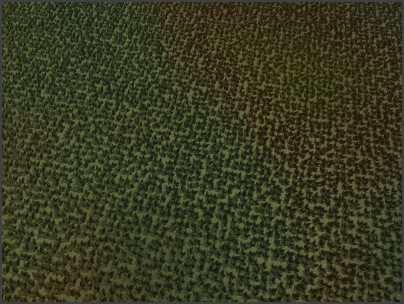
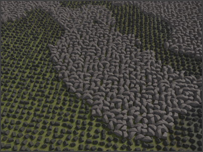

# ProcGen Graph Placement Output

The *Placement Output* node is at the heart of the procedural placement system. This node specifies which [prefabs](../../prefabs/prefabs-overview.md) to spawn, what density to use, how to position each object and how to add variety.

A [ProcGen graph](procgen-graph-asset.md) can already work, even if it contains just a single of these nodes. However, you can add as many of these nodes as you like. Every placement node represents a different type of object, with different conditions under which they are spawned.

For example one node would be used to spawn stones on rocky surfaces, another node spawns bushes on grassy surfaces, a third spawns trees and so on. Every type of object has a *footprint*, meaning an certain size of area in which only one of them will be placed. The larger the footprint, the more sparse these objects are spawned.
The node itself can already filter whether to place an object, at all, by inspecting the [surface](../../materials/surfaces.md). This way vegetation isn't planted on concrete or water.

More elaborate filtering can be achieved with [modifier nodes (TODO)](procgen-graph-modifiers.md). For example an image can represent where exactly what type of object should appear.

## Node Properties

* `Name`: A custom display name that is shown in the node's title bar. This has no function other than to make it easier to find in the graph.
* `Objects`: A list of [prefabs](../../prefabs/prefabs-overview.md). When an object gets placed, which one to use is either chosen through the `ObjectIndex` pin, or randomly, if the pin is not connected.
* `Footprint`: The radius (in meters) of the circle in which a single object gets placed. Increase the footprint to make object placement more sparse, decrease it to make it more dense.
  
* `MinOffset`, `MaxOffset`: How much the position of the placed object may randomly deviate from the center position. If this is large enough and the footprint is too small, neighboring objects may end up overlapping. It is common to set `MinOffset` to `-MaxOffset`. If an object may only move upwards, but not downwards, keep `MinOffset.z` at `0` and only set `MaxOffset.z` to a positive value.
  
* `YawRotationSnap`: All placed objects are rotated randomly along the up axis. If this is non-zero, the used rotation angles are always a multiple of it.
* `AlignToNormal`: How much to blend the placed object up direction towards the underlying surface's slope. If this is zero, the placed object always stands upright, regardless of the slope. If it is set to one, the placed object will fully follow the slope of the terrain. Anything in between, the object bends more or less towards the slope.
* `MinScale`, `MaxScale`: How large the placed object is at least (`MinScale`) and at most (`MaxScale`). The final scale is a blend between min and max, so if both values are uniform (x = y = z), the object's scale is also always uniform.
  
* `ColorGradient`: An optional [color gradient](../../animation/common/color-gradients.md) from which a random color is chosen to set the [mesh color](../../graphics/meshes/mesh-component.md) (in fact a `ezMsgSetColor` is sent when the object is spawned, so this could also be used to implement other features). If the `ColorIndex` pin is connected, the incoming value in the [0;1] range is used instead to lookup the color from the gradient.

  

* `CullDistance`: At what distance to start spawning this type of object. For large objects with a low density, this distance can be increased. Small objects with high density should use a small distance, to prevent performance issues.

  

* `PlacementMode`: How to determine the location where to place objects.
  1. *Raycast:* In this mode a physics ray is cast downwards from the volume of the [placement component](procgen-placement-component.md). Using the `CollisionLayer` and `Surface` as filters, the closest intersection point is used.

     

  1. *Fixed:* In this mode objects are always placed at the height of the [placement component](procgen-placement-component.md). No ray is cast, and no location is filtered out. This can be used for 2D games where no [collision geometry](../../physics/collision-shapes/collision-meshes.md) exists. Custom filtering can still be achieved through [image volumes](procgen-volume-image-component.md) and other [modifiers (TODO)](procgen-graph-modifiers.md).

     

* `CollisionLayer`: The [collision layer](../../physics/collision-shapes/collision-layers.md) to use when `PlacementMode` is set to *Raycast*. The collision layer decides which physical objects will be hit by the raycast and thus on which surfaces objects may get spawned at all. Note that in *Raycast* mode objects can only be placed, if a [collision meshes](../../physics/collision-shapes/collision-meshes.md) exist in the scene at all ([greyboxes](../../scenes/greyboxing.md) and [heightfields](../heightfield-component.md) set these up automatically).
* `Surface`: An optional [surface](../../materials/surfaces.md) that's used to filter object placement. Objects will only be placed on surfaces of this type (or derived). This is used to only plant certain vegetation on each type of ground.

  

  Filtering by surface can also be very useful to prevent procedural objects from getting spawned on top or inside of other procedural objects. The left image shows gras being placed on top of the procedurally placed rocks, in the right image a surface filter prevents this from happening:

  

## Input Pins

* `Density`: A value in [0;1] range that determines how likely it is that an object gets spawned. A lower density means that fewer objects get spawned. If this pin is not connected, a default density of `1` is assumed. Connect this pin to a [Perlin noise node](procgen-graph-math.md#perlin-noise-node) or an [modifier node (TODO)](procgen-graph-modifiers.md) to vary density by location. The image below shows varying density using Perlin noise.

  

* `Scale`: A value in [0;1] range to blend between `MinScale` and `MaxScale`. This can be used to scale objects up or down by location or other environmental influences. If this pin is not connected, every object uses a random scale factor. The image below shows varying scale using Perlin noise.

  

* `ColorIndex`: If a `ColorGradient` has been set, connecting this pin allows you to decide which color to use for an object. The value is in [0;1] range, with `0` selecting the left-most color from the gradient and `1` the right-most color. The image below shows varying color tint using Perlin noise.

  

* `ObjectIndex`:  If more than one prefab is added to the object list, this pin can be used to select a specific one. The value is in normalized [0;1] range, so if two objects are in the list, the first one is selected by any value between `0` and `0.5` and the second by values between `0.5` and `1`. The image below shows how varying prefabs are picked by Perlin noise.

  

## See Also

* [Procedural Object Placement](procedural-object-placement.md)
* [Procedural Placement Component](procgen-placement-component.md)
* [ProcGen Graph Asset](procgen-graph-asset.md)
