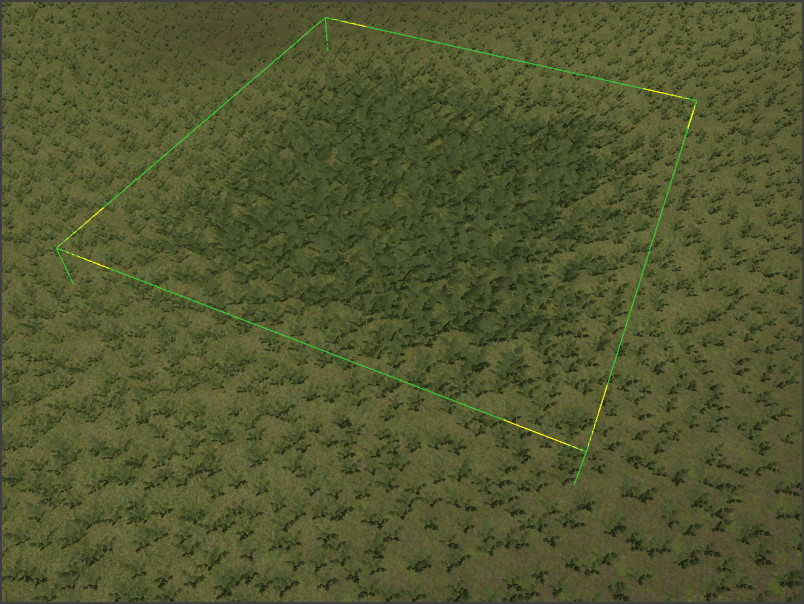

# Procedural Volume Box Component

The *procedural volume box component* defines a box shaped volume in which the rules of [ProcGen graphs](procgen-graph-asset.md) are modified. Not every graph has to make use of this information, and what the exact effect is, is up to the ProcGen graph.

For more details see the chapter on [ProcGen graph modifier nodes](procgen-graph-modifiers.md).

The image below shows a box volume used to locally increase the scale of an object type. A fade out value of 0.5 makes the transition soft.

## Component Properties

* `Value`: A single number value. This is combined with the *InputValue* from the [modifier node](procgen-graph-modifiers.md) in the graph, using the `BlendMode` formula.
* `SortOrder`: If multiple modifier volumes overlap, the `SortOrder` can be used to control in which order the volumes are evaluated.
* `BlendMode`: How to combine `Value` with the *InputValue* from the [modifier node](procgen-graph-modifiers.md) in the graph. The *Set* mode just sets the result to `Value` and ignores the other operand.
* `Extents`: The size of the box volume in which the modifier is active.
* `PositiveFalloff`: The falloff values for the positive direction of each axis (X, Y, Z). Controls how the influence fades out toward the positive edge of the box on each axis. A value of zero means fade out starts immediately at the center, while one means no fade out (abrupt edge).
* `NegativeFalloff`: The falloff values for the negative direction of each axis (X, Y, Z). Controls how the influence fades out toward the negative edge of the box on each axis. This allows asymmetric falloff, for example a volume that fades out slowly on one side but sharply on the other.

## See Also

* [Procedural Object Placement](procedural-object-placement.md)
* [ProcGen Graph Modifier Nodes](procgen-graph-modifiers.md)
