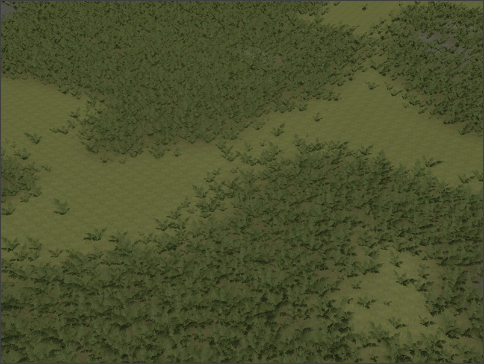

# Procedural Volume Image Component

The *procedural volume image component* defines a box shaped volume in which the rules of [ProcGen graphs](procgen-graph-asset.md) are modified. Not every graph has to make use of this information, and what the exact effect is, is up to the ProcGen graph.

For more details see the chapter on [ProcGen graph modifier nodes](procgen-graph-modifiers.md).

In contrast to the [procedural volume box component](procgen-volume-box-component.md), this component additionally samples an [ImageData asset](../../misc/imagedata-asset.md), such that it can provide fine grained information for every location within the box. This can be utilized to, for example, use a mask of the terrain that defines where roads are, where which type of plant shall grow and so on, to describe precisely how the procedural placement shall look like.

The image below shows an image volume used to only place the vegetation on the darker terrain patches.

## Component Properties

* `Value`: A single number value. This is combined with the *InputValue* from the [modifier node](procgen-graph-modifiers.md) in the graph, using the `BlendMode` formula.
* `SortOrder`: If multiple modifier volumes overlap, the `SortOrder` can be used to control in which order the volumes are evaluated.
* `BlendMode`: How to combine `Value` with the *InputValue* from the [modifier node](procgen-graph-modifiers.md) in the graph. The *Set* mode just sets the result to `Value` and ignores the other operand.
* `Extents`: The size of the box volume in which the modifier is active.
* `FadeOutStart`: The influence of the volume can fade out towards its edges, for smooth transitions. This value controls for every axis, at what distance from the center point the fade out starts. So if this is set to zero, the fade out starts immediately at the middle (towards the closest edge), whereas if it is set to one, there will be no fade out, at all, and rather the influence of the volume stops abruptly at its border.
* `Image`: The [ImageData asset](../../misc/imagedata-asset.md) that is used as the reference data.

## See Also

* [Procedural Object Placement](procedural-object-placement.md)
* [ProcGen Graph Modifier Nodes](procgen-graph-modifiers.md)
