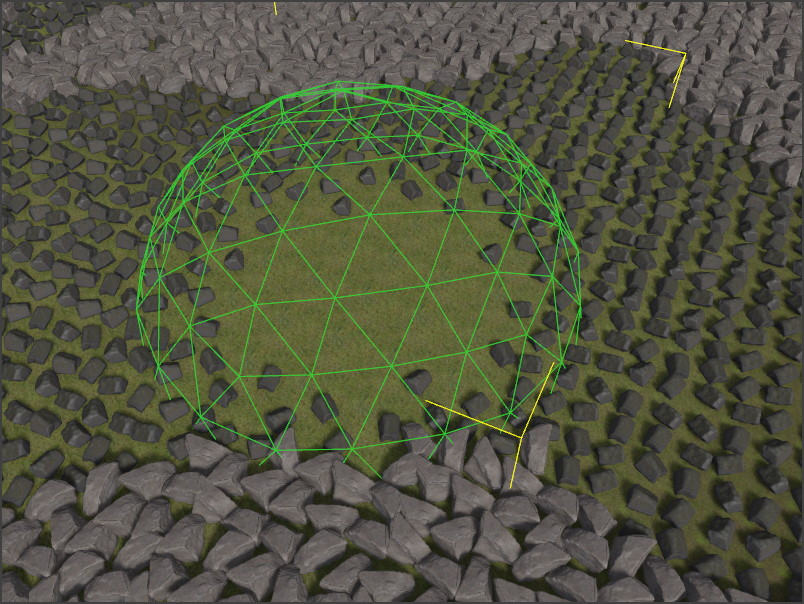

# Procedural Volume Sphere Component

The *procedural volume sphere component* defines a sphere shaped volume in which the rules of [ProcGen graphs](procgen-graph-asset.md) are modified. Not every graph has to make use of this information, and what the exact effect is, is up to the ProcGen graph.

For more details see the chapter on [ProcGen graph modifier nodes (TODO)](procgen-graph-modifiers.md).

The image below shows a sphere volume used to set the density of an object type locally to zero. A fade out value of 0.5 makes the transition soft.

## Component Properties

* `Value`: A single number value. This is combined with the *InputValue* from the [modifier node (TODO)](procgen-graph-modifiers.md) in the graph, using the `BlendMode` formula.
* `SortOrder`: If multiple modifier volumes overlap, the `SortOrder` can be used to control in which order the volumes are evaluated.
* `BlendMode`: How to combine `Value` with the *InputValue* from the [modifier node (TODO)](procgen-graph-modifiers.md) in the graph. The *Set* mode just sets the result to `Value` and ignores the other operand.
* `Radius`: The radius of the sphere volume in which the modifier is active.
* `FadeOutStart`: The influence of the volume can fade out towards its edges, for smooth transitions. This value controls at what distance from the center point the fade out starts. So if this is set to zero, the fade out starts immediately at the middle (towards the closest edge), whereas if it is set to one, there will be no fade out, at all, and rather the influence of the volume stops abruptly at its border.

## See Also

* [Procedural Object Placement](procedural-object-placement.md)
* [ProcGen Graph Modifier Nodes (TODO)](procgen-graph-modifiers.md)
