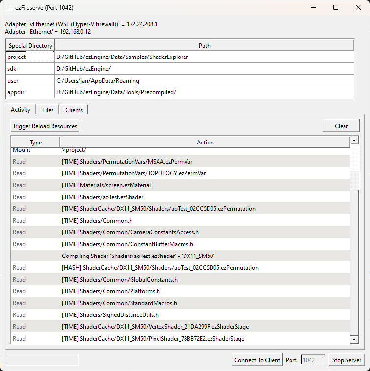

# FileServe

This is the GUI front-end and the server of the file-serving functionality. It is used to stream project data over a network to a connected (mobile) device.



## Introduction

On PCs there are no restrictions for file access and there is no deployment step required when you modify data or your application, which is why it is the most convenient platform to work with.

However, many other platforms have very strict rules how to *deploy* an application and which files they can access. Often you need to build a package that contains all the data, that your app may need to access. If you want to iterate on things, such as shaders, particle effects or level design, you have to repeat this lengthy process every single time, even though you only touch a few files.

Additionally, you may only work with a small test level, but if you also want to test with larger amounts of data every once in a while, your package needs to include all of this data, which can make the deployment step quite slow.

To solve this issue, the EZ [fileSystem](../runtime/filesystem.md) makes it possible to get its files not from the device itself, but instead streamed over a network connection, from a development PC. You then deploy a much smaller package, that contains nearly no data files, and have all files sent over on demand. Files are cached on the device, such that repeated accesses don't need to re-send unchanged files.

This means creating and deploying app packages becomes much faster. Additionally, you can now utilize the [resource manager's (TODO)](../runtime/resource-management.md) functionality to *reload modified resources*. Therefore, you can modify any file on the development PC, and then hot-reload that data onto the device, without even restarting the app. And even in situations where you need to restart the app on the device, this is still much faster than having to do a full re-deployment.

Note that there is also [ezInspector](inspector.md), that you can also connect to your remote app, so that you can get additional insights, such as the log output.

## How to Enable Fileserve Functionality

Generally the fileserve functionality is added to the engine through the `ezFileservePlugin`. Enabling it is thus just a matter of loading that plugin during engine initialization. If your game is built on top of `ezGameApplication` (such as [ezPlayer](player.md)), it is automatically enabled in development builds for platforms that have file access restrictions (see `ezGameApplication::Init_LoadRequiredPlugins()` for details). This is also true for [ezInspector](inspector.md) support.

If your game is [using a custom application class](../runtime/application/application.md), make sure this is set up in your code. The [Shader Explorer Sample](../../samples/shader-explorer.md) is such an application and should be used as reference.

If you want more control over the fileserve connection in your application, have a look at `ezFileserveClient`.

## Shader Explorer Sample

The [Shader Explorer Sample](../../samples/shader-explorer.md) is great to try out the fileserve functionality. In `ShaderExplorer.h` you can find the `#define USE_FILESERVE`, which is `OFF` by default, but can be easily forced to `ON` even when running on a PC. This is useful to try out fileserve on the same machine, and verify that it works in general.

## The ezFileServe Application

*ezFileServe* is the GUI application that provides the *server* functionality. It has to run on the PC that has access to the game's data.

> **IMPORTANT**
>
> ezFileServe needs to know where the *project specific* data for your game is, ie where the main project folder is. Thus it can only serve data for one specific project at a time. If this path is not provided through a command line argument, it will ask for it right at startup. If you cancel this, or select the wrong folder, clients can connect, but will fail to find their files.

### ezFileserve UI

At the very top it displays the detected network adaptors. This may be important to know, if you need to configure firewalls to let traffic through to this device.

Below that, it lists the *special directories*. Some of these are automatically set. The **project** special directory is the most important one for the client to find its files. If you try different apps on a device, be certain that you restart ezFileserve and set the correct project path each time. Special directories are typically provided through the command line `-specialdirs`. If you launch ezFileserve from the editor (*Tools > Launch Fileserve...*) it automatically sets this. If it is not provided, ezFileserve will ask for a project folder at startup.

Further down there are three tabs:

* **Activity**: This is a log of all activity. Some entries have tooltips with explanations.
* **Files**: A list of all the files that were accessed and how often.
* **Clients**: Information about clients and which data directories they mounted. It is possible to connect with multiple clients to a single file server at the same time.

### Shader Compilation

ezFileserve loads the [shader compiler plugins](shadercompiler.md). This enables shader compilation on the host PC, for platforms that do not support shader compilation on device.

### Reloading Resources

In the *Activity* tab there is a button **Trigger Reload Resources**. This instructs the connected clients to reload all changed resources. Use this, if you modified a file on the PC, such as a shader, and want to see the change on device without restarting the app.

### Connect To Client

The button at the bottom shows a dialog that asks you for the IP address of a device that you want to connect to. Try this out, if you have issues getting a network connection between your devices. Often devices have multiple different IP addresses, depending through which network adapters they are reachable. If in doubt, try all of them.

For more information, see [Connecting to ezFileServe](#connecting-to-ezfileserve).

### ezFileserve Command Line Arguments

* `-fs_port XYZ`: By default ezFileserve uses **port 1042**. This command line argument overrides this value. In this case, the client has to be adjusted to know about the different port. use `ezFileserveClient::AddServerAddressToTry("ip:port")` to do so.

* `-specialdirs Name Path Name Path ...` Adds special directories. Each one has to be a pair of a "name" and a "path". The path should be an absolute path to an existing folder on disk. This is used for when clients need to mount data directories. They can use *special directories* to have them redirected to the correct path on different devices. The most common use case is that games mount the `>project` folder and the `>sdk/Data/Base` folder, using `>project` and `>sdk` as the respective *special directories*.

* `-fs_close_timeout seconds`: If given, the application automatically shuts down when no client is connected anymore and a certain timeout is reached. Once a client connects, the timeout is reset. This timeout has no effect as long as no client has connected.

* `-fs_wait_timeout seconds`: If given, the server waits for a limited time for any client to connect and closes automatically, if no connection is established. Once a client connects, this timeout becomes irrelevant.

## Connecting to ezFileServe

Connecting from a device to the host PC isn't always straight forward, for several reasons.

1. The client doesn't know the IP of the server.
1. Firewalls may block communication between devices.

Unfortunately it isn't possible to solve these issues fully automatically, but there are different approaches.

### ezFileserve.txt

To tell the client (your game) the IP to connect to, create a file called `ezFileserve.txt` and put it into the folder next to the game's binary. This file should contain only a single line, with IP and port information:

```cmd
192.168.0.11:1042
```

This needs to be deployed to your device and you must redeploy your app if you change the file. If this doesn't work, check that you put in the correct IP of your development PC, often PCs have multiple network adapters and thus multiple different IPs.

> **IMPORTANT**
>
> Make sure you get the casing of `ezFileserve.txt` right, otherwise it may simply not get found.

### Injected Command Line

You can get the same data into the system using the `-fs_server` command line (see below). If you have a way to start your app with custom command line arguments, this may be quicker to do, than to redeploy with a different ezFileserve.txt file.

### Attempt to Reach from ezFileserve

Instead of the above methods, you can also try to connect from the host PC to the client device using the **Connect To Client** button. Launch the app on the device, then enter the IP of the device on the host PC. If all goes well, the PC will then send its own connection information to the device, which then in turn uses that information to connect to the file server. In case of success, the device stores this information, such that the next time it starts, it can already connect without further help.

### Troubleshooting

If you attempt to connect from a device to a PC for the first time, you may need to try different methods, before one of them succeeds. This is often due to

1. not knowing which IP of server and client to use and
1. the firewall actively blocking communication. 

The former is basically trial and error. For the server, ezFileserve displays its own IPs at the top. Only one of them will work, though. Put the different IPs into `ezFileserve.txt`, redeploy and see if that works.

However, due to firewalls, you may *also* try to connect from ezFileserve using the **Connect To Client** feature, if you know the IP of your device. This can also help to tell the firewall that you indeed want to talk to that device, and that it should not block incoming connection attempts from that device.

Try these methods in different orders and do repeat failed methods. Also check your firewall settings and logs, it may show you blocked activities. Once you manage to get through *once*, it's usually going to work without problems from then on, since that means the firewall now accepts this network traffic, and the EZ application caches the IP that it successfully connected with.

## Client Command Line Arguments

Be aware that command line arguments don't need to be set on the command line. You can hard code arguments in your application using `ezCommandLineUtils::InjectCustomArgument()` at application startup.

* `-fs_off`: Overrides the use of fileserving to be off, even if the plugin is loaded.

* `-fs_server ip:port` The address to the server to connect to. The default is `localhost:1042`, which means connections only work on the same PC. For more information, see [Connecting to ezFileServe](#connecting-to-ezfileserve).

* `-fs_timeout seconds`: How long the client will wait for a connection. A zero timeout means the application will wait indefinitely.

## See Also

* [FileSystem](../runtime/filesystem.md)
* [ezInspector](inspector.md)
* [Supported Platforms](../build/supported-platforms.md)
