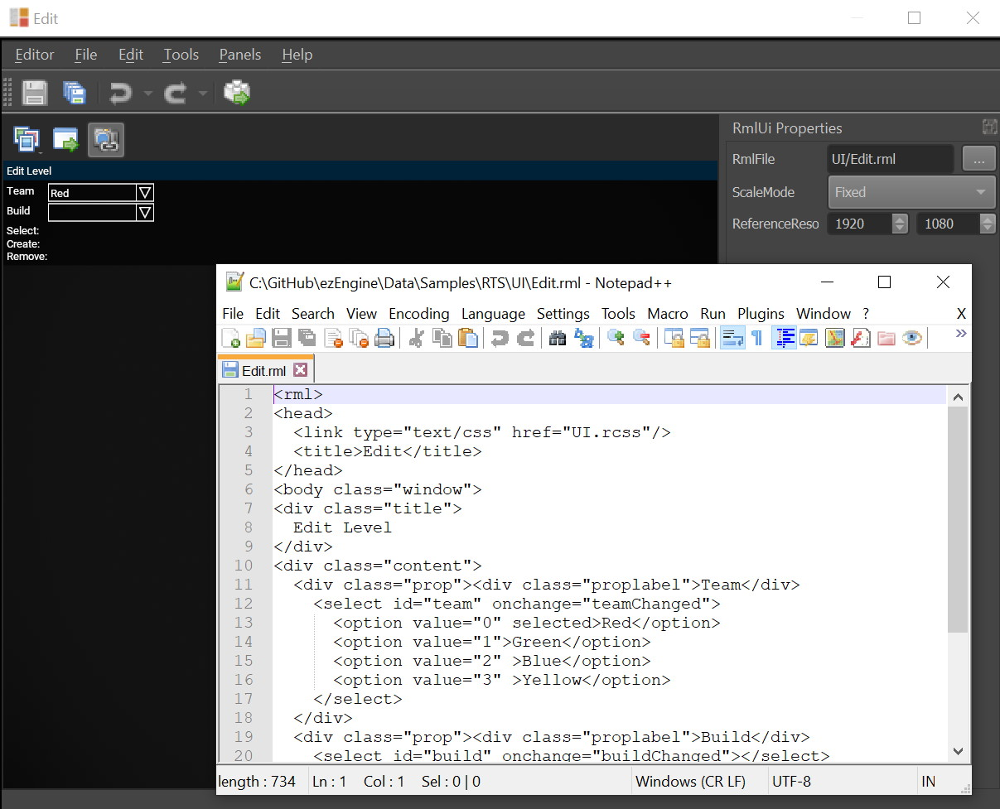

# RmlUI Canvas 2D Component

The *RmlUI Canvas 2D Component* renders [RmlUi](rmlui.md) user interfaces on the screen in 2D space. This is the standard component for creating traditional user interfaces like menus, HUDs, inventory screens, and other overlay UI elements.



The 2D canvas component displays UI on top of the rendered scene, positioned relative to screen coordinates. It's ideal for any interface that should appear as an overlay rather than as part of the 3D world.

## 2D vs 3D Canvas

The key differences between the 2D and 3D canvas components:

| Feature | 2D Canvas | [3D Canvas](rmlui-canvas3d-component.md) |
|---------|-----------|------------------------------------------|
| **Rendering** | Screen overlay | On 3D mesh surfaces |
| **Positioning** | Screen coordinates | World space |
| **Input** | Direct mouse/keyboard | Raycast-based |
| **Use Cases** | Menus, HUDs, dialogs | Terminals, displays, holograms |

Use the 2D canvas when you want standard UI elements that appear on top of your game view. Use the [3D canvas](rmlui-canvas3d-component.md) when you need UI that exists as part of the 3D scene.

## Setting Up a 2D UI

To create a 2D UI in your scene:

1. Add a game object to your scene
2. Add the *RmlUI Canvas 2D Component* to it
3. Assign an [RmlUi document asset](rmlui.md) to the `Document` property
4. Configure the size, position, and other properties as needed
5. The UI will render on top of the screen when the component is active

The [RTS Sample](../../samples/rts.md) demonstrates how to use the 2D canvas component effectively.

## Component Properties

### UI Content

* `Document`: The [RmlUi document asset](rmlui.md) to display. This references an `.rml` file that defines the UI structure and content.

### Layout and Positioning

* `Size`: The resolution of the UI canvas in pixels (e.g., 1920x1080). This defines the virtual canvas size that your RML document will render into.
* `Offset`: Screen position offset in pixels. Works together with `AnchorPoint` to determine final position.
* `AnchorPoint`: Determines which part of the screen to anchor the UI to:
  - `(0, 0)` = Top-left corner
  - `(0.5, 0.5)` = Center of screen
  - `(1, 1)` = Bottom-right corner
  - Values between 0 and 1 position proportionally
* `CustomScale`: Additional scaling factor applied to the UI. Values > 1.0 make the UI larger, < 1.0 makes it smaller. Useful for adapting UI to different screen resolutions.

### Input Handling

* `PassInput`: Whether the canvas should receive and process input events. Enable this for interactive UIs, disable for purely visual overlays that shouldn't capture input.

## Positioning Examples

### Centered Menu
```
AnchorPoint: (0.5, 0.5)
Offset: (0, 0)
```
Centers the UI in the middle of the screen.

### Top-Left HUD
```
AnchorPoint: (0, 0)
Offset: (10, 10)
```
Positions the UI 10 pixels from the top-left corner.

### Bottom-Right Status Panel
```
AnchorPoint: (1, 1)
Offset: (-10, -10)
```
Positions the UI 10 pixels from the bottom-right corner (negative offset moves inward).

## Code Example

To interact with a 2D RmlUi canvas from C++ code:

```cpp
ezRmlUiCanvas2DComponent* pCanvas;
// ... get component reference ...

// Access the RmlUi context
ezRmlUiContext* pContext = pCanvas->GetRmlContext();

// From here you can use standard RmlUi API
// See RmlUi documentation: https://mikke89.github.io/RmlUiDoc/
```

The [RTS Sample](../../samples/rts.md) contains extensive examples of interacting with 2D canvases from code. Search for `ezRmlUiCanvas2DComponent` in the sample's source code to see practical usage patterns.

## Live Preview and Editing

The ezEngine editor provides a live preview for RmlUi canvases. When you edit the `.rml` or `.rcss` files referenced by your UI document, the changes will be reflected immediately in the editor viewport. This makes it easy to iterate on your UI design.

Additionally, CSS files (`.rcss`) automatically trigger asset reloading when modified, so changes to stylesheets are instantly visible without manual refresh.

## Performance Considerations

- The canvas renders every frame by default
- Higher `Size` values use more memory and rendering time
- Use `PassInput: false` on non-interactive UI elements to skip input processing
- Multiple 2D canvases can exist in a scene and will render in order

## Common Use Cases

- **Main Menus**: Title screens, settings, and navigation
- **HUDs**: Health bars, minimaps, score displays
- **Inventory Systems**: Item grids and character equipment
- **Dialogue**: Conversation trees and subtitles
- **Debug Overlays**: Performance stats and development tools

## See Also

* [RmlUi](rmlui.md)
* [RmlUI Canvas 3D Component](rmlui-canvas3d-component.md)
* [Ingame UI](ui.md)
* [RTS Sample](../../samples/rts.md)
