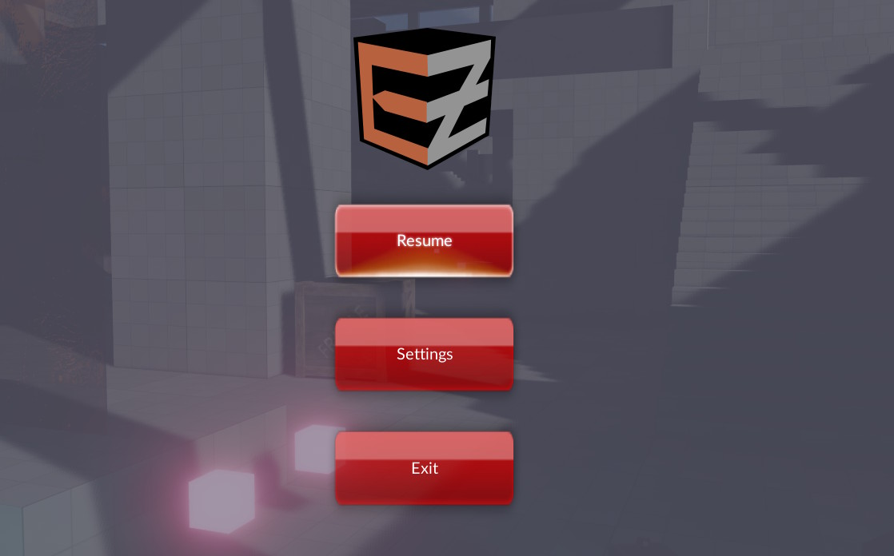
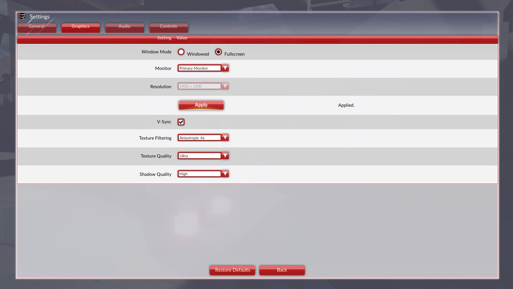

# RmlUI Main Menu Component

The *RmlUi Main Menu* component (`ezRmlUiMainMenuComponent`) provides a main menu with a settings page, without any code or UI authoring. Add it to any object in a scene, and pressing *ESC* opens a menu with *Resume*, *Settings* and *Exit*.

This exists so that samples and new projects have a way to leave the application and to change the most common settings. A finished game will usually want its own menu, either by replacing the documents that this component displays, or by building the UI from scratch, as the [RTS sample](../../samples/rts.md) does.

## How it is opened

[ezFallbackGameState](../runtime/application/game-state.md) searches the world for a main menu component. If it finds one, pressing *ESC* opens the menu instead of quitting the application. *ESC* then goes back one page at a time, and closes the menu from the top level page.

`Ctrl+Q` always quits, no matter whether the menu is open. Inside ezEditor both the *Exit* button and `Ctrl+Q` stop the play-the-game mode.

Note that `Ctrl+Q` is only registered in development builds. In an exported game the menu's *Exit* button is the only way out.

A custom game state can also utilize this main menu component, for an example, see the code of the [Monster Attack Sample](../../samples/monster-attack/monster-attack.md).

## Component Properties

**Menu File:** The document to display for the top level menu. Defaults to the built-in `rmlui-menu/ez-main-menu.ezRmlUiAsset`.

**Settings File:** The document to display for the settings page. Defaults to the built-in `rmlui-menu/ez-app-settings.ezRmlUiAsset`. Clearing this leaves the menu without a settings page.

**Sound Groups:** One volume slider is added to the *Audio* tab for each entry. *Label* is what the menu shows, *Sound Group* is what is passed to `ezSoundInterface::SetSoundGroupVolume()`. What a group name means depends on the sound plugin: [MiniAudio](../sound/miniaudio/ma-overview.md) uses the names from its sound group configuration, FMOD expects the GUID of a VCA. The list is empty by default, so the *Audio* tab only offers the master volume until groups are added. `Music` and `Effects` are what the sample projects configure. Without a sound plugin the sliders are disabled.

**Input Sets:** The input sets whose actions the *Controls* tab offers for rebinding. When this is empty, every input set is listed, except the ones that the engine registers for itself (the console, the debug keys of `ezGameApplication`, the scene switching of *ezPlayer*, the menu itself). Set this to the input set that the game's own actions use (`Player` in the sample projects) to keep the actions of other systems out of the menu.

**Pause World:** Whether the game gets paused while the menu is open.

## Saved settings

What the user picks is stored in [CVars](../debugging/cvars.md) whose names start with `Options.`, for example `Options.Graphics.ShadowQuality` or `Options.Audio.MasterVolume`. These have the `Save` flag, so they end up in `:appdata/CVars` and are read at startup.

They are deliberately separate from the engine's own CVars: a quality selection is a single number that means 'Medium', while the engine is configured through several unrelated values (shadow atlas size, mip drop, ...). Only the selection is worth saving and showing, the mapping to the engine's CVars is what `ezRmlUiMainMenuComponent::ApplySettings()` does. A game that offers its own menu would do the same.

The component applies these settings when it is activated, which is how the settings of a previous run take effect.

## Using the documents as an RmlUi example

Besides being a working menu, the two documents show most of what a settings UI needs from [RmlUi](rmlui.md): a tab set, tables, buttons, check boxes, sliders, drop downs, radio buttons, a text field, images, and rows that are generated from C++ at runtime (the sound groups and the key bindings). The component's implementation shows how each widget is read and written.

## Replacing the documents

The built-in documents live in `Data/Plugins/RmlUiPlugin/rmlui-menu/`, next to the default RmlUi styles, so they are available in every project that has the RmlUi plugin enabled. To change how the menu looks, copy them into your project, adjust them, and point the *Menu File* and *Settings File* properties at your copies.

The component addresses the widgets by their element IDs, and the buttons by the identifiers in their `onclick` and `onchange` attributes, so those have to be kept. A widget that a document does not contain is simply skipped, which is how a stripped down settings page can be built: remove the rows that should not be offered and leave the rest alone.

## See Also

* [RmlUi](rmlui.md)
* [Input System](../input/input-overview.md)
* [Sound](../sound/sound-overview.md)
* [Samples](../../samples/samples-overview.md)
