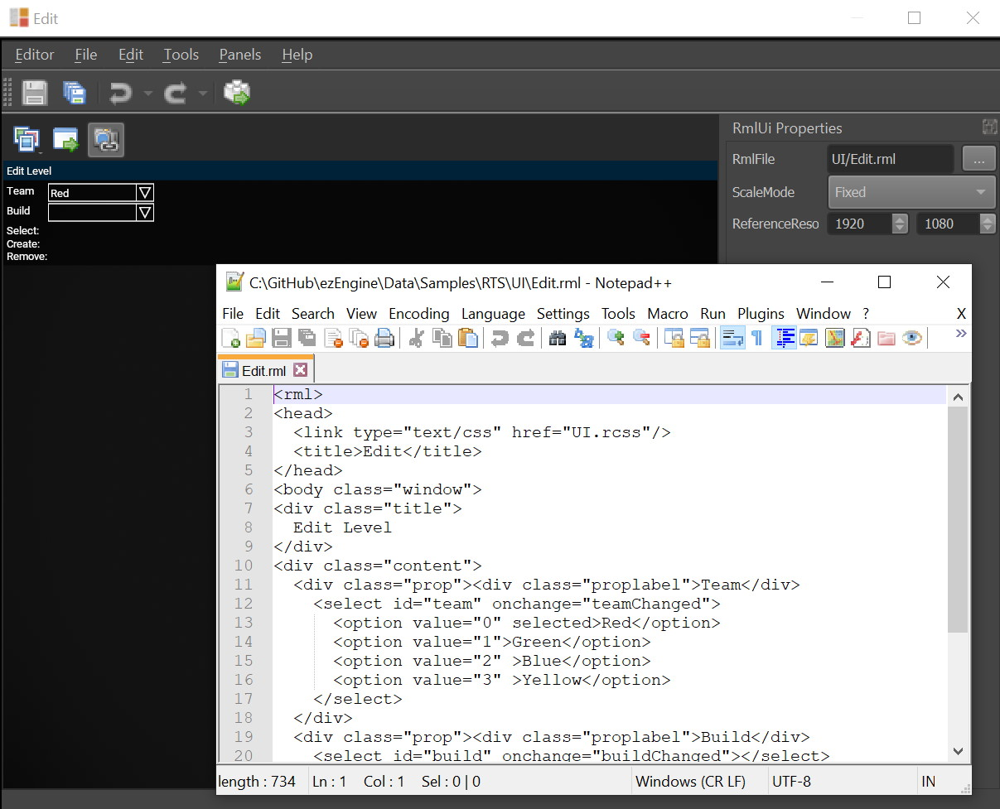

# RmlUi

[RmlUi](https://github.com/mikke89/RmlUi) is a third-party GUI library that uses an HTML-like syntax to describe UI elements, and CSS to style them. RmlUi is lightweight, yet flexible, making it ideal for creating both simple and complex user interfaces.


Support for RmlUi is provided through a dedicated [engine plugin](../custom-code/cpp/engine-plugins.md). To enable it in your project, activate the plugin in the [project settings](../projects/project-settings.md).

## Overview

RmlUi in ezEngine allows you to create user interfaces using familiar web technologies:

- **HTML-like markup** (`.rml` files) for UI structure
- **CSS** (`.rcss` files) for styling and layout
- **C++ code integration** for dynamic behavior and game logic

The engine provides two types of canvas components for rendering RmlUi interfaces:

### [RmlUI Canvas 2D Component](rmlui-canvas2d-component.md)

Renders UI on the screen as a 2D overlay. Use this for:
- Main menus and settings screens
- HUDs (heads-up displays)
- Inventory and character screens
- Dialogue interfaces

### [RmlUI Canvas 3D Component](rmlui-canvas3d-component.md)

Renders UI onto 3D mesh surfaces in world space. Use this for:
- Interactive computer terminals
- Holographic displays
- Vehicle dashboards and cockpits
- In-world information kiosks

## Getting Started

### Creating Your First UI

1. **Enable the RmlUi plugin** in your [project settings](../projects/project-settings.md)
2. **Create an RML file** with your UI structure (similar to HTML)
3. **Create a CSS file** (optional) to style your UI
4. **Add a canvas component** to a game object in your scene:
   - [RmlUI Canvas 2D Component](rmlui-canvas2d-component.md) for screen overlay
   - [RmlUI Canvas 3D Component](rmlui-canvas3d-component.md) for in-world UI
5. **Assign the RML document** to the component's `Document` property

### Sample Project

The [RTS Sample](../../samples/rts.md) provides a comprehensive example of using RmlUi in ezEngine. It demonstrates:

- Multiple 2D canvas components for menus and HUD
- RML document structure
- CSS styling
- C++ code interaction with the UI



Open the RTS sample in the editor to see live previews of RML documents and experiment with editing the UI files.

## Workflow Features

### Live Preview

The ezEngine editor provides a live preview for RmlUi canvases. When you edit `.rml` or `.rcss` files, changes are reflected immediately in the editor viewport, allowing for rapid iteration on your UI design.

### Automatic Asset Reloading

When you modify CSS files (`.rcss`) that are dependencies of RmlUi documents, the affected UI assets automatically reload. This applies to:
- Direct CSS references in RML files
- CSS files included through RML templates

This feature makes it easy to iterate on UI styling without manually refreshing assets.

## Working with RmlUi

### From C++ Code

Both canvas components provide access to the RmlUi context through `GetRmlContext()`:

```cpp
ezRmlUiCanvas2DComponent* pCanvas;
// ... get component reference ...

ezRmlUiContext* pContext = pCanvas->GetRmlContext();
// pContext implements Rml::Core::Context
```

Once you have the `ezRmlUiContext`, you have full access to the RmlUi API. This allows you to:

- Load and unload documents dynamically
- Update element content and properties
- Handle events and user interactions
- Create custom data bindings

See the [RTS Sample](../../samples/rts.md) source code for practical examples of UI interaction patterns.

### RmlUi Documentation

For details on RML markup syntax, CSS styling, event handling, and advanced features, refer to the official RmlUi documentation:

**[RmlUi Documentation](https://mikke89.github.io/RmlUiDoc/index.html)**

The RmlUi documentation covers:
- RML element reference
- RCSS property reference
- Data binding
- Custom elements and decorators
- Event handling
- And much more

## Component Comparison

| Feature | [2D Canvas](rmlui-canvas2d-component.md) | [3D Canvas](rmlui-canvas3d-component.md) |
|---------|------------------------------------------|------------------------------------------|
| **Rendering Location** | Screen overlay | 3D mesh surface |
| **Positioning** | Screen coordinates | World space |
| **Input Method** | Direct mouse/keyboard | Raycast-based |
| **Typical Uses** | Menus, HUDs, dialogs | Terminals, holograms, in-world displays |
| **Setup Complexity** | Simple | Requires material setup |

## Current Limitations

The RmlUi integration is functional but still evolving:

- **C++ Only**: Currently requires C++ code to interact with the UI. Convenience features may be added in the future for simpler use cases.
- **No Script Binding**: There is no script binding for RmlUi, and this is unlikely to change. However, if convenience features are added, limited functionality might become available to scripts.

## See Also

* [RmlUI Canvas 2D Component](rmlui-canvas2d-component.md)
* [RmlUI Canvas 3D Component](rmlui-canvas3d-component.md)
* [Ingame UI](ui.md)
* [ImGui](imgui.md)
* [RTS Sample](../../samples/rts.md)
* [RmlUi Official Documentation](https://mikke89.github.io/RmlUiDoc/index.html)
