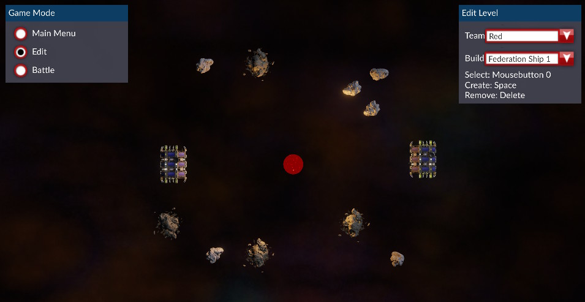
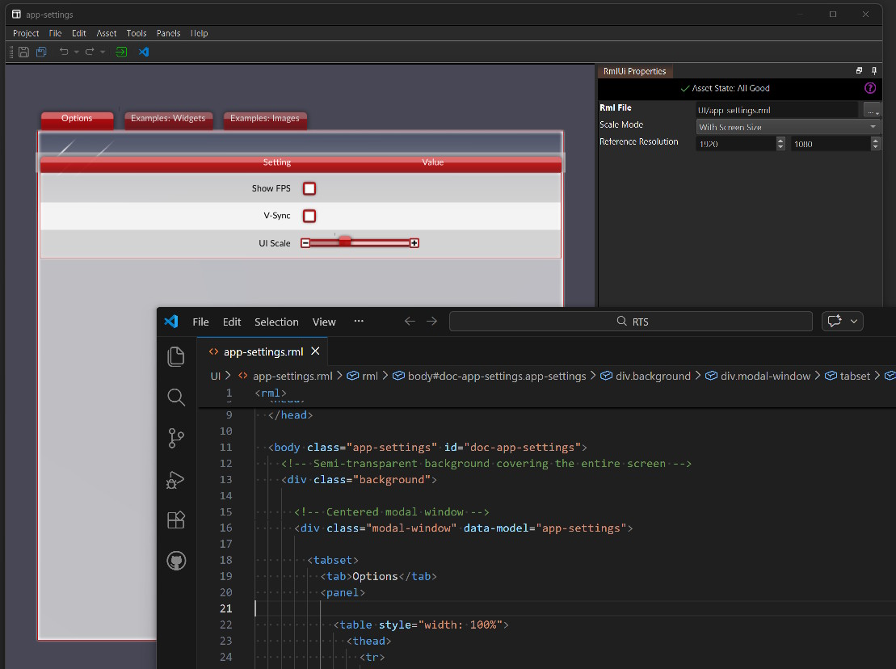

# RmlUi

[RmlUi](https://github.com/mikke89/RmlUi) is a third-party GUI library that uses an HTML-like syntax to describe UI elements, and CSS to style them. RmlUi is lightweight, yet flexible.

Support for RmlUi is provided through a dedicated [engine plugin](../custom-code/cpp/engine-plugins.md). To enable it in your project, activate the plugin in the [project settings](../projects/project-settings.md).

## Rml Documentation

The documentation for RmlUi [can be found here](https://mikke89.github.io/RmlUiDoc/index.html).

Please refer to that documenation for any questions around how to use RmlUi.

## Sample

The [RTS Sample](../../samples/rts.md) shows how to use RmlUi. Have a look at it the project in the editor, it contains Rml assets. The editor shows a live preview for Rml canvases, and you can edit the respective `.rml` files to see the effect:

The sample uses multiple *RmlUi Canvas 2D* components in its scene to place the UI elements. At runtime the RTS sample's game code accesses the RmlUi functionality through the `ezRmlUiCanvas2DComponent`. Search the sample's code for those places to see how to interact with the GUI.

Using `ezRmlUiCanvas2DComponent::GetRmlContext()` you get access to the `ezRmlUiContext`. This class implements `Rml::Core::Context`. This gives you access to all the RmlUi features. See the RmlUi [documentation](https://mikke89.github.io/RmlUiDoc/index.html) for details.

## 2D and 3D Canvases

The *RmlUi Canvas 2D* component (`ezRmlUiCanvas2DComponent`) renders the UI as a screen-space overlay. This is the standard choice for HUDs and menus.

The *RmlUi Canvas 3D* component (`ezRmlUiCanvas3DComponent`) renders the UI into a texture that is applied to a mesh in the scene, allowing UI panels to exist as physical objects in the 3D world — for example interactive terminals, noticeboards, or in-world displays. Set the **Proxy Mesh** to define the surface used for hit-testing, the **Base Material** to control the look of the panel, and the **Texture Slot Name** to the material's texture parameter that should receive the rendered UI. Interaction is driven by raycasting: call `RaycastInput()` with a world-space ray (e.g. from a player's line-of-sight or crosshair) to deliver mouse position and click events to the UI. Disable the **Interactive** property to make the panel a non-interactive display.

## Blackboard Data Binding

The [blackboard](../misc/blackboards.md) of an object can be automatically bound to the RmlUi data model, making blackboard entries accessible as RmlUi data model variables. Enable the **Autobind Blackboards** property on the canvas component to have it search the owner object's hierarchy for a blackboard component and bind it automatically. The blackboard's name is used as the RmlUi model name.

You can also bind blackboards manually from C++ using `ezRmlUiCanvasComponentBase::AddBlackboardBinding()`.

Both scalar values and [variant arrays](https://mikke89.github.io/RmlUiDoc/pages/data_bindings.html) stored in the blackboard are supported.

## UI Events

By default, reacting to RmlUi events (such as button clicks) requires registering C++ event handlers via `ezRmlUiContext::RegisterEventHandler()`.

As a simpler alternative, enable the **Send Event Message** property on the canvas component. When enabled, every RmlUi event fires an `ezMsgRmlUiEvent` message on the component's owner object. The message carries:

* `m_sIdentifier` — the identifier string configured on the RmlUi element (e.g. via the `data-event-id` attribute or the event listener identifier).
* `m_sType` — the RmlUi event type (e.g. `click`, `change`).

This message can be handled in [visual scripts](../custom-code/visual-script/visual-script-overview.md) or C++ components attached to the same object, enabling script-driven UI logic without writing a custom C++ event handler.

## Localization

All text content in RmlUi documents is automatically passed through ezEngine's localization system (`ezTranslate`). That means you can set up translation tables for different languages.

## See Also

* [Ingame UI](ui.md)
* [ImGui](imgui.md)
* [Blackboards](../misc/blackboards.md)
