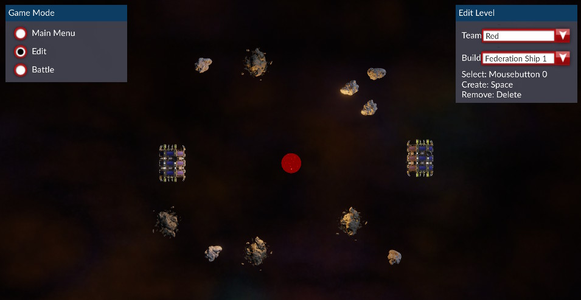
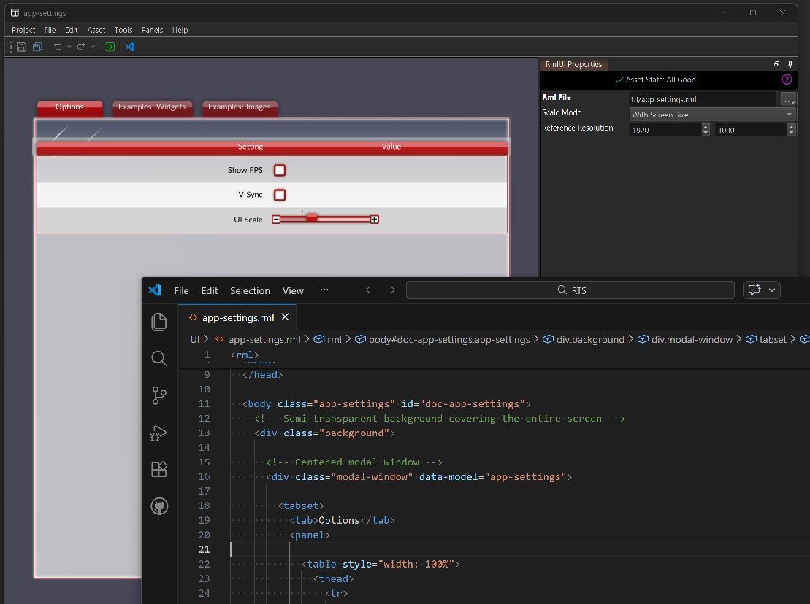

# RmlUi

[RmlUi](https://github.com/mikke89/RmlUi) is a third-party GUI library that uses an HTML-like syntax to describe UI elements, and CSS to style them. RmlUi is lightweight, yet flexible.



Support for RmlUi is provided through a dedicated [engine plugin](../custom-code/cpp/engine-plugins.md). To enable it in your project, activate the plugin in the [project settings](../projects/project-settings.md).

## Rml Documentation

The documentation for RmlUi [can be found here](https://mikke89.github.io/RmlUiDoc/index.html).

Please refer to that documenation for any questions around how to use RmlUi.

## Sample

The [RTS Sample](../../samples/rts.md) shows how to use RmlUi. Have a look at it the project in the editor, it contains Rml assets. The editor shows a live preview for Rml canvases, and you can edit the respective `.rml` files to see the effect:



The sample uses multiple *RmlUi Canvas 2D* components in its scene to place the UI elements. At runtime the RTS sample's game code accesses the RmlUi functionality through the `ezRmlUiCanvas2DComponent`. Search the sample's code for those places to see how to interact with the GUI.

Using `ezRmlUiCanvas2DComponent::GetRmlContext()` you get access to the `ezRmlUiContext`. This class implements `Rml::Core::Context`. This gives you access to all the RmlUi features. See the RmlUi [documentation](https://mikke89.github.io/RmlUiDoc/index.html) for details.

## Canvas Components

ezEngine provides two canvas components for placing RmlUi documents in a scene:

* The [RmlUI Canvas 2D Component](rmlui-canvas2d-component.md) (`ezRmlUiCanvas2DComponent`) renders the UI as a screen-space overlay. This is the standard choice for HUDs and menus.
* The [RmlUI Canvas 3D Component](rmlui-canvas3d-component.md) (`ezRmlUiCanvas3DComponent`) renders the UI into a texture applied to a mesh in the scene, allowing UI panels to exist as physical objects in the 3D world.

Both components support blackboard data binding, event messages, and on-demand rendering. See the individual component pages for their full property reference.

## Debugger

RmlUi comes with its own [debugger](https://mikke89.github.io/RmlUiDoc/pages/cpp_manual/debugger.html), which shows the element hierarchy of a document, the applied styles, and a log. It can be attached to a context through the [CVar](../debugging/cvars.md) `RmlUi.DebugContext`.

Set the CVar to the name of the context that should be debugged. The canvas components name their context after the Rml asset that they display, so entering the asset's file name is usually sufficient. The lookup is a case insensitive substring match, so a partial name works as well. Setting the CVar to an empty string closes the debugger again.

For example, to debug the UI of an Rml asset called `MainMenu.ezRmlUiAsset`, open the [console](../debugging/console.md) while the game runs and type:

```cmd
RmlUi.DebugContext = "MainMenu"
```

The same can be done through the *CVars* panel in ezEditor, or from the command line when starting the application:

```cmd
MyGame.exe -RmlUi.DebugContext MainMenu
```

Only a single context can be debugged at a time. Attaching to another context detaches the previous one. If no context matches the given name at that moment, the debugger is closed, but it opens automatically once a matching context loads a document afterwards.

The debugger is only available in development builds and only on Windows, since it is loaded from `RmlDebugger.dll` at runtime. If that DLL can't be found, an error is logged and nothing else happens.

## Localization

All text content in RmlUi documents is automatically passed through ezEngine's localization system (`ezTranslate`). That means you can set up translation tables for different languages.

## See Also

* [RmlUI Canvas 2D Component](rmlui-canvas2d-component.md)
* [RmlUI Canvas 3D Component](rmlui-canvas3d-component.md)
* [Ingame UI](ui.md)
* [ImGui](imgui.md)
* [Blackboards](../misc/blackboards.md)
