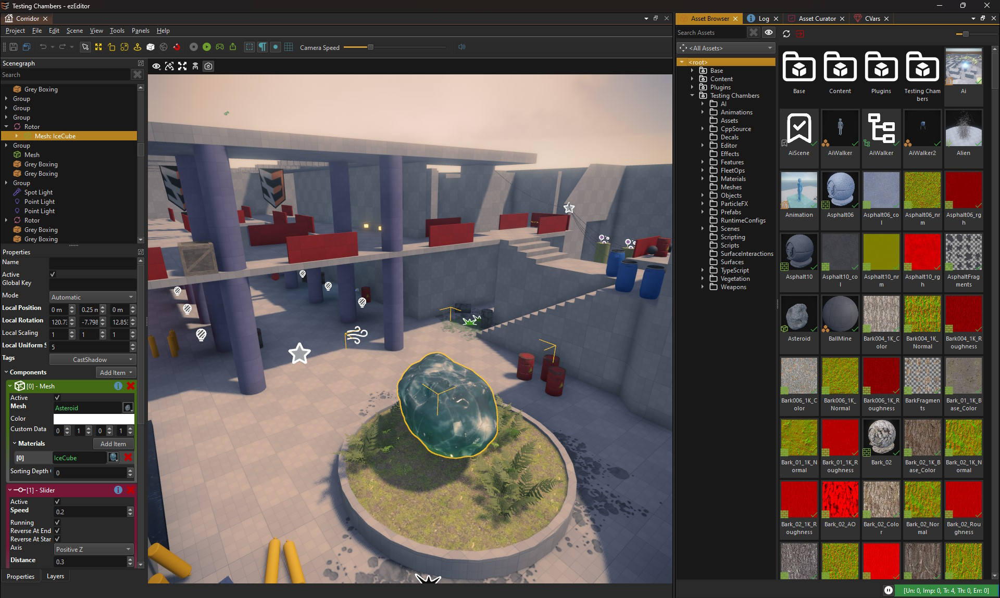

# ezEditor Overview

<!-- TODO: This page needs a lot more information -->

ezEditor is the central application for authoring content and bringing existing assets together. It includes a scene editor, functionality for working with [meshes](../docs/graphics/meshes/meshes-overview.md), [textures](../docs/graphics/textures-overview.md), [materials](../docs/materials/materials-overview.md), [particles](../docs/effects/particle-effects/particle-effects-overview.md) and [sounds](../docs/sound/sound-overview.md), as well as a [visual shader editor (TODO)](../docs/materials/visual-shaders.md), [visual scripting](../docs/custom-code/visual-script/visual-script-overview.md) and [prefabs](../docs/prefabs/prefabs-overview.md). The editor transforms [assets](../docs/assets/assets-overview.md) from source data into the optimized runtime formats and keeps track which assets are up to date.

The editor can also [run the game logic](../docs/editor/run-scene.md) inside the viewport while making edits, or start a complete play-the-game mode which lets you experience your creation without delay.

The runtime functionality of the editor lives in a separate engine process, which makes the editor very robust. If the engine crashes, the editor can just relaunch it within a second, without loss of work and with minimal interruption.

## Compiling the Editor

The editor currently only builds on Windows and requires Qt. See [Building ezEngine](../docs/build/building-ez.md).

## Sample Projects

See [Testing Chambers](../samples/testing-chambers.md).

## Setting Up a Custom Project

See [Projects](../docs/projects/projects-overview.md).

## Importing Assets

See [Asset Import](../docs/assets/import-assets.md)

## Video: ezEngine Overview

## Video: Demo Level Playthrough

## See Also

* [Samples](../samples/samples-overview.md)
* [Videos](videos.md)
