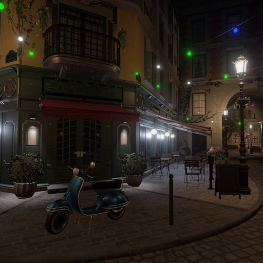

# Bistro Sample

The **Bistro Sample** is a scene that demonstrates the use of a large number of assets, especially textures.

The sample is based on the well-known [Amazon Lumberyard Bistro](https://developer.nvidia.com/orca/amazon-lumberyard-bistro) scene, adapted for ezEngine.

The sample can be downloaded directly from the ezEditor [dashboard](../docs/editor/dashboard.md). Because of the amount of texture data, the download and unpacking may take a while. Once cloning is complete, any compressed archives in the project are extracted automatically.

For more details, see its [GitHub repository](https://github.com/jankrassnigg/ez-sample-bistro).

## See Also

* [Samples](samples-overview.md)
* [Store Sample](store-sample.md)
* [Dashboard](../docs/editor/dashboard.md)
