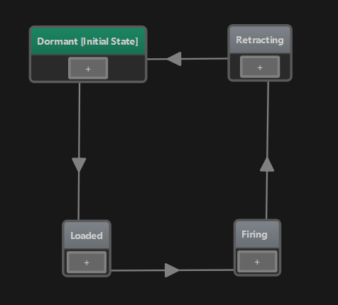
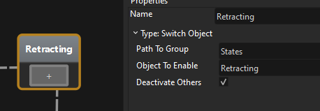
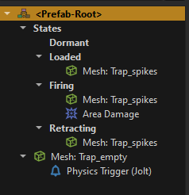
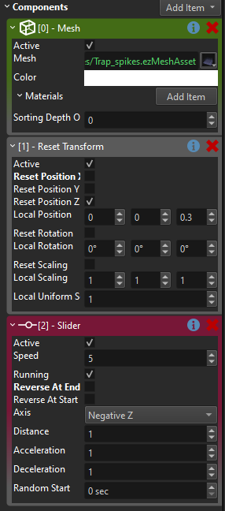
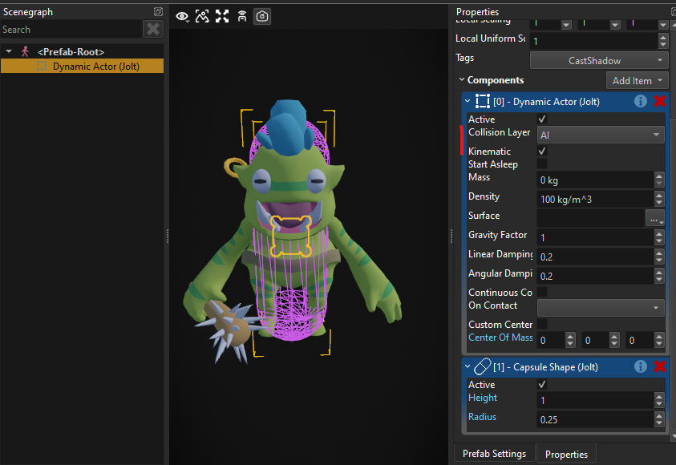
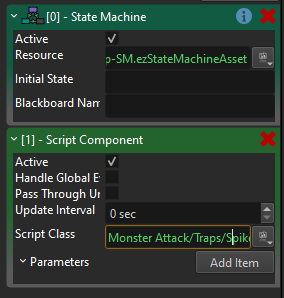
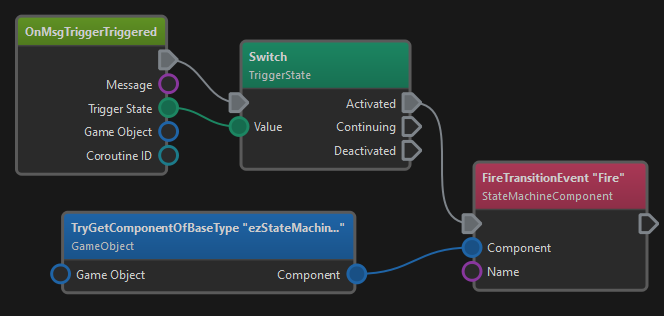
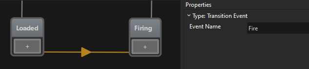

# MA Devlog 2 - Spike Trap

So today was all about getting my first trap working. Here is the result:

<video src="media/devlog2/ma-dl2-Spike_Trap.mp4" width=600 controls></video>

The most flexible way to do these things, is to just use [custom C++ components](../../docs/custom-code/cpp/custom-cpp-component.md) for everything. However, I want to test out our other infrastructure as well, for example the new [visual scripting (TODO)](../../docs/custom-code/visual-script/visual-script-overview.md), the [state machines](../../docs/custom-code/game-logic/state-machine-asset.md), and so on, so the goal is to prefer those, and only use C++ for the things that really need it.

At the moment I only have two custom C++ components, one for the player logic and one for the monsters. The former mostly does [input handling](../../docs/input/input-overview.md) and forwarding to the [character controller](../../docs/physics/jolt/special/jolt-character-controller.md), the latter mainly does the path finding and steering.

So today I had to figure out how to build my first trap.

If I were (or had) an artist, I would use an [animated mesh](../../docs/animation/skeletal-animation/animated-mesh-asset.md) with multiple [animations](../../docs/animation/skeletal-animation/animation-clip-asset.md) for the different trap states. However, I only have two [static meshes](../../docs/graphics/meshes/mesh-asset.md), one with spikes, one without, and I really want to make things work with the assets as I have them. So I needed a way to do the visuals without animations.

Here is what it looks like in a close up:

<video src="media/devlog2/ma-dl2-SpikeTrapAnim.mp4" width=600 controls></video>

The trap has four states, therefore I built a [state machine](../../docs/custom-code/game-logic/state-machine-asset.md).

In the *Dormant* state it does nothing. This is the state where the trap is not dangerous. It takes a second and then transitions into the *Loaded* state.

In the loaded state, the spikes show up and peak through the bottom. Now when a creature walks over it, the trap enters the *Firing* state where it makes damage.

After a short time, it enters the *Retracting* state, where the spikes move down and then it starts over.

Again, there are different ways how you could achieve the animations and the behavior, but I wanted to use as much existing functionality as possible. For each *State* in the state machine you select what code it should run. And one existing type of state is the **Switch Object** state. What this will do, is it simply activates / deactivates game objects in your object structure. So you could for example use this to enable a particle effect node and thus make your object *burning* or switch to a different mesh object, so that it looks broken.

For example the *Retracting* state deactivates all objects under the *States* group, but enables the *Retracting* object:

My trap prefab looks like this:

On the root node, there is my state machine component.

Directly attached to it are the base mesh (second to last node) and a trigger (last node). Inside the *States* group there are the four different groups that represent the different states. For example, the *Dormat* group is just empty.

The three other groups add the spiky mesh and the *Firing* group additionally adds area damage.

Now as I said, for the animation one should use a skinned mesh and just play animations, but to achieve the up/down movement without this, I used the [Slider component](../../docs/animation/property-animation/slider-component.md).

Also I added a new *Reset Transform* component, to make the sub-objects move back into place each time. So now the *Retracting* and *Firing* group uses these components:

All this gives you the visuals.

Now on the state machine you have *transitions* (the arrows between the states). For each transition you again have to choose the "type". The transition type determines the logic to decide whether the transition should be taken or not. So you can have complex logic here.

To start, I just used the **Timeout** transition, which would just cycle through the states with a 1 second delay.
This is fine for all transitions, except for the one from *Loaded* to *Firing*. Here we only want to transition when a creature walks into the trap.

To detect this, I decided to use a [physics trigger](../../docs/physics/jolt/actors/jolt-trigger-component.md).

First this meant that my creatures need to have some kind of physics representation, which the physics trigger can detect at all. So I added a kinematic capsule shape, which just moves along with my creature (they currently don't use a character controller).

Now whenever the creature walks into a trap, the trigger in my trap prefab will fire an event. However, so far this event won't have any effect.

I need to hook up the event from the trigger to my state machine. And this is what [visual scripts (TODO)](../../docs/custom-code/visual-script/visual-script-overview.md) are really good for.

On the root node of my trap, I added a *Script Component*:

The script is quite trivial:

Whenever the trigger fires, the script's *OnMsgTriggerTriggered* node gets executed. We then switch over the state and only react to *Activated* events. If so, we call *FireTransitionEvent* on the sibling [StateMachineComponent](../../docs/custom-code/game-logic/state-machine-component.md) and tell it to *Fire*.

So now we have it. When a creature walks into the trigger, the visual script gets the physics trigger event, forwards that to the state machine and when the state machine happens to be in the *Loaded* state, it will transition into the *Firing* state. The state machine then changes which sub-objects in the trap are active, which in turn starts the spike movement and applies area damage to anything close by.

## See Also

* [Monster Attack Sample](monster-attack.md)