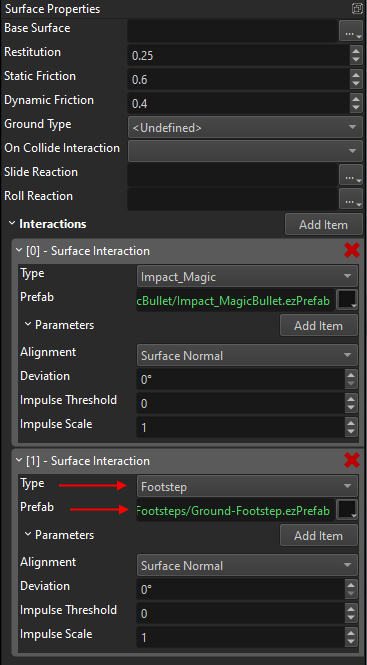
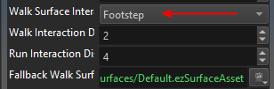
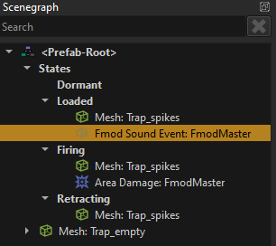
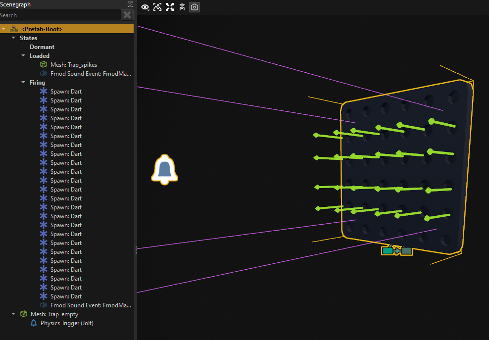
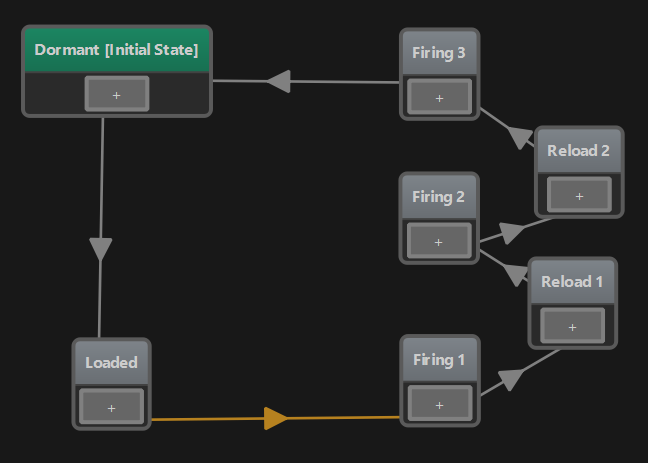

# MA Devlog 3 - Sound

Today I spent some time on improving and polishing what I built so far.

First I set up sound. EZ uses Fmod, so [following the documentation](../../docs/sound/fmod/fmod-overview.md) and my own tutorial video, I created a new Fmod Studio project, downloaded a couple of sounds from <freesound.org> and added sounds for footsteps, the player's projectile and the trap.

Footsteps for the player are quite easy, because the [character controller](../../docs/physics/jolt/special/jolt-character-controller.md) already supports this through [surface interactions](../../docs/materials/surfaces.md). Basically, whenever something needs to interact with a surface, for example a bullet hitting a wall, we can easily spawn a *surface interaction*. Usually polygons are linked to a surface and the surface acts as a lookup table. So if I walk over a stone surface and I want to spawn a *footstep* interaction, the stone surface defines which prefab to use, and if I walk over a metal surface, it may define a different prefab to use.



Surfaces are hierarchical, so both stone and metal surfaces are built on top of the *Default* surface, and as long as they don't define an override, the value from the *Default* surface is used.

Therefore, on the character controller, all that we need to define is the name of the surface interaction, and how quickly those should be spawned when walking or running.



The same system is used by the [projectile](../../docs/gameplay/projectile-component.md) to spawn a prefab when it hits something.

For my trap, all I needed to add was a sound event to the *Loaded* state, so that it makes a mechanical noise when it is ready.



The next thing I did, was to add code to the player component, so that the player can place traps. This is all done in C++.

EZ has an [abstract interface](../../docs/runtime/configuration/interfaces.md) `ezPhysicsWorldModuleInterface` which you can query from the [world](../../docs/runtime/world/world-overview.md), that gives you access to things like raycasts. To get this interface, you call

`ezPhysicsWorldModuleInterface* pPhysics = GetOwner()->GetWorld()->GetModule<ezPhysicsWorldModuleInterface>();`

This is probably one of the most important such interfaces, since physics queries are so ubiquitously useful for all sorts of game mechanics.

For now I simply use this to check where the player is looking. Meaning, I shoot a ray through the camera like this:

```cpp
ezPhysicsCastResult result;
pPhysics->Raycast(result, pCameraObject->GetGlobalPosition(), pCameraObject->GetGlobalDirForwards(), 10.0f, params);
```

Now I have the point that the player is looking at. The next step is to validate, that one can place a trap there. For now I only do very simply position snapping and some rotation, I don't yet prevent the player from placing traps where they don't belong.

Of course, while in trap placement mode you want to have a preview how things would look like, so I built a copy of my trap prefab, that has no functionality, and I add that to the scene (and move it around) to show where the trap would end up. At some point this should probably also use a [custom shader](../../docs/graphics/shaders/shaders-overview.md) for a nice "preview effect", and some sounds when placing traps for better feedback.

<video src="media/devlog3/ma-dl3-TrapPlacement.mp4" width=600 controls></video>

At some point I noticed that when a monster dies, it doesn't dissappear and a lot of bodies where piling up. So now the }*monster component* simply puts itself into a queue when it starts playing the *die* animation to keep track of dead bodies, and I delete the oldest one when I have more than 20.

Finally, I wanted to have a second trap. My favourite trap in *Orcs Must Die* is the one that shoots arrows out of a wall. From its logic it's very similar to the spike trap, so I copied and adjusted it. This is what it looks like:



I've added a *Dart* [projectile](../../docs/gameplay/projectile-component.md) prefab and this trap simply uses 24 [spawn components](../../docs/gameplay/spawn-component.md) to shoot a lot of those. This is it in action:

<video src="media/devlog3/ma-dl3-ArrowTrap.mp4" width=600 controls></video>

However, I wanted the trap to shoot arrows three times in quick succession. Because that's way cooler. Turns out, this was absolutely trivial to do with the state machine. All I needed to do, was to copy two of the states a few times and set up a short time delay as transitions:



And now it behaves like this:

<video src="media/devlog3/ma-dl3-ArrowTrap2.mp4" width=600 controls></video>

And together they already create quite some mayhem:

<video src="media/devlog3/ma-dl3-Gameplay.mp4" width=600 controls></video>

Finally, in game,  it looks and sounds like this:

<video src="media/devlog3/ma-dl3-Gameplay2.mp4" width=600 controls></video>

## See Also

* [Monster Attack Sample](monster-attack.md)