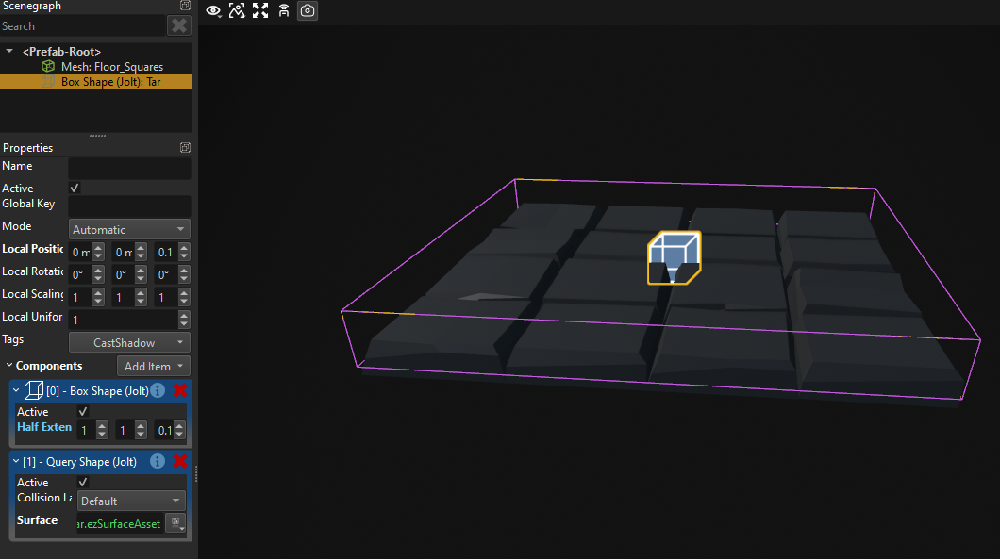
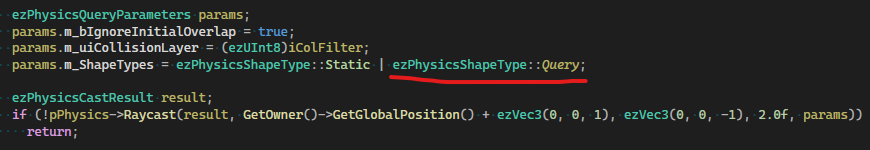
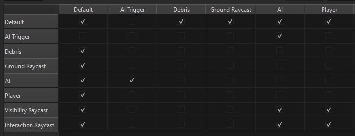
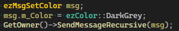
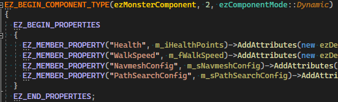
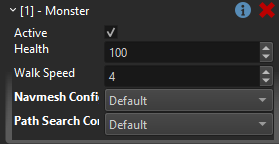

# MA Devlog 4 - Tar Trap

Today I added a simple trap that just slows down monsters when they walk over it.

<video src="media/devlog4/SlowDown.mp4" width=600 controls></video>

As always, there are many ways how one can implement this. I chose to simply do a raycast at the monster position downwards and find the physics object beneath their feet. From there I could use the [surface](../../docs/materials/surfaces.md) to determine whether to slow down the monster.

That means that my trap needs to actually contain a [physical collider](../../docs/physics/jolt/collision-shapes/jolt-collision-meshes.md) object, so that the raycast can hit anything. Therefore my trap now looks like this:

Here I use a [query shape actor](../../docs/physics/jolt/actors/jolt-queryshape-actor-component.md) rather than a static actor, because I only want raycasts to be able to hit this collider, I do not want any other objects (like my player's character controller) to collide with it.

But that also means that when I do my raycast, I need to make sure to include *Query objects*:

Now this kinda worked, but I ran into the problem that the raycast would often not hit the ground, but the monster itself.

To show the problem, in the video above I enabled the skeleton collider visualization for the blue monsters. Those are the animated shapes that are used for shooting the monsters. My raycast would sometimes hit that and then not detect the correct ground type.

I had to set up proper [collision layers](../../docs/physics/jolt/collision-shapes/jolt-collision-layers.md) and assign the right ones to the monster shapes, the ground shapes, and the raycast.

Unfortunately this isn't fun, because there is a limit of 32 layers and you have to be very careful how to set them up, because their number can quickly grow.

For now my setup looks like this:

For debugging purposes, I wanted to see when exactly the monsters are slowed down, so I used the `ezMsgSetColor` to just dim the monsters mesh color when slowed:

Finally, I exposed the health and walk speed as properties, so that I could configure my two monster types slightly differently.

In C++ this macro block is used to declare which variables are configurable:

And then these show up in the editor:

## See Also

* [Monster Attack Sample](monster-attack.md)